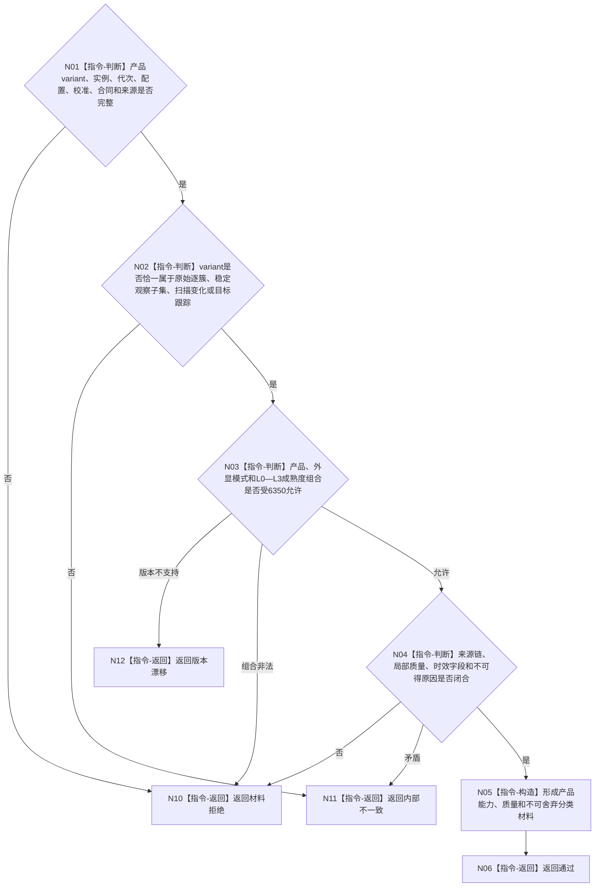

# BIZ-L4-004-10-01-01 双目相机报告验证器复核产品合同目标函数流程图 v0.1

更新时间：2026-08-03

## 依据

```text
6320、6340—6360；BIZ-L3-004-10-01
```

## 身份与边界

正式目标函数设计图。纯值复核双目相机四类逻辑供给产品、L0—L3成熟度、模式、质量、来源和配置版本；不判断任务匹配。

## 函数合同

```text
根函数：双目相机报告验证器::复核产品合同
归属模块 / 文件 / 层级：双目相机报告验证 / 海中鱼巣/外设/验证.双目相机报告.ixx / L4
现有或待新增：待新增；吸收6350四产品与成熟度/模式矩阵
完整签名：双目相机产品合同复核结果 双目相机报告验证器::复核产品合同(const 双目相机产品合同复核请求& 请求) const noexcept
参数：请求为只读借用；含强类型产品variant、相机实例、生产代次、配置/校准/产品合同版本和来源材料见证
返回结果：值式结果；含通过、材料拒绝、版本漂移或内部不一致，以及产品类型、成熟度、模式、质量、来源和不可舍弃分类材料
被调函数流程图：无；有限四产品矩阵复核为本函数内指令
父图：BIZ-L3-004-10-01
```

## 流程图



## 节点合同

| 节点 | 类型 | 输入 | 输出 | 事实读写 | 验证 |
| --- | --- | --- | --- | --- | --- |
| N02/N03 | 指令 | 强类型产品 | 产品/模式/成熟度资格 | 无写入 | 四类不可跨类替代 |
| N04—N06 | 指令 | 来源与质量 | 复核材料 | 无写入 | 局部质量不被整体覆盖 |

## 关键边界

原始逐簇报告不得作为自我侧方法正式输入；产品通过也不证明任务命中或世界事实成立。

