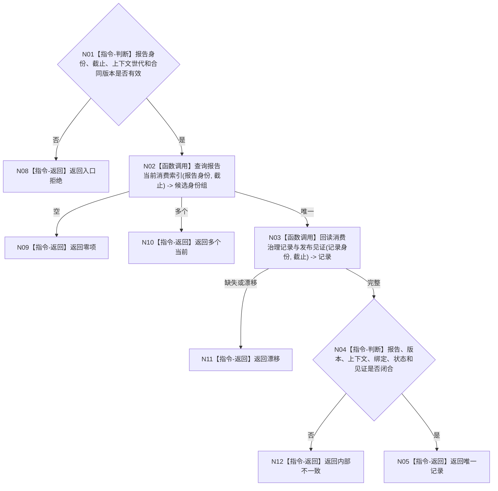

# BIZ-L4-004-10-02-01 按报告身份读取当前消费记录目标函数流程图 v0.1

更新时间：2026-08-03

## 依据

```text
4010、4050、6340、8100；BIZ-L3-004-10-02
```

## 身份与边界

正式目标函数设计图。以报告稳定身份为唯一竞争键读取当前消费治理记录和发布见证；不读取物理报告队列。

## 函数合同

```text
根函数：任务外设材料数据操作::按报告身份读取当前消费记录
归属模块 / 文件 / 层级：任务外设材料数据操作 / 海中鱼巣/领域/数据操作.任务外设材料承接.ixx / L4
现有或待新增：待新增；建立按报告身份唯一当前消费索引与回源读取
完整签名：报告消费记录读取结果 任务外设材料数据操作::按报告身份读取当前消费记录(const 报告消费记录读取请求& 请求) const
参数：请求为只读借用；含报告稳定身份、事实截止、运行期上下文世代和消费合同版本
返回结果：不可变值式结果；含零项、唯一记录、多个当前、漂移或内部不一致，以及记录、绑定、处理结果和发布见证
被调函数流程图：无；索引候选回源消费治理侧表为简单同截止读取
父图：BIZ-L3-004-10-02、BIZ-L3-004-10-04
```

## 流程图



## 节点合同

| 节点 | 类型 | 输入 | 输出 | 事实读写 | 验证 |
| --- | --- | --- | --- | --- | --- |
| N02/N03 | 函数调用 | 报告身份与截止 | 候选和权威记录 | 只读 | 索引命中后回源 |
| N04/N05 | 指令 | 完整记录 | 唯一读取结果 | 无写入 | 跨代仍唯一当前 |

## 关键边界

任务、窗口和代次不能加入竞争键以放宽一次承接；索引命中不等于读取成功。

