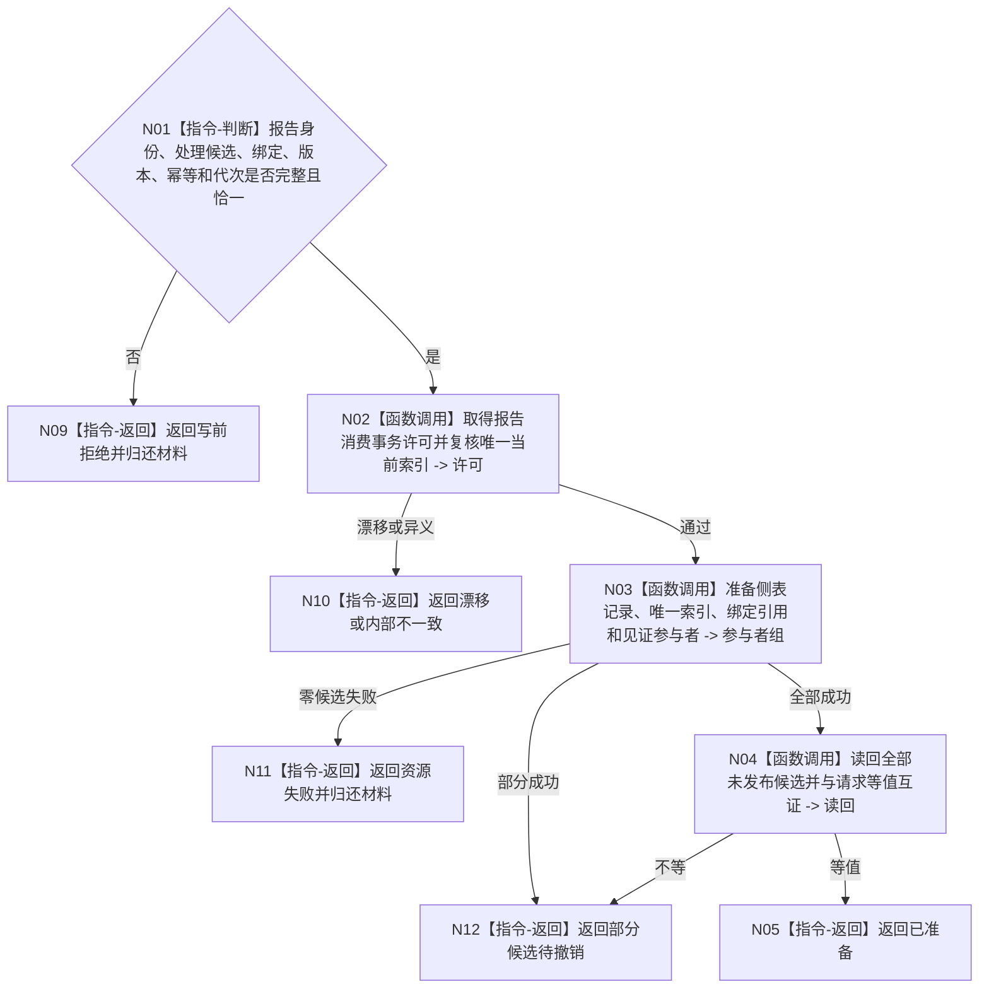

# BIZ-L4-004-10-04-01 准备报告消费治理候选目标函数流程图 v0.1

更新时间：2026-08-03

## 依据

```text
4010—4050、5230、6340、8100；BIZ-L3-004-10-04
```

## 身份与边界

正式目标函数设计图。为互斥的正式承接、不可舍弃收束或普通处置准备不可见侧表记录、唯一索引候选和可选材料引用。

## 函数合同

```text
根函数：任务外设材料数据操作::准备报告消费治理候选
归属模块 / 文件 / 层级：任务外设材料数据操作 / 海中鱼巣/领域/数据操作.任务外设材料承接.ixx / L4
现有或待新增：待新增；专用侧表与报告唯一当前索引事务参与者
完整签名：报告消费候选准备结果 任务外设材料数据操作::准备报告消费治理候选(报告一次承接事务请求&& 请求) noexcept
参数：请求为独占可移动值；含报告身份、恰一处理候选、可选绑定、材料引用、版本、幂等、预期代次和规则版本
返回结果：独占值式结果；含已准备、写前拒绝、漂移、资源失败、部分候选待撤销或内部不一致，以及候选和未引用材料
被调函数流程图：底层参与者准备在L5展开
父图：BIZ-L3-004-10-04
```

## 流程图



## 节点合同

| 节点 | 类型 | 输入 | 输出 | 事实读写 | 验证 |
| --- | --- | --- | --- | --- | --- |
| N02—N04 | 函数调用 | 独占请求 | 不可见候选组 | 仅候选 | 三类处理互斥 |
| N05/N09—N12 | 返回 | 准备状态 | 候选或未引用材料 | 无发布 | 材料所有权明确 |

## 关键边界

准备成功不表示报告已承接；任何部分候选必须交给具名撤销函数，不能静默遗留。
