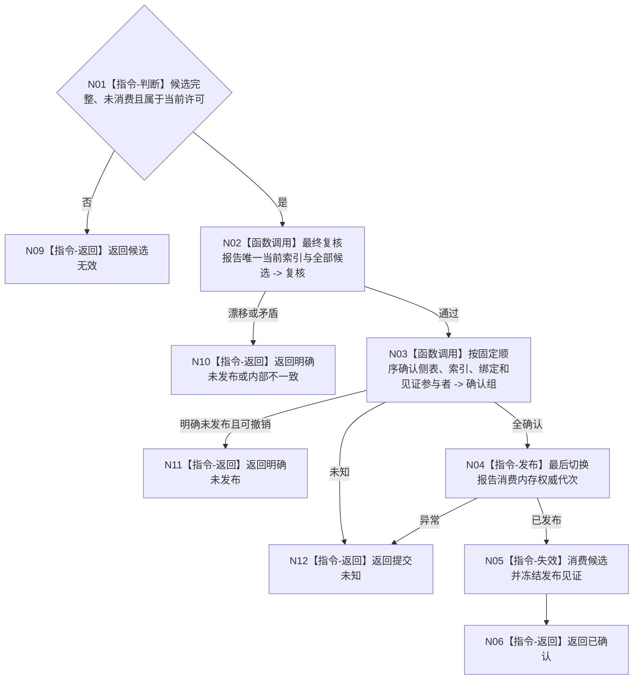

# BIZ-L4-004-10-04-02 确认报告消费治理候选目标函数流程图 v0.1

更新时间：2026-08-03

## 依据

```text
4010—4050、6340、8100；BIZ-L3-004-10-04
```

## 身份与边界

正式目标函数设计图。确认全部报告消费候选并最后发布一个内存权威代次；持久证据失败不回滚已发布内存事实。

## 函数合同

```text
根函数：任务外设材料数据操作::确认报告消费治理候选
归属模块 / 文件 / 层级：任务外设材料数据操作 / 海中鱼巣/领域/数据操作.任务外设材料承接.ixx / L4
现有或待新增：待新增
完整签名：报告消费候选确认结果 任务外设材料数据操作::确认报告消费治理候选(报告消费治理候选&& 候选) noexcept
参数：候选为独占右值；必须属于当前许可、未确认且全部参与者已准备，调用后失效
返回结果：值式结果；含已确认、明确未发布、提交未知、候选无效或内部不一致，以及权威代次、发布见证和持久证据状态
被调函数流程图：参与者确认和最后发布在L5展开
父图：BIZ-L3-004-10-04
```

## 流程图



## 节点合同

| 节点 | 类型 | 输入 | 输出 | 事实读写 | 验证 |
| --- | --- | --- | --- | --- | --- |
| N02/N03 | 函数调用 | 候选 | 确认结果 | 尚未公开 | 全参与者确认 |
| N04—N06 | 指令 | 确认组 | 权威代次与见证 | 最后发布 | 单次消费候选 |

## 关键边界

提交未知不得换幂等键重试；已发布后材料文件或SQL证据失败只降低持久证据状态。

