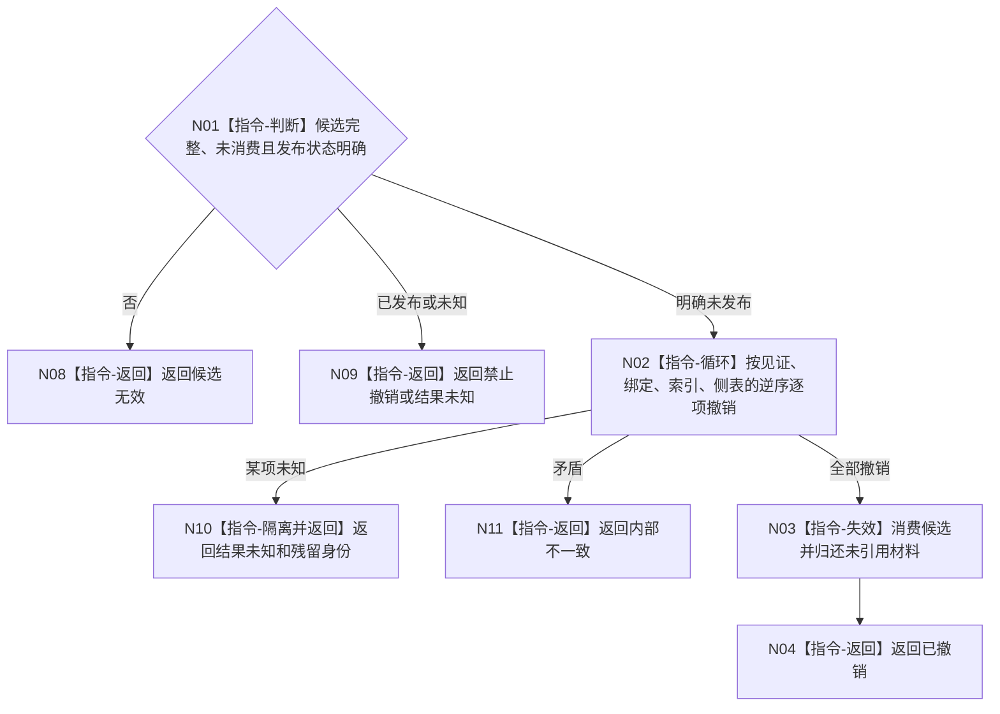

# BIZ-L4-004-10-04-03 撤销报告消费治理候选目标函数流程图 v0.1

更新时间：2026-08-03

## 依据

```text
4010—4050、6340、8100；BIZ-L3-004-10-04
```

## 身份与边界

正式目标函数设计图。只逆序撤销尚未发布的报告消费候选并归还未引用材料；已发布或结果未知候选禁止撤销。

## 函数合同

```text
根函数：任务外设材料数据操作::撤销报告消费治理候选
归属模块 / 文件 / 层级：任务外设材料数据操作 / 海中鱼巣/领域/数据操作.任务外设材料承接.ixx / L4
现有或待新增：待新增
完整签名：报告消费候选撤销结果 任务外设材料数据操作::撤销报告消费治理候选(报告消费治理候选&& 候选) noexcept
参数：候选为独占右值；仅明确未发布且许可仍有效时可撤销，调用后失效
返回结果：值式结果；含已撤销、无需撤销、禁止撤销、结果未知或内部不一致，以及归还材料和残留隔离身份
被调函数流程图：无；按参与者准备逆序调用撤销为本函数内顺序指令
父图：BIZ-L3-004-10-04
```

## 流程图



## 节点合同

| 节点 | 类型 | 输入 | 输出 | 事实读写 | 验证 |
| --- | --- | --- | --- | --- | --- |
| N02 | 指令 | 明确未发布候选 | 撤销状态 | 删除候选 | 严格逆序 |
| N03/N04 | 指令 | 已撤销候选 | 归还材料 | 无权威写入 | 所有权唯一 |

## 关键边界

撤销不删除已发布事实；任何未知残留必须隔离并停止依赖路径。

