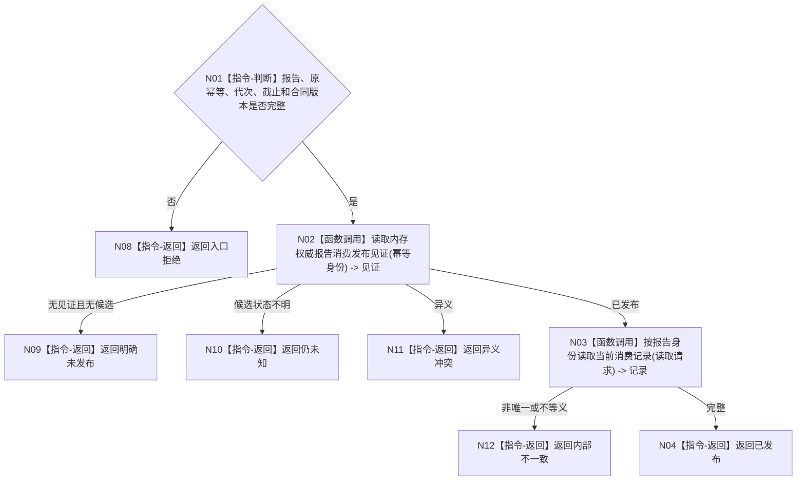

# BIZ-L4-004-10-04-04 按幂等身份读取报告消费发布见证目标函数流程图 v0.1

更新时间：2026-08-03

## 依据

```text
4050、6340、8100；BIZ-L3-004-10-04
```

## 身份与边界

正式目标函数设计图。提交未知后按原幂等身份读取内存权威发布见证，并回源唯一报告消费记录；不借日志或持久证据裁决发布。

## 函数合同

```text
根函数：任务外设材料数据操作::按幂等身份读取报告消费发布见证
归属模块 / 文件 / 层级：任务外设材料数据操作 / 海中鱼巣/领域/数据操作.任务外设材料承接.ixx / L4
现有或待新增：待新增
完整签名：报告消费发布见证读取结果 任务外设材料数据操作::按幂等身份读取报告消费发布见证(const 报告消费发布见证读取请求& 请求) const
参数：请求为只读借用；含报告身份、原幂等身份、预期代次、事实截止和合同版本
返回结果：不可变值式结果；含已发布、明确未发布、仍未知、异义冲突或内部不一致，以及发布见证和消费治理读回
被调函数流程图：当前记录读取复用BIZ-L4-004-10-02-01
父图：BIZ-L3-004-10-04
```

## 流程图



## 节点合同

| 节点 | 类型 | 输入 | 输出 | 事实读写 | 验证 |
| --- | --- | --- | --- | --- | --- |
| N02 | 函数调用 | 原幂等身份 | 权威见证 | 只读内存事实 | 不看日志/SQL |
| N03/N04 | 函数调用/返回 | 报告身份 | 完整记录 | 只读 | 见证与记录互证 |

## 关键边界

持久证据状态不能裁决内存发布；仍未知时禁止生成新幂等身份。
