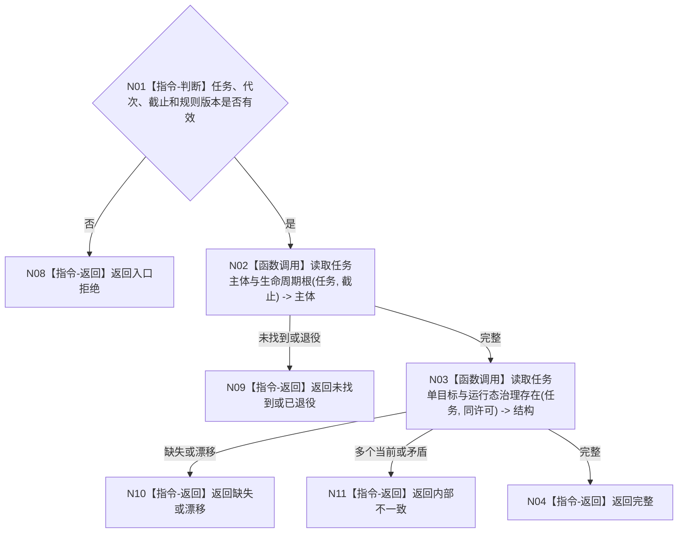

# BIZ-L4-004-11-01-01 读取任务主体目标与治理存在目标函数流程图 v0.1

更新时间：2026-08-03

## 依据

```text
3200、4010、5090、5200—5230；BIZ-L3-004-11-01
```

## 身份与边界

正式目标函数设计图。按任务稳定身份读取权威任务主体、单目标及唯一运行态治理存在；不读取队列占用或线程身份。

## 函数合同

```text
根函数：任务承接数据操作::读取任务主体目标与治理存在
归属模块 / 文件 / 层级：任务承接数据操作 / 海中鱼巣/领域/数据操作.任务承接.ixx / L4
现有或待新增：待新增；组合任务主体、目标关系和治理存在读取
完整签名：任务主体目标治理读取结果 任务承接数据操作::读取任务主体目标与治理存在(const 任务主体目标治理读取请求& 请求) const
参数：请求为只读借用；含任务、运行代次、事实截止和承接规则版本
返回结果：不可变值式结果；含完整、未找到、已退役、缺失、漂移或内部不一致，以及主体、目标、治理存在和版本
被调函数流程图：无；任务节点、目标关系和治理存在使用同许可简单读取
父图：BIZ-L3-004-11-01
```

## 流程图



## 节点合同

| 节点 | 类型 | 输入 | 输出 | 事实读写 | 验证 |
| --- | --- | --- | --- | --- | --- |
| N02/N03 | 函数调用 | 任务与截止 | 主体、目标、治理存在 | 只读 | 单目标、唯一治理存在 |
| N04/N08—N11 | 返回 | 读取状态 | 结构化结果 | 无写入 | 缺失与退役分离 |

## 关键边界

任务列表位置、队列项、线程占用和日志都不是任务主体或治理存在。
