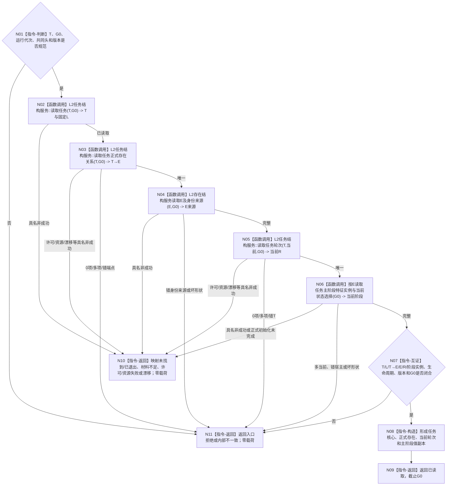

# BIZ-L4-004-11-01-01 读取任务核心正式存在当前轮次与主阶段目标函数流程图 v0.2

更新时间：2026-08-27

## 依据与替代

```text
0050、3200、4230、4260 v0.9、5090、5210 v1.1
父图：BIZ-L3-004-11-01 v0.2
```

本图替代 v0.1“读取任务主体目标与治理存在”。任务目标副本和任务治理存在退出；当前叶只读取任务核心、正式 `T→E`、存在身份来源、当前任务轮次和 `E` 上的 ARCH-L2 当前主阶段。

## 身份与边界

正式目标 BIZ 读取叶。函数在一个非零 `G0` 通过各自公开服务读取并互证：任务 `T` 与身份来源、固定查询锚点 `L`、唯一正式 `T→E`、`E` 的存在身份来源、唯一当前任务轮次 `R`，以及 `E` 上“任务主阶段 / 业务状态段”特征实例的唯一当前状态选择。它不读取 `T→D`、目标、选择 / 冻结、等待、队列或需求树。

## 函数合同

```text
根函数：运行期只读查询组合器::读取任务核心正式存在当前轮次与主阶段
归属模块 / 文件 / 目标分解深度：运行期只读查询module-private提供者 / 海中鱼巣/领域/组合.运行期只读查询.ixx / BIZ-L4
可见性：module-private；只由BIZ-L3-004-11-01 v0.2调用
现有或待新增：待新增；HEAD只有读取任务，正式T→E/当前轮次生产ABI和本组合尚未实现
完整签名：任务核心阶段读取结果 运行期只读查询组合器::读取任务核心正式存在当前轮次与主阶段(const 任务核心阶段读取请求& 请求) const noexcept
参数：T、运行代次、非零G0、共同L2请求头和任务/存在/阶段/读取规则版本；不携带声明E、R或阶段
返回结果：已读取时携带T及身份来源、L、T→E、E及身份来源、当前R、阶段特征定义/实例、当前状态、主阶段/业务状态段投影、生命周期/动态见证和G0；其它为未找到、已退出、材料不足、当前性/版本漂移、入口/许可拒绝、资源失败或内部不一致且零业务载荷
基础数据调用：L2任务结构服务::读取任务；目标ABI `读取任务正式存在关系`、`读取任务轮次`；L2存在结构服务身份来源读取；ARCH-L2特征/状态公开当前选择读取
```

## 流程图



## 节点合同

| 节点 | 类型 | 输入 | 输出 | 事实读写 | 验证 |
| --- | --- | --- | --- | --- | --- |
| N02 | DATA读取 | T、G0 | T身份来源、L、生命周期 | 只读task owner | 未找到、已退出、错family、错截止 |
| N03/N04 | DATA读取 | T/E、G0 | 唯一T→E与E来源 | 只读task/存在owner | 0/1/>1、错端点、兼容投影不得冒充 |
| N05 | DATA读取 | T、G0 | 唯一当前R | 只读task owner | 当前关系、R→T、序号和生命周期 |
| N06 | ARCH-L2读取 | E、阶段特征、G0 | 当前阶段状态及见证 | 只读特征/状态/动态owner | 恰一当前选择、错宿主、合法初始化窗口 |
| N07—N09 | 互证 / 构造 / 返回 | 全部正式读回 | 核心阶段值副本 | 无写入 | 全部身份、版本和截止同义 |

## 关键边界

- `L`不是需求来源集合；本叶不枚举L成员。
- `T→E`和E身份来源是正式存在资格；旧任务虚拟存在只能作历史兼容投影，不能补齐0项T→E。
- 当前阶段只由E上的ARCH-L2当前状态选择形成。旧任务治理状态、生命周期枚举、线程或队列不得重命名为阶段。
- `T→E`和当前R与新任务核心由同一task-owner写集形成；当前T缺任一单例都是内部不一致。只有后继独立owner的阶段尚未发布且存在正式初始化检查点时，才返回材料不足 / 初始化未完成；不得拼接半结构成功。

## 当前代码实现对照

- HEAD有`读取任务`与通用存在/状态读取能力；没有已发布`读取任务正式存在关系`、`读取任务轮次`生产实现和本组合。
- 因而本图冻结消费边界，不证明DATA ABI、普通应用装配或生产调用已完成。
