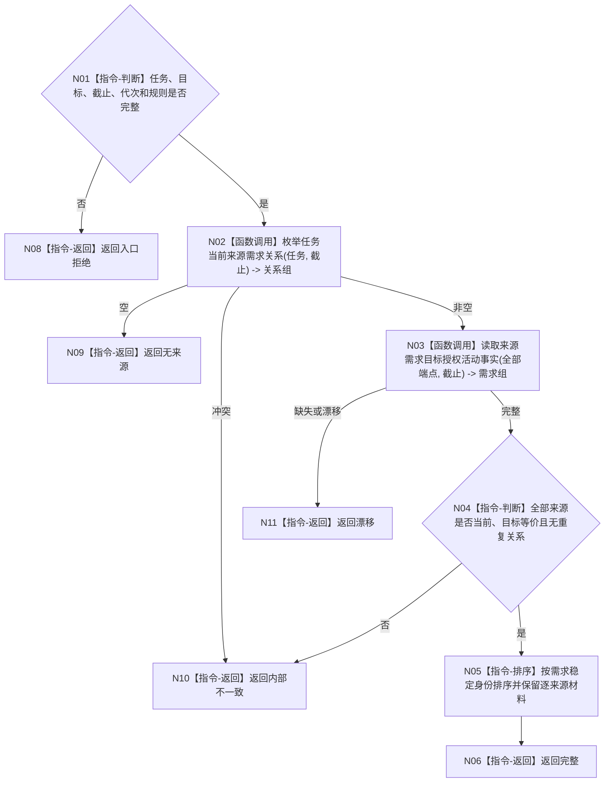

# BIZ-L4-004-11-01-02 枚举任务全部当前来源需求目标函数流程图 v0.1

更新时间：2026-08-03

## 依据

```text
3100、3200、4010、5090、5200—5230；BIZ-L3-004-11-01
```

## 身份与边界

正式目标函数设计图。读取任务全部当前目标等价来源需求并回源需求权威事实；不只取第一来源，不合并权重、权限或预算。

## 函数合同

```text
根函数：任务承接数据操作::枚举任务全部当前来源需求
归属模块 / 文件 / 层级：任务承接数据操作 / 海中鱼巣/领域/数据操作.任务承接.ixx / L4
现有或待新增：待新增；组合全部当前来源关系与需求回源读取
完整签名：任务全部来源需求读取结果 任务承接数据操作::枚举任务全部当前来源需求(const 任务全部来源需求读取请求& 请求) const
参数：请求为只读借用；含任务、目标、事实截止、运行代次和来源规则版本
返回结果：不可变值式结果；含完整、无来源、漂移或内部不一致，以及稳定排序的全部来源需求和关系见证
被调函数流程图：需求目标授权活动读取复用BIZ-L4-004-02-02-03
父图：BIZ-L3-004-11-01
```

## 流程图



## 节点合同

| 节点 | 类型 | 输入 | 输出 | 事实读写 | 验证 |
| --- | --- | --- | --- | --- | --- |
| N02/N03 | 函数调用 | 任务与截止 | 关系和需求组 | 只读 | 全端点回源 |
| N04—N06 | 指令 | 全部来源 | 稳定有序来源 | 无写入 | 不合并逐来源材料 |

## 关键边界

稳定排序只服务确定性输出；不得据此产生来源优先级或丢弃后续来源。
