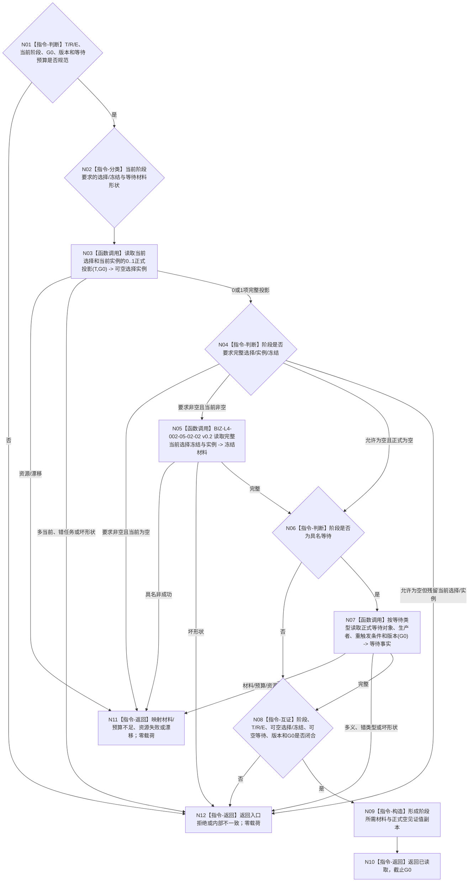

# BIZ-L4-004-11-01-03 按主阶段读取可空选择冻结与具名等待事实目标函数流程图 v0.2

更新时间：2026-08-27

## 依据与替代

```text
0050、3200、4260 v0.9、5090、5210 v1.1、5220 v0.2、5230 v1.2、5300
父图：BIZ-L3-004-11-01 v0.2
复用：BIZ-L4-002-05-02-02 v0.2（阶段要求完整选择/实例/冻结时）
```

本图替代 v0.1“读取任务治理状态合同”。旧任务治理状态不再参与裁决；v0.2以父叶已经正式读取的 ARCH-L2 当前主阶段为路由，只读取该阶段要求的当前选择 / 实例 / 冻结或具名等待事实，并对不要求的分支取得正式空见证。

## 身份与边界

正式目标 BIZ 读取叶。函数不推导阶段，不把材料缺失解释为等待。阶段处于待初次筹办、筹办中或其它尚未形成选择的合法状态时，当前选择 / 实例 / 冻结可以正式为空；处于执行冻结完成、待授权、执行或结算相关阶段时，所需选择 / 实例 / 冻结必须完整；处于具名等待状态时必须读回该等待类型的正式对象、生产者、重新触发条件和版本。

## 函数合同

```text
根函数：运行期只读查询组合器::按主阶段读取可空选择冻结与具名等待事实
归属模块 / 文件 / 目标分解深度：运行期只读查询module-private提供者 / 海中鱼巣/领域/组合.运行期只读查询.ixx / BIZ-L4
可见性：module-private；只由BIZ-L3-004-11-01 v0.2调用
现有或待新增：待新增；发布源码有当前选择/实例读取，缺覆盖全部阶段的正式空见证和具名等待组合
完整签名：任务阶段材料读取结果 运行期只读查询组合器::按主阶段读取可空选择冻结与具名等待事实(const 任务阶段材料读取请求& 请求) const noexcept
参数：T、当前R、正式E、父叶ARCH-L2当前阶段、运行代次、非零G0、阶段/选择/冻结/等待/读取规则版本和等待数量预算；不接收调用方声明的等待结论或缓存冻结
返回结果：已读取时携带阶段要求的可空当前选择/路径/实例/执行绑定冻结材料、可空具名等待事实组、正式空见证和G0；其它为材料/预算不足、当前性/版本漂移、入口拒绝、资源失败或内部不一致且零业务载荷；DATA读取不产生许可拒绝
基础数据调用：L2任务结构服务::按任务读取当前方法选择、按任务读取当前实例方法；阶段要求非空时复用BIZ-L4-002-05-02-02 v0.2；具名等待事实只经其正式owner公开读取
```

## 流程图



## 阶段材料矩阵

| 当前阶段类别 | 当前选择 / 实例 / 冻结 | 具名等待事实 | 完整读取解释 |
| --- | --- | --- | --- |
| 待初次筹办、筹办中且尚未选择 | 必须正式为空 | 必须与阶段一致；非等待为空 | 空值是完整结果，不是材料缺失 |
| 等待子目标 / 方法补齐 / 条件 / 输入 / 外部事实 / 时间 | 按阶段可空；不得用旧冻结补齐 | 必须非空、类型唯一、对象与重触发条件完整 | 等待事实完整时仍返回已读取 |
| 可执行已冻结、待现实执行授权、执行或结果结算相关 | 必须存在并与T/R/E/路径/实例逐字段一致 | 除显式等待分支外为空 | 缺冻结是材料不足；异义是内部不一致 |
| 轮次已收束 | 当前执行冻结必须已退出；历史仍可读 | 只允许后继决议等待材料 | 旧当前残留属于内部不一致 |

## 关键边界

- 阶段来自父叶的ARCH-L2正式状态；本函数不能根据是否有选择、冻结或等待事实反向猜阶段。
- “正式空”必须来自同G0的0项完整读取。缓存未命中、接口不存在或读取失败都不能冒充空值。
- 等待必须有具名对象、owner、重触发条件和版本；普通材料缺失不是等待。
- 当前选择 / 实例 / 冻结只属于task owner当前投影；本函数不建立第二索引，也不读取旧任务治理状态。

## 当前代码实现对照

- 发布源码已发布当前方法选择和当前实例方法读取，可支持非空分支的部分材料。
- 发布源码尚无覆盖全部主阶段的正式空见证与具名等待统一读取组合；该缺口使本叶和父组合尚未实现，但不授权回退旧任务治理状态。
