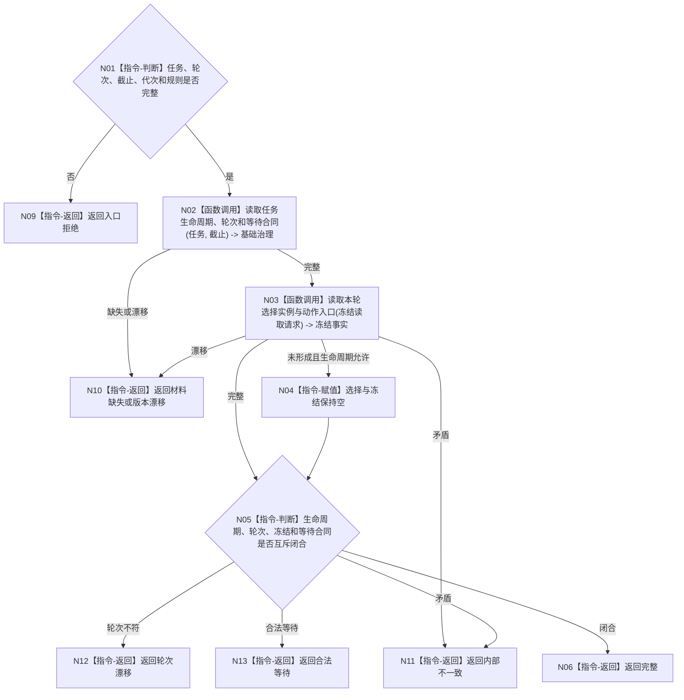

# BIZ-L4-004-11-01-03 读取任务治理状态合同目标函数流程图 v0.1

更新时间：2026-08-03

## 依据

```text
3200、5090、5210—5230、5300；BIZ-L3-004-11-01
```

## 身份与边界

正式目标函数设计图。按任务和事实截止读取生命周期、当前方法选择、执行冻结、等待合同和筹办轮次，并裁决结构互斥性。

## 函数合同

```text
根函数：任务承接数据操作::读取任务治理状态合同
归属模块 / 文件 / 层级：任务承接数据操作 / 海中鱼巣/领域/数据操作.任务承接.ixx / L4
现有或待新增：待新增；组合任务治理分支读取
完整签名：任务治理状态合同读取结果 任务承接数据操作::读取任务治理状态合同(const 任务治理状态合同读取请求& 请求) const
参数：请求为只读借用；含任务、期望轮次、事实截止、运行代次和治理规则版本
返回结果：不可变值式结果；含完整、合法等待、材料缺失、轮次漂移、版本漂移或内部不一致，以及生命周期、选择、冻结、等待合同和轮次
被调函数流程图：选择与冻结读取复用BIZ-L4-004-05-02-02；等待合同为简单专用读取
父图：BIZ-L3-004-11-01
```

## 流程图



## 节点合同

| 节点 | 类型 | 输入 | 输出 | 事实读写 | 验证 |
| --- | --- | --- | --- | --- | --- |
| N02/N03 | 函数调用 | 任务与截止 | 生命周期、轮次、等待、冻结 | 只读 | 同代次 |
| N05/N06 | 指令 | 治理材料 | 闭合合同 | 无写入 | 分支互斥 |

## 关键边界

合法等待必须由等待合同证明；材料缺失不能一律解释成等待。
