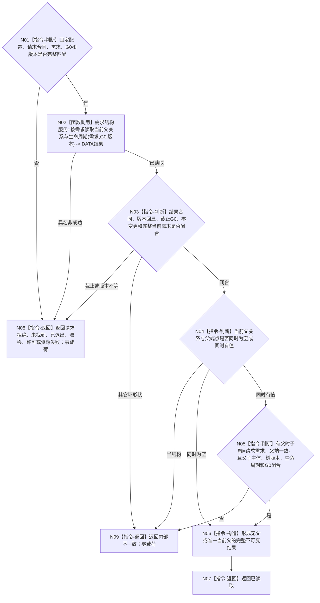

# BIZ-L4-004-11-03-01 读取需求当前父关系与生命周期目标函数流程图 v0.3

更新时间：2026-08-26

## 依据与迁移

```text
0050、3100、5100、5110、5160、4015；BIZ-L3-004-11-03；DATA-EXT-12
```

本图由旧 BIZ-L4-002-04-02-01 v0.2 迁移，函数合同不因迁移改变。002-04不再消费需求父关系；004-11父链读取及其它具名消费者统一复用本身份。

## 函数合同

```text
根函数：需求业务服务::读取需求当前父关系与生命周期
归属模块 / 文件 / 目标分解深度：需求业务服务 / 海中鱼巣/领域/服务.需求.ixx / BIZ-L4
现有或待新增：待新增；只消费 DATA-EXT-12 正式公开强类型读取
完整签名：需求当前父关系生命周期读取结果 需求业务服务::读取需求当前父关系与生命周期(const 需求当前父关系生命周期读取请求& 请求) const noexcept
参数：合同版本、运行代次、事实/需求范围版本、需求树/父关系/读取规则版本、需求身份和非零G0；版本匹配服务固定配置
返回结果：已读取时携带完整当前需求、可空唯一当前父关系、同现父端点和G0；未找到、已退出或其它非成功均零业务载荷
被调函数流程图：DATA-EXT-12“按需求和非零截止读取当前父关系与生命周期”
父图：BIZ-L3-004-11-03
```

## 流程图



## 强制边界

- 当前父关系至多一个；多父、半结构、错端点或跨主体属于内部不一致，不得选择第一项。
- 无父必须来自同 `G0` 完整读取的权威空结果，不是未找到、缓存未命中或历史补缺。
- 本函数不读取活动、路径权重、满足、结算或任务，不发布任何事实。
