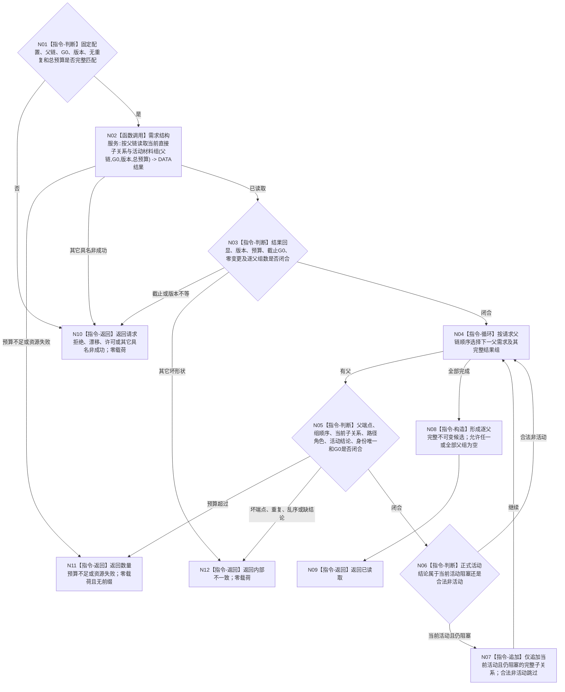

# BIZ-L4-004-11-03-02 读取父链各节点当前活动子关系目标函数流程图 v0.3

更新时间：2026-08-26

## 依据与迁移

```text
0050、3100、5100、5110、5160、4015；BIZ-L3-004-11-03；DATA-EXT-12
```

本图由旧 BIZ-L4-002-04-02-02 v0.2 迁移，函数合同不因迁移改变。002-04不再读取需求活动路径；004-11父链读取及其它具名消费者统一复用本身份。

## 函数合同

```text
根函数：需求业务服务::读取父链各节点当前活动子关系
归属模块 / 文件 / 目标分解深度：需求业务服务 / 海中鱼巣/领域/服务.需求.ixx / BIZ-L4
现有或待新增：待新增；只消费 DATA-EXT-12 正式公开强类型组读
完整签名：需求活动子关系组读取结果 需求业务服务::读取父链各节点当前活动子关系(const 需求活动子关系组读取请求& 请求) const noexcept
参数：合同版本、运行代次、范围/树/路径/活动/读取规则版本、根到叶非空无重复需求身份链、非零G0和非零当前子关系总数量预算；版本匹配固定配置
返回结果：已读取时按父链顺序逐父返回完整父端点和当前活动子关系组；任一父及全链均可为空组。预算不足或其它非成功零业务载荷
被调函数流程图：DATA-EXT-12“按父链和非零截止有界读取当前直接子关系与活动材料组”
父图：BIZ-L3-004-11-03
```

## 流程图



## 强制边界

- DATA 对请求父链每个父需求返回恰一完整结果组；空组不是缺组，不能由未找到或缓存未命中补造。
- BIZ只解释已发布强类型活动结论，不从权重、任务状态、创建时间或列表位置重算活动性。
- 数量预算覆盖全部当前直接子关系；预算不足不返回截断父组或前缀结果。
- 本函数不读取满足、结算或历史关系，不发布活动事实，也不重排父链。
