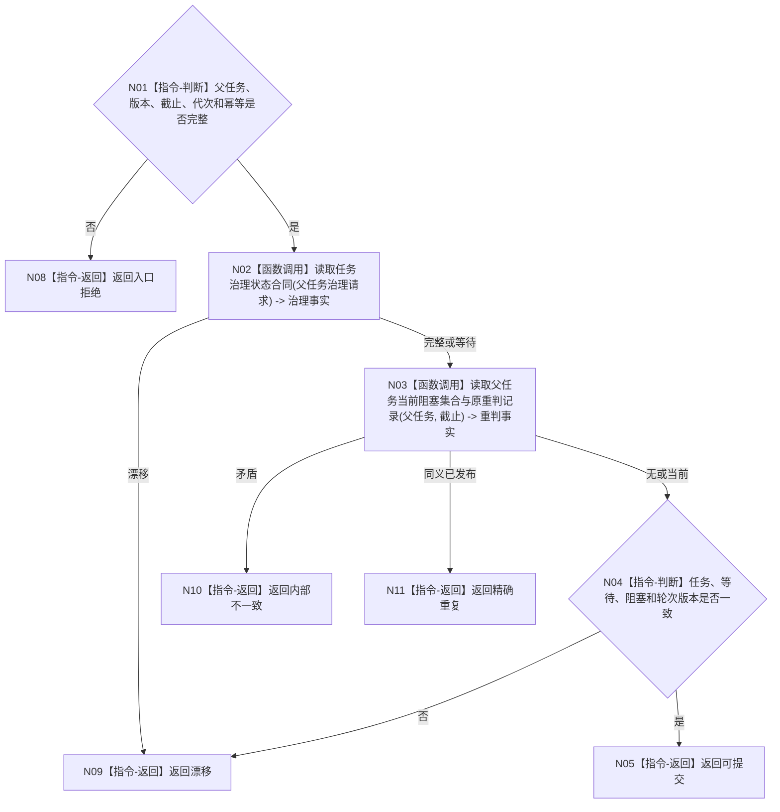

# BIZ-L4-004-12-03-01 读取父任务等待重判当前事实目标函数流程图 v0.1

更新时间：2026-08-03

## 依据

```text
3200、4010、5090、5210、5220；BIZ-L3-004-12-03
```

## 身份与边界

正式目标函数设计图。读取父任务当前生命周期、等待合同、剩余阻塞项、筹办轮次和原幂等重判事实；不修改父任务。

## 函数合同

```text
根函数：父任务重判数据操作::读取父任务等待重判当前事实
归属模块 / 文件 / 层级：父任务重判数据操作 / 海中鱼巣/领域/数据操作.父任务重判.ixx / L4
现有或待新增：待新增；组合任务状态、等待合同、阻塞集合和轮次读取
完整签名：父任务等待重判当前事实读取结果 父任务重判数据操作::读取父任务等待重判当前事实(const 父任务等待重判当前事实读取请求& 请求) const
参数：请求为只读借用；含父任务、预期任务/等待/轮次版本、事实截止、运行代次和幂等身份
返回结果：不可变值式结果；含可提交、精确重复、漂移或内部不一致，以及生命周期、等待合同、阻塞集合、轮次和版本
被调函数流程图：治理状态读取复用BIZ-L4-004-11-01-03
父图：BIZ-L3-004-12-03
```

## 流程图



## 节点合同

| 节点 | 类型 | 输入 | 输出 | 事实读写 | 验证 |
| --- | --- | --- | --- | --- | --- |
| N02/N03 | 函数调用 | 父任务与截止 | 治理和阻塞事实 | 只读 | 同轮同版本 |
| N04/N05 | 指令 | 当前事实 | 提交资格 | 无写入 | 重复与漂移分离 |

## 关键边界

保持等待可以没有生命周期变化，但必须有当前等待合同和阻塞集合证明。

