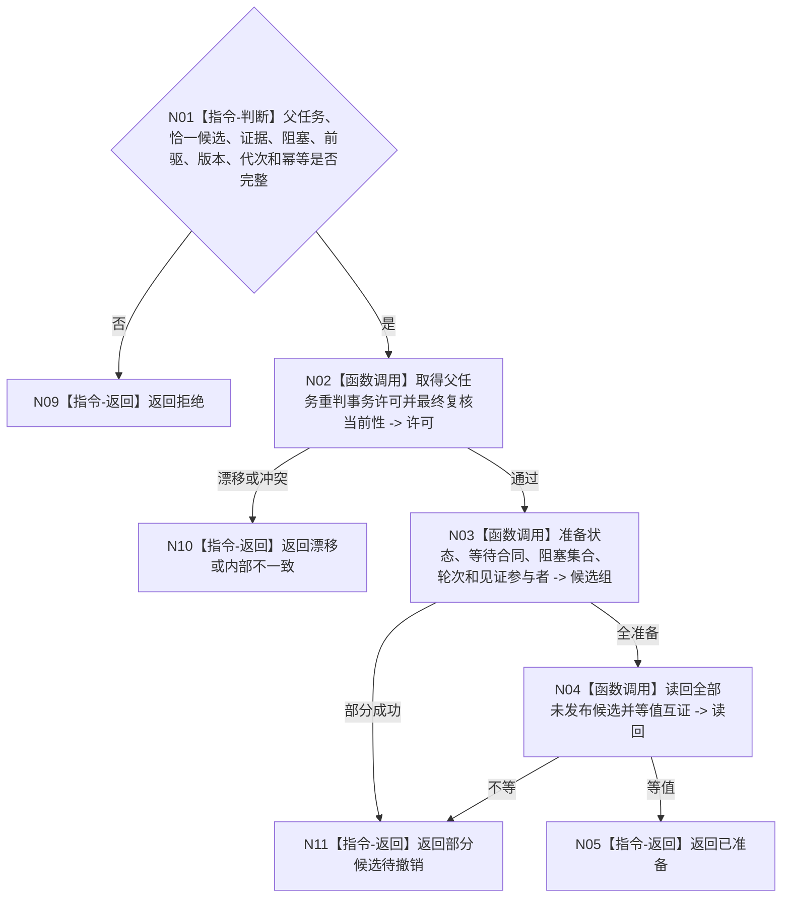

# BIZ-L4-004-12-03-02 准备父任务等待重判联合候选目标函数流程图 v0.1

更新时间：2026-08-03

## 依据

```text
3200、4010—4050、5210、5220；BIZ-L3-004-12-03
```

## 身份与边界

正式目标函数设计图。为保持等待、进入待重筹办或父任务目标已完成三类互斥候选准备状态、等待合同、阻塞集合、轮次和见证参与者。

## 函数合同

```text
根函数：父任务重判数据操作::准备父任务等待重判联合候选
归属模块 / 文件 / 层级：父任务重判数据操作 / 海中鱼巣/领域/数据操作.父任务重判.ixx / L4
现有或待新增：待新增
完整签名：父任务重判候选准备结果 父任务重判数据操作::准备父任务等待重判联合候选(const 父任务等待重判候选准备请求& 请求)
参数：请求为只读借用；含父任务、恰一重判候选、触发证据、阻塞项、前驱状态、预期版本、事实代次和幂等身份
返回结果：独占值式结果；含已准备、拒绝、漂移、部分候选待撤销或内部不一致，以及联合候选
被调函数流程图：参与者准备在L5展开
父图：BIZ-L3-004-12-03
```

## 流程图



## 节点合同

| 节点 | 类型 | 输入 | 输出 | 事实读写 | 验证 |
| --- | --- | --- | --- | --- | --- |
| N02—N04 | 函数调用 | 重判请求 | 不可见候选 | 仅候选 | 三分支互斥、轮次单调 |
| N05/N09—N11 | 返回 | 准备状态 | 候选或非成功 | 无发布 | 部分候选显式撤销 |

## 关键边界

父任务完成候选必须携带父任务自身目标已达成证据；子任务完成不能替代该证据。

