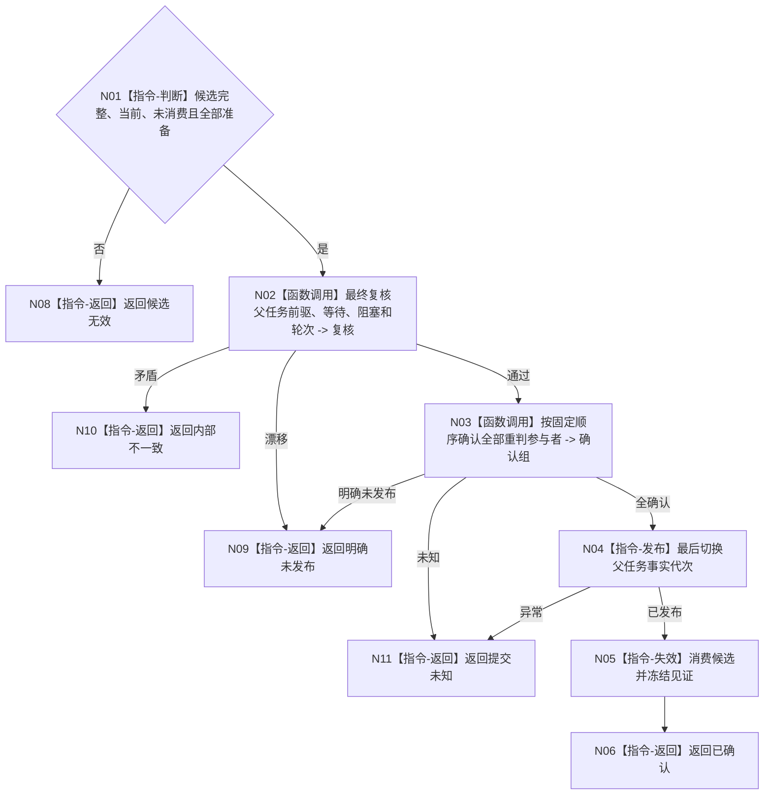

# BIZ-L4-004-12-03-03 确认父任务等待重判联合候选目标函数流程图 v0.1

更新时间：2026-08-03

## 依据

```text
3200、4010—4050、5210、5220；BIZ-L3-004-12-03
```

## 身份与边界

正式目标函数设计图。确认全部重判候选并最后发布一个父任务事实代次；不写父需求满足或服务结算。

## 函数合同

```text
根函数：父任务重判数据操作::确认父任务等待重判联合候选
归属模块 / 文件 / 层级：父任务重判数据操作 / 海中鱼巣/领域/数据操作.父任务重判.ixx / L4
现有或待新增：待新增
完整签名：父任务重判候选确认结果 父任务重判数据操作::确认父任务等待重判联合候选(父任务等待重判联合候选&& 候选) noexcept
参数：候选为独占右值；必须全部准备、当前且未消费，调用后失效
返回结果：值式结果；含已确认、明确未发布、提交未知、候选无效或内部不一致，以及权威代次和发布见证
被调函数流程图：参与者确认与最后发布在L5展开
父图：BIZ-L3-004-12-03
```

## 流程图



## 节点合同

| 节点 | 类型 | 输入 | 输出 | 事实读写 | 验证 |
| --- | --- | --- | --- | --- | --- |
| N02/N03 | 函数调用 | 联合候选 | 确认组 | 尚未公开 | 全参与者确认 |
| N04—N06 | 指令 | 确认组 | 发布代次与见证 | 最后发布 | 候选单次消费 |

## 关键边界

保持等待分支不得伪写生命周期变化；待重筹办分支轮次只能增加一次。
