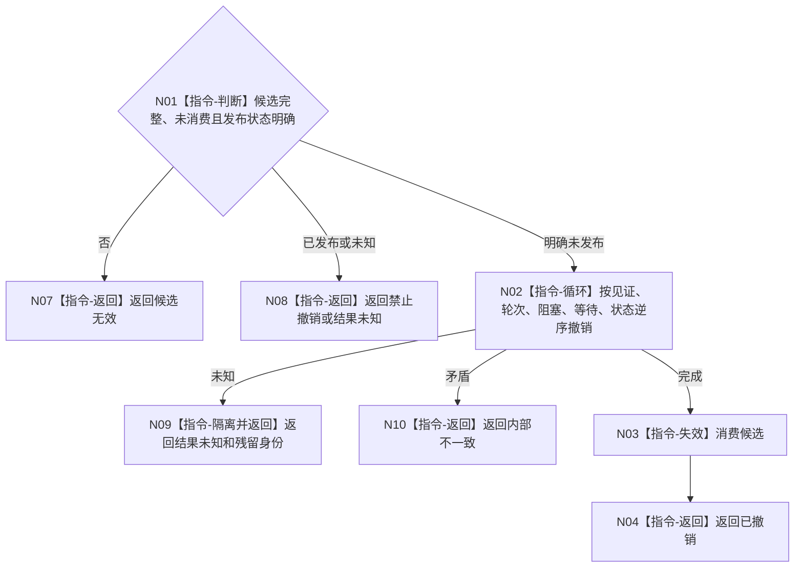

# BIZ-L4-004-12-03-04 撤销父任务等待重判联合候选目标函数流程图 v0.1

更新时间：2026-08-03

## 依据

```text
4010—4050、5210、5220；BIZ-L3-004-12-03
```

## 身份与边界

正式目标函数设计图。仅逆序撤销明确未发布的父任务重判候选；已发布或结果未知禁止撤销。

## 函数合同

```text
根函数：父任务重判数据操作::撤销父任务等待重判联合候选
归属模块 / 文件 / 层级：父任务重判数据操作 / 海中鱼巣/领域/数据操作.父任务重判.ixx / L4
现有或待新增：待新增
完整签名：父任务重判候选撤销结果 父任务重判数据操作::撤销父任务等待重判联合候选(父任务等待重判联合候选&& 候选) noexcept
参数：候选为独占右值；仅明确未发布时合法，调用后失效
返回结果：值式结果；含已撤销、禁止撤销、结果未知或内部不一致，以及残留隔离身份
被调函数流程图：无；按准备逆序撤销为本函数内顺序指令
父图：BIZ-L3-004-12-03
```

## 流程图



## 节点合同

| 节点 | 类型 | 输入 | 输出 | 事实读写 | 验证 |
| --- | --- | --- | --- | --- | --- |
| N02 | 指令 | 明确未发布候选 | 撤销状态 | 删除候选 | 严格逆序 |
| N03/N04 | 指令 | 已撤销候选 | 完成结果 | 无权威写入 | 单次消费 |

## 关键边界

撤销不得删除任何已发布任务事实；未知残留必须隔离。
