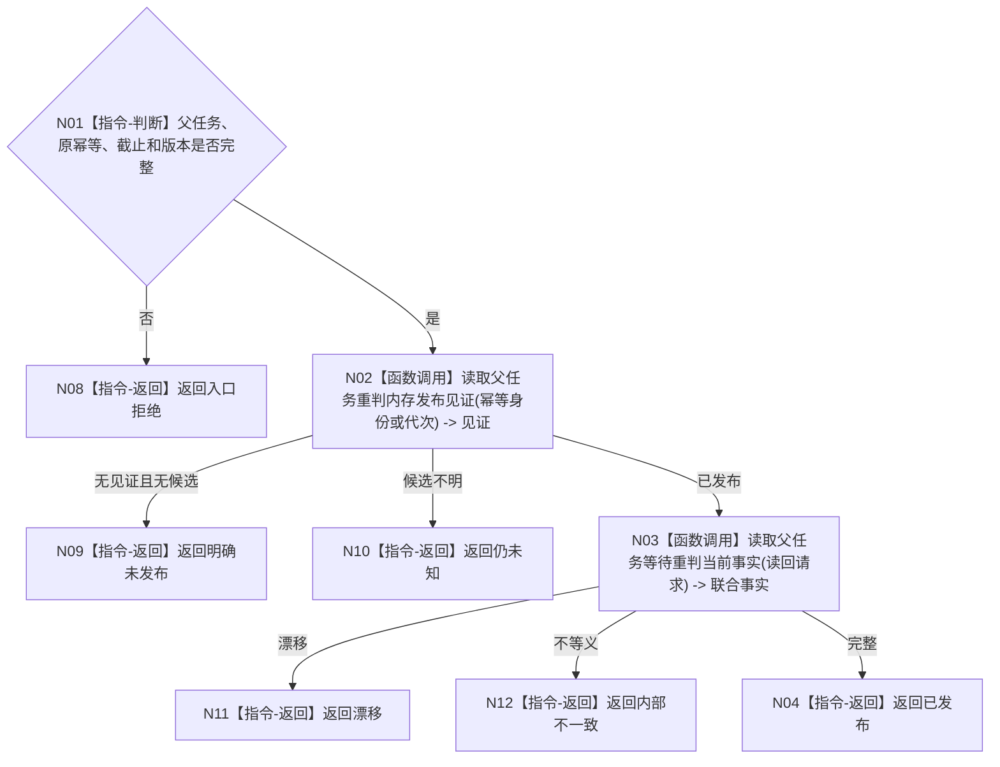

# BIZ-L4-004-12-03-05 读取父任务等待重判发布见证与联合事实目标函数流程图 v0.1

更新时间：2026-08-03

## 依据

```text
3200、4050、5210、5220；BIZ-L3-004-12-03
```

## 身份与边界

正式目标函数设计图。按原幂等身份或发布代次联合读取父任务状态、等待合同、阻塞集合、轮次和发布见证。

## 函数合同

```text
根函数：父任务重判数据操作::读取父任务等待重判发布见证与联合事实
归属模块 / 文件 / 层级：父任务重判数据操作 / 海中鱼巣/领域/数据操作.父任务重判.ixx / L4
现有或待新增：待新增
完整签名：父任务重判发布读回结果 父任务重判数据操作::读取父任务等待重判发布见证与联合事实(const 父任务重判发布读回请求& 请求) const
参数：请求为只读借用；含父任务、原幂等身份、可选发布代次、事实截止和预期版本
返回结果：不可变值式结果；含已发布、明确未发布、仍未知、漂移或内部不一致，以及状态、等待合同、阻塞集合、轮次和见证
被调函数流程图：当前治理读取复用BIZ-L4-004-12-03-01
父图：BIZ-L3-004-12-03
```

## 流程图



## 节点合同

| 节点 | 类型 | 输入 | 输出 | 事实读写 | 验证 |
| --- | --- | --- | --- | --- | --- |
| N02 | 函数调用 | 原身份或代次 | 权威见证 | 只读 | 不看日志/SQL |
| N03/N04 | 函数调用/返回 | 父任务 | 联合事实 | 只读 | 状态、等待、阻塞、轮次同代次 |

## 关键边界

发布见证和联合事实必须互证；仅有持久记录或日志不能证明发布。
