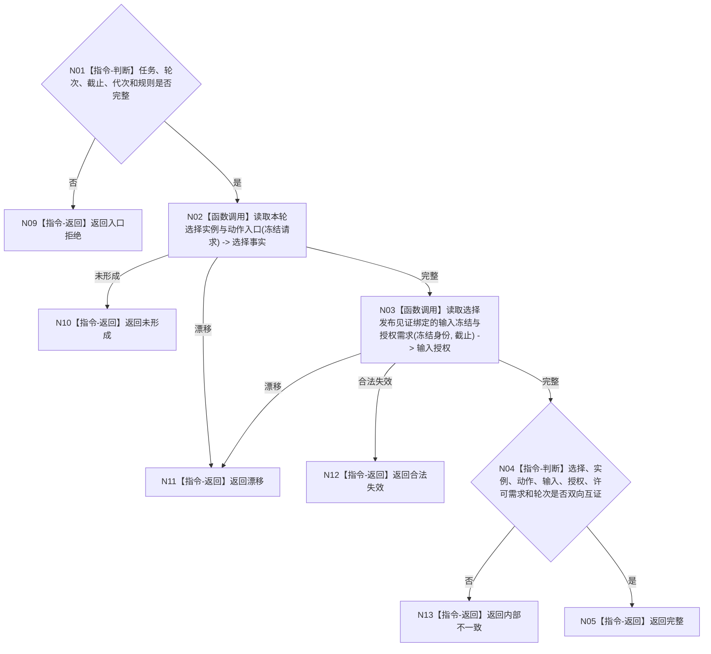

# BIZ-L4-004-13-02-01 读取当前选择实例动作入口与输入冻结目标函数流程图 v0.1

更新时间：2026-08-03

## 依据

```text
5090、5210、5230、5300、8100；BIZ-L3-004-13-02
```

## 身份与边界

正式目标函数设计图。调度阶段按任务和轮次读取当前选择、1—3实例方法、动作入口、输入冻结、授权和许可需求；不发放许可、不执行动作。

## 函数合同

```text
根函数：任务执行冻结事实提供者::读取当前选择实例动作入口与输入冻结
归属模块 / 文件 / 层级：任务执行冻结事实 / 海中鱼巣/领域/提供者.任务执行冻结事实.ixx / L4
现有或待新增：待新增；扩展执行冻结联合读取以包含输入冻结和授权需求
完整签名：当前执行冻结材料读取结果 任务执行冻结事实提供者::读取当前选择实例动作入口与输入冻结(const 当前执行冻结材料读取请求& 请求) const
参数：请求为只读借用；含任务、期望轮次、事实截止、运行代次和冻结规则版本
返回结果：不可变值式结果；含完整、未形成、合法失效、漂移或内部不一致，以及选择、实例、方法版本、动作入口、输入冻结、授权和许可需求
被调函数流程图：选择/实例/动作读取复用BIZ-L4-004-05-02-02；输入冻结为同发布见证专用读取
父图：BIZ-L3-004-13-02
```

## 流程图



## 节点合同

| 节点 | 类型 | 输入 | 输出 | 事实读写 | 验证 |
| --- | --- | --- | --- | --- | --- |
| N02/N03 | 函数调用 | 任务、轮次、截止 | 选择与输入授权 | 只读 | 同发布见证 |
| N04/N05 | 指令 | 冻结材料 | 完整结果 | 无写入 | 双向互证 |

## 关键边界

调度复核只证明可形成执行包；动作开始前仍须重新读取当前输入、许可、生存控制和禁止项。
