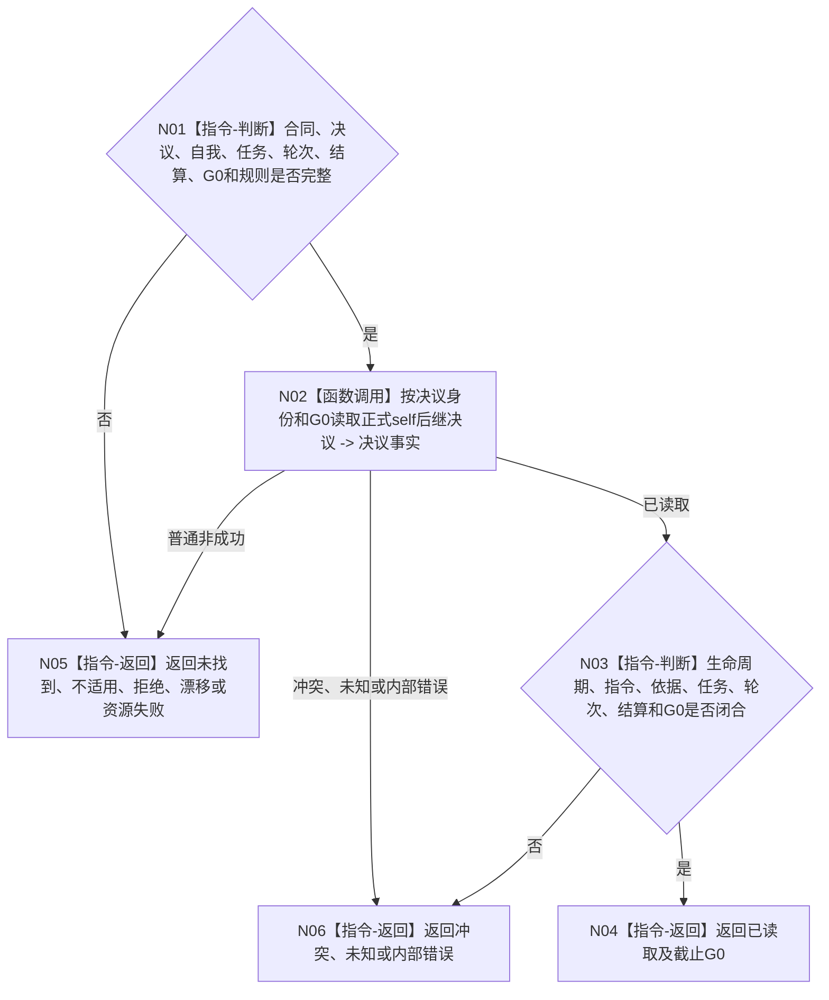

# BIZ-L4-004-16-01-01 读取自我任务后继决议目标函数流程图 v0.1

更新时间：2026-08-26

## 依据

```text
0050、5090 v0.8、8100 v0.8、8200
BIZ-L3-004-16-01
```

## 身份与边界

正式目标函数设计图。调用 self 后继决议 owner 的公开读取入口，以显式决议身份和 `G0` 返回完整决议；不按任务枚举或猜最近决议。

## 函数合同

```text
根函数：自我任务后继决议提供者::读取自我任务后继决议
归属模块 / 文件 / 目标分解深度：自我任务后继决议 / 海中鱼巣/领域/自我治理/服务.自我任务后继决议.ixx / BIZ-L4
现有或待新增：当前工作区已有被 `任务主阶段治理提供者` 调用的同名入口
完整签名：自我任务后继决议读取结果 自我任务后继决议提供者::读取自我任务后继决议(const 自我任务后继决议读取请求& 请求) const noexcept
参数：合同、决议、自我、任务、任务轮次、轮次结算、G0和规则
返回结果：已读取、未找到、不适用、入口/许可拒绝、当前性漂移、幂等冲突、资源失败、已可能发布或内部错误
被调函数流程图：无；owner公开读取
父图：BIZ-L3-004-16-01
```

## 流程图



## 关键边界

消息、线程缓存和任务当前值不能替代正式决议 owner 的指定身份读回。
