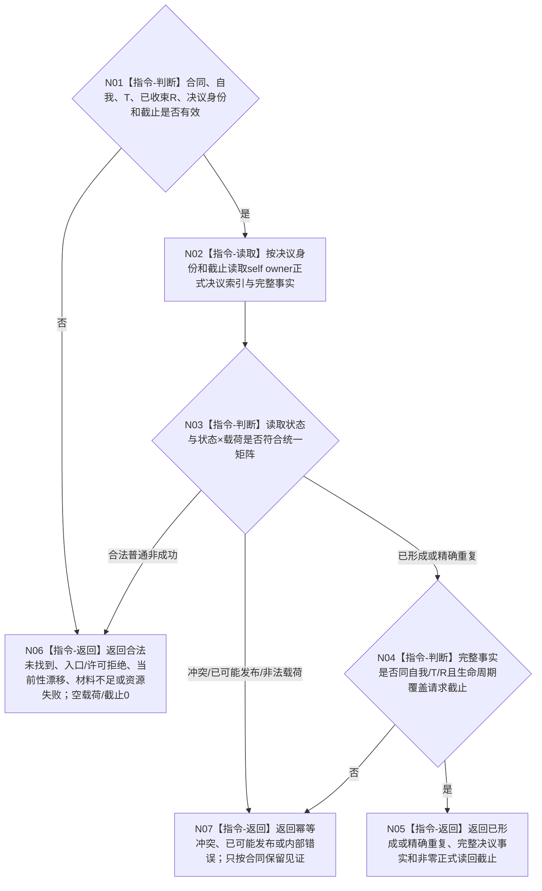

# BIZ-L4-004-16-01-01 读取自我任务后继决议目标函数流程图 v0.2

更新时间：2026-08-27

## 依据

```text
0050、3200 v0.9、5090 v0.8、8100 v0.8、8200
SELF-GOVERNANCE-CLOSURE-L4-INTEGRATED 详细设计 v0.1第6.7节、v0.3第5.2节
BIZ-L3-004-16-01 v0.2
```

## 身份与边界

正式目标函数设计图。self owner公开读取入口按显式决议身份、自我、任务、已收束任务轮次和非零截止返回唯一完整决议事实。它不按任务枚举、不猜“最近决议”、不读取消息正文，也不写任何事实。

## 函数合同

```text
根函数：自我任务后继决议提供者::读取自我任务后继决议
完整签名：自我任务后继决议读取结果 自我任务后继决议提供者::读取自我任务后继决议(const 自我任务后继决议读取请求& 请求) const noexcept
归属模块 / 文件 / 目标分解深度：海中鱼巣.领域.自我治理.服务.自我任务后继决议 / 海中鱼巣/领域/自我治理/服务.自我任务后继决议.ixx / BIZ-L4
实现状态：公开目标合同已由详细设计冻结；HEAD 09b40d6c 无该module或公开入口
参数：合同版本、自我、任务、已收束任务轮次、决议身份和非零截止
返回结果：状态、可选完整决议事实、可选四字段提交见证、本次正式读回截止；仅已形成/精确重复且事实完整、截止非零时成功
被调函数流程图：无；owner内部只读索引与事实回源属于后续代码函数图
父图：BIZ-L3-004-16-01 v0.2
```

## 流程图



## 状态与载荷边界

- 读取成功沿已冻结统一状态`已形成 / 精确重复`，不得另造`已读取`状态。
- `未找到`只对读取入口合法，完整事实、见证和截止均为空或零。
- `已可能发布`只携带四字段提交见证且成功否；读取调用者不得把见证当决议事实。
- 消息、线程缓存、当前任务值和历史最近项都不能替代指定身份读回。
