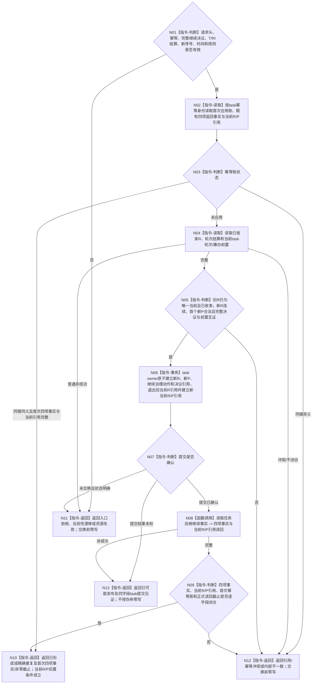

# BIZ-L4-004-16-02-01 写入或读取任务后继继续事实目标函数流程图 v0.2

更新时间：2026-08-27

## 依据

```text
0050、3200 v0.9、4260 v0.11、5090 v0.8、5210
SELF-GOVERNANCE-CLOSURE-L4-INTEGRATED 详细设计 v0.3第5.2节
BIZ-L3-004-16-02 v0.2
```

## 身份与边界

正式目标函数设计图。task owner机械入口只处理完整正式`继续当前任务`决议，以一个owner写集建立新任务轮次、该轮首个筹办轮次、继续治理动作和决议引用，并把`T→当前任务轮次`从已收束R切到新R、建立新R的当前筹办轮次引用；随后按首次幂等身份或完整事实身份独立读回四项返回事实并验证两个当前引用后置条件。它不选择后继指令、不调用阶段端口，也不写ARCH-L2状态或动态。

## 函数合同

```text
根函数：L2任务结构服务::写入或读取任务后继继续事实
完整签名：L2任务后继继续写入结果 L2任务结构服务::写入或读取任务后继继续事实(const L2任务后继继续写入请求& 请求) noexcept
归属模块 / 文件 / 目标分解深度：海中鱼巣.领域.服务.L2任务结构 / 海中鱼巣/领域/服务.L2任务结构.ixx / BIZ-L4
实现状态：正式业务语义已冻结；HEAD 5b163ca7 无该DTO或入口。详细设计v0.3未显式冻结当前R/P引用切换且仍含旧`许可拒绝`状态，机械公开ABI需先同步
参数：task请求头/幂等身份、完整self决议事实、T、已收束R、轮次结算、新任务轮次序号、新筹办轮次序号、发生时间和规则版本
返回结果：完整四项返回事实、四字段task提交见证和正式读回截止的互斥状态矩阵；首次/精确重复成功还保证当前R/P引用后置条件成立，已可能发布只保留见证
被调函数流程图：读取任务后继继续事实为同一task owner公开只读机械入口；owner内部L1事务不在BIZ图展开
父图：BIZ-L3-004-16-02 v0.2
```

## 流程图



## 关键边界

- 精确重复优先回显首次四项返回事实并复核当前R/P引用，零新应用、零新代次；同幂等身份任一字段异义均为幂等冲突。
- 提交确认后读回失败只能返回`已可能发布 + task提交见证`，不得返回普通资源失败冒充未写。
- 一个task写集建立task owner四项返回事实并同次切换当前R/P引用；阶段迁移属于后续ARCH-L2 owner提交。
- 新轮次不复制旧路径、实例、冻结、技术许可、现实执行授权或实际结果。
