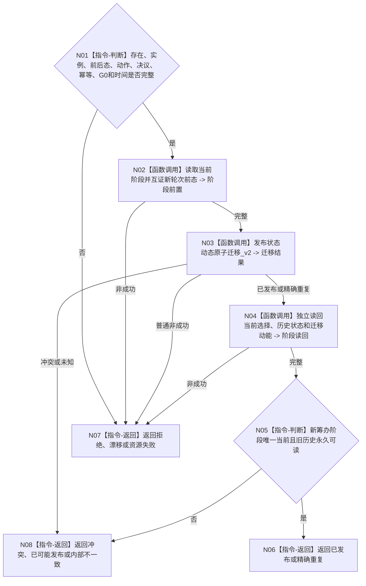

# BIZ-L4-004-16-03-01 发布并读回继续阶段迁移目标函数流程图 v0.1

更新时间：2026-08-26

## 依据

```text
0050、1160、4260 v0.11、5090 v0.8
BIZ-L3-004-16-03
```

## 身份与边界

正式目标函数设计图。消费已读回的新轮次事实，经任务阶段结构消费端口发布并读回新轮次筹办阶段迁移。只写ARCH-L2状态/动态公开结构，不在task owner复制第二状态。

## 函数合同

```text
根函数：任务阶段结构消费端口::发布阶段迁移
归属模块 / 文件 / 目标分解深度：任务阶段结构消费 / 海中鱼巣/领域/内部治理/服务.任务阶段结构消费端口.ixx / BIZ-L4
现有或待新增：当前工作区已有公开端口
完整签名：任务阶段写入结果 任务阶段结构消费端口::发布阶段迁移(const 任务阶段迁移请求& 请求) noexcept
参数：任务正式存在、阶段实例、前后态、继续治理动作、决议引用、幂等、G0和时间
返回结果：已发布、精确重复、入口/许可拒绝、当前性漂移、引用/幂等冲突、资源失败、已可能发布或内部不一致
被调函数流程图：复用状态动态原子迁移v2和正式读回
父图：BIZ-L3-004-16-03
```

## 流程图



## 关键边界

阶段迁移失败不得回退或删除已经正式建立的新任务轮次；保留同键恢复并禁止派发半接线新轮次。
