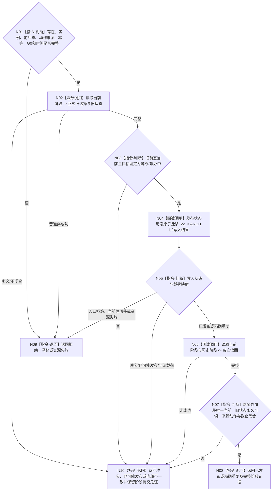

# BIZ-L4-004-16-03-01 发布并读回继续阶段迁移目标函数流程图 v0.2

更新时间：2026-08-27

## 依据

```text
0050、1160、3200 v0.9、4260 v0.11、5090 v0.8、5210
SELF-GOVERNANCE-CLOSURE-L4-INTEGRATED 详细设计 v0.3第5.1—5.2节
BIZ-L3-004-16-03 v0.2
```

## 身份与边界

正式目标函数设计图。任务阶段结构消费端口把一个完整`任务阶段迁移请求`映射到ARCH-L2状态动态原子迁移v2，并独立读取当前阶段和永久历史。它只映射公开ABI和状态×载荷，不在task owner保存阶段副本。

## 函数合同

```text
根函数：任务阶段结构消费端口::发布阶段迁移
完整签名：任务阶段写入结果 任务阶段结构消费端口::发布阶段迁移(const 任务阶段迁移请求& 请求) noexcept
归属模块 / 文件 / 目标分解深度：海中鱼巣.领域.内部治理.服务.任务阶段结构消费端口 / 海中鱼巣/领域/内部治理/服务.任务阶段结构消费端口.ixx / BIZ-L4
实现状态：正式业务语义已冻结；冻结发布提交 5b163ca7 无该module或公开端口。详细设计v0.3仍含新合同不得产生的`许可拒绝`状态，端口ABI需先同步
参数：正式任务存在、阶段实例、旧当前选择/旧状态、固定筹办后态、继续治理动作来源、阶段幂等身份、G0和发生时间
返回结果：已发布、精确重复、入口拒绝、当前性漂移、引用/幂等冲突、资源失败、已可能发布或内部不一致；成功携带完整阶段迁移证据和正式读回截止
被调函数流程图：ARCH-L2 `发布状态动态原子迁移_v2`、当前/历史正式读取；属于DATA能力，不在本BIZ图重复展开
父图：BIZ-L3-004-16-03 v0.2
```

## 流程图



## 关键边界

- 本端口的提交代次和正式读回截止独立于task owner前段，不要求等于task截止。
- provider提交确认后读回失败必须保留阶段提交见证，不能把已发布迁移伪装成零写资源失败。
- 历史状态永久可读，当前性只由唯一当前选择关系表达；迁移不删除旧状态事实。
