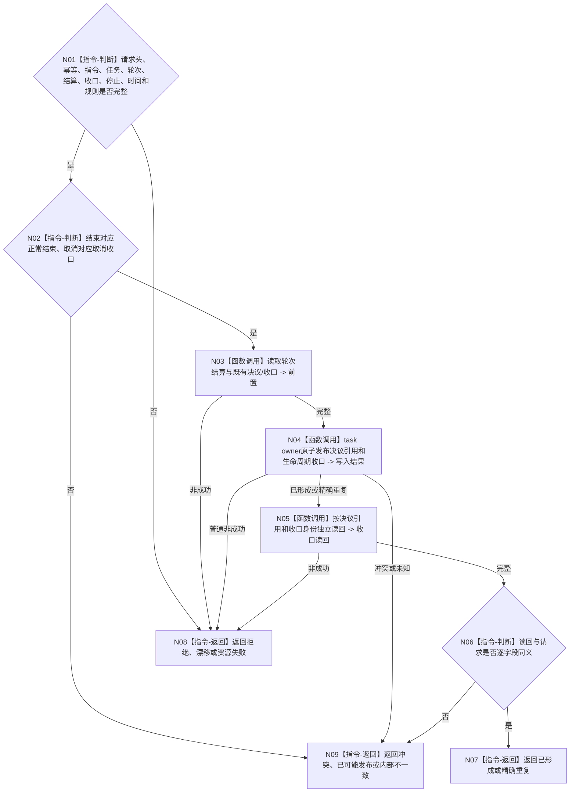

# BIZ-L4-004-16-04-01 写入或读取任务生命周期收口目标函数流程图 v0.1

更新时间：2026-08-26

## 依据

```text
0050、4260 v0.11、5090 v0.8
BIZ-L3-004-16-04
```

## 身份与边界

正式目标函数设计图。task owner按结束或取消指令发布决议引用和对应生命周期收口，并独立读回；不删除任务、轮次或结果历史，不建立新轮次。

## 函数合同

```text
根函数：L2任务结构服务::写入或读取任务生命周期收口
归属模块 / 文件 / 目标分解深度：任务结构 owner / 海中鱼巣/领域/服务.L2任务结构.ixx / BIZ-L4
现有或待新增：当前工作区已有同名WIP
完整签名：L2任务生命周期收口写入结果 L2任务结构服务::写入或读取任务生命周期收口(const L2任务生命周期收口写入请求& 请求) noexcept
参数：L2请求头、幂等、结束/取消指令、任务、已收束轮次、轮次结算、收口种类、可选停止证据、时间和规则
返回结果：已形成、精确重复、入口/许可拒绝、当前性漂移、引用/幂等冲突、资源失败、已可能发布或内部不一致
被调函数流程图：无；owner内部事务和读回
父图：BIZ-L3-004-16-04
```

## 流程图



## 关键边界

等待指令不得调用本入口；结束/取消收口不发布需求满足、价值结算或新轮次。
