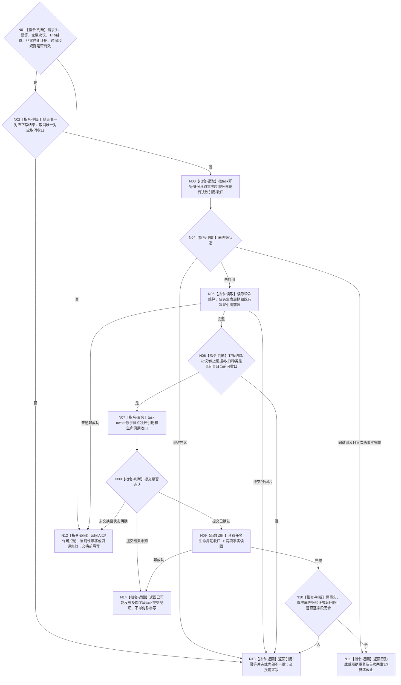

# BIZ-L4-004-16-04-01 写入或读取任务生命周期收口目标函数流程图 v0.2

更新时间：2026-08-27

## 依据

```text
0050、3200 v0.9、4260 v0.11、5090 v0.8、5210
SELF-GOVERNANCE-CLOSURE-L4-INTEGRATED 详细设计 v0.3第5.2节
BIZ-L3-004-16-04 v0.2
```

## 身份与边界

正式目标函数设计图。task owner机械入口只接受完整正式结束或取消决议、匹配的非零任务运行停止证据和唯一对应收口种类，以一个写集建立决议引用和生命周期收口，再独立读回两项事实。它不建立新任务轮次、筹办轮次、阶段迁移或需求结论。

## 函数合同

```text
根函数：L2任务结构服务::写入或读取任务生命周期收口
完整签名：L2任务生命周期收口写入结果 L2任务结构服务::写入或读取任务生命周期收口(const L2任务生命周期收口写入请求& 请求) noexcept
归属模块 / 文件 / 目标分解深度：海中鱼巣.领域.服务.L2任务结构 / 海中鱼巣/领域/服务.L2任务结构.ixx / BIZ-L4
实现状态：机械公开合同已由详细设计冻结；HEAD 09b40d6c 无该DTO或入口
参数：task请求头/幂等身份、完整self结束/取消决议事实、T、已收束R、轮次结算、非零停止证据、收口种类、发生时间和规则版本
返回结果：完整决议引用/生命周期收口、四字段task提交见证和正式读回截止的互斥矩阵；首次/精确重复成功，已可能发布只保留见证
被调函数流程图：读取任务生命周期收口为同一task owner公开只读机械入口；owner内部L1事务不在BIZ图展开
父图：BIZ-L3-004-16-04 v0.2
```

## 流程图



## 关键边界

- 结束与取消都必须携带匹配的非零任务运行停止证据；不得以轮次已收束、线程返回或空身份代替。
- 精确重复回显首次决议引用和生命周期收口，零新应用；同键异义为幂等冲突。
- 提交确认后读回失败返回`已可能发布 + task提交见证`，不得报告普通资源失败并重做收口。
- 等待指令不调用本入口；结束/取消不发布需求满足、价值、归因、结果分配或新轮次。
