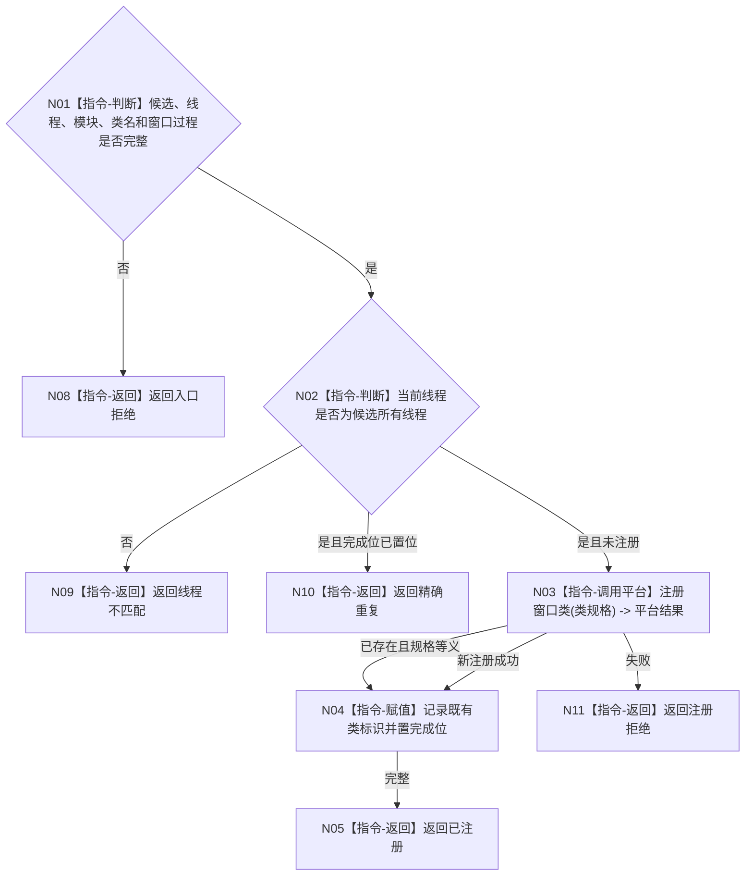

# BIZ-L4-005-01-01-01 注册控制面板窗口类目标函数流程图 v0.1

更新时间：2026-08-03

## 依据

```text
8110、8120；BIZ-L3-005-01-01
```

## 身份与边界

正式目标函数设计图。在控制面板线程上幂等注册当前进程窗口类并冻结注册完成位；不创建窗口、不读取业务事实。

## 函数合同

```text
根函数：控制面板窗口端口::注册控制面板窗口类
归属模块 / 文件 / 层级：控制面板窗口 / 海中鱼巣/界面/控制面板窗口.cpp / L4
现有或待新增：适配扩展；复用现有Win32窗口类注册
完整签名：控制面板窗口类注册结果 控制面板窗口端口::注册控制面板窗口类(控制面板窗口资源候选& 候选)
参数：候选为可变独占借用；含线程身份、模块句柄、类名、窗口过程和注册完成位
返回结果：值式结果；含已注册、精确重复、线程不匹配、注册拒绝或内部错误，以及类标识和完成位
被调函数流程图：无；平台注册调用为叶子外部边界
父图：BIZ-L3-005-01-01
```

## 流程图



## 节点合同

| 节点 | 类型 | 输入 | 输出 | 事实读写 | 验证 |
| --- | --- | --- | --- | --- | --- |
| N02/N03 | 指令 | 候选 | 平台注册结果 | 仅UI资源 | 线程亲和、等义重复 |
| N04/N05 | 指令 | 类标识 | 完成位 | 进程内状态 | 幂等 |

## 关键边界

窗口类注册只证明平台资源可用，不证明窗口实例、页面或投影已建立。
