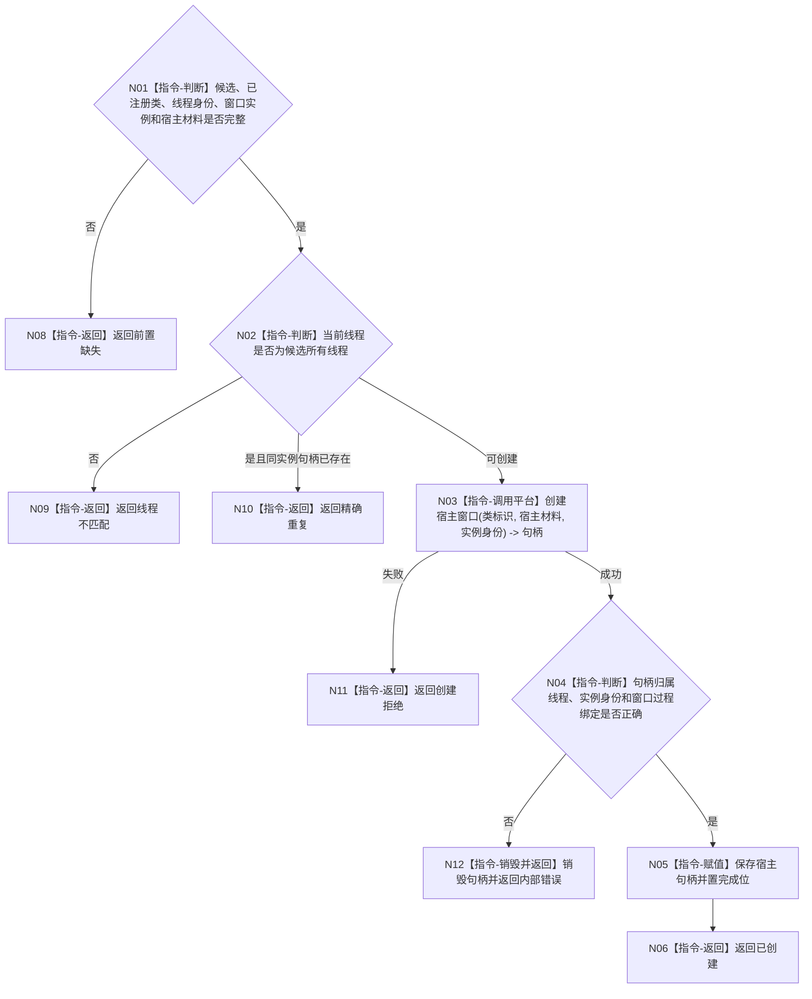

# BIZ-L4-005-01-01-02 创建控制面板宿主窗口目标函数流程图 v0.1

更新时间：2026-08-03

## 依据

```text
8110、8120；BIZ-L3-005-01-01
```

## 身份与边界

正式目标函数设计图。在已注册窗口类上创建唯一宿主窗口句柄并绑定稳定窗口实例；不创建Web资源、不显示页面。

## 函数合同

```text
根函数：控制面板窗口端口::创建控制面板宿主窗口
归属模块 / 文件 / 层级：控制面板窗口 / 海中鱼巣/界面/控制面板窗口.cpp / L4
现有或待新增：适配扩展；复用现有Win32宿主窗口创建
完整签名：控制面板宿主窗口创建结果 控制面板窗口端口::创建控制面板宿主窗口(控制面板窗口资源候选& 候选, const 控制面板宿主材料& 宿主材料)
参数：候选为可变独占借用；宿主材料为只读借用，含父句柄、尺寸、模式和平台创建参数
返回结果：值式结果；含已创建、精确重复、前置缺失、线程不匹配、创建拒绝或内部错误，以及宿主句柄和完成位
被调函数流程图：无；平台窗口创建为叶子外部边界
父图：BIZ-L3-005-01-01
```

## 流程图



## 节点合同

| 节点 | 类型 | 输入 | 输出 | 事实读写 | 验证 |
| --- | --- | --- | --- | --- | --- |
| N02/N03 | 指令 | 类与宿主材料 | 平台句柄 | UI资源 | 线程亲和 |
| N04—N06 | 指令 | 句柄 | 完成位 | 进程内窗口状态 | 绑定稳定实例 |

## 关键边界

本地句柄只是实现材料，不是业务身份；创建宿主窗口不证明页面资源或业务投影可用。
