# BIZ-L4-005-01-01-03 创建控制面板窗口资源组目标函数流程图 v0.1

更新时间：2026-08-03

## 依据

```text
8110、8120；BIZ-L3-005-01-01
```

## 身份与边界

正式目标函数设计图。在宿主窗口上创建页面运行环境、控制器及必要回调资源组；部分失败逆序回收本轮资源。

## 函数合同

```text
根函数：控制面板窗口端口::创建控制面板窗口资源组
归属模块 / 文件 / 层级：控制面板窗口 / 海中鱼巣/界面/控制面板窗口.cpp / L4
现有或待新增：适配扩展；复用现有WebView2与窗口资源创建
完整签名：控制面板窗口资源组创建结果 控制面板窗口端口::创建控制面板窗口资源组(控制面板窗口资源候选& 候选)
参数：候选为可变独占借用；必须含当前线程、宿主句柄、窗口实例和资源完成位
返回结果：值式结果；含已创建、精确重复、前置缺失、异步创建拒绝或内部错误，以及资源组和完成位
被调函数流程图：无；平台异步资源创建与回调为叶子外部边界
父图：BIZ-L3-005-01-01
```

## 流程图

```mermaid
flowchart TD
 N01{"N01【指令-判断】候选、线程、宿主句柄和窗口实例是否完整"} -->|否| N10["N10【指令-返回】返回前置缺失"]
 N01 -->|已完整创建| N11["N11【指令-返回】返回精确重复"]
 N01 -->|可创建| N02["N02【指令-调用平台】创建页面运行环境并等待具名完成 -> 环境结果"]
 N02 -->|失败| N08["N08【指令-回收】逆序释放本轮资源"]
 N02 -->|成功| N03["N03【指令-调用平台】创建窗口控制器并等待具名完成 -> 控制器结果"]
 N03 -->|失败| N08
 N03 -->|成功| N04["N04【指令-注册】登记导航、消息、关闭和尺寸回调令牌"]
 N04 -->|失败| N08
 N04 -->|完整| N05["N05【指令-赋值】冻结资源组和完成位"] --> N06["N06【指令-返回】返回已创建"]
 N08 -->|回收完整| N12["N12【指令-返回】返回异步创建拒绝"]
 N08 -->|回收不一致| N13["N13【指令-返回】返回内部错误"]
```



## 节点合同

| 节点 | 类型 | 输入 | 输出 | 事实读写 | 验证 |
| --- | --- | --- | --- | --- | --- |
| N02—N04 | 指令 | 宿主与候选 | 环境、控制器、令牌 | UI资源 | 具名异步完成 |
| N05/N06 | 指令 | 完整资源 | 资源组 | 进程内状态 | 完成位闭合 |
| N08 | 指令 | 部分资源 | 回收结果 | 释放UI资源 | 严格逆序 |

## 关键边界

资源组创建不读取业务事实；异步回调或页面消息不能成为业务入口。

