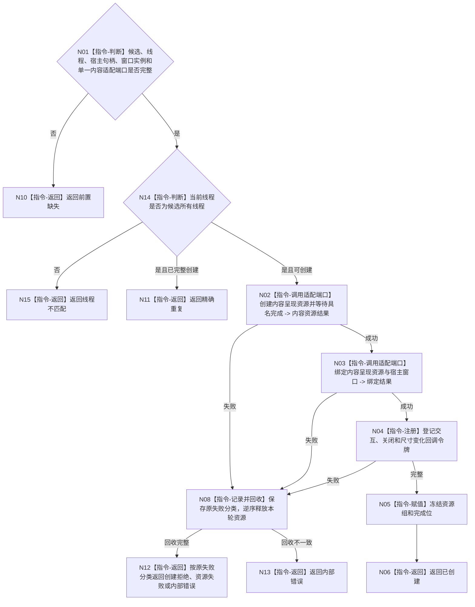

# BIZ-L4-005-01-01-03 创建控制面板窗口资源组目标函数流程图 v0.2

更新时间：2026-08-27

## 依据

```text
8110 v0.3、8120 v0.10；BIZ-L3-005-01-01 v0.2
HEAD 5bcc121d：不存在控制面板内容呈现、交互适配或回调资源生产实现
```

## 身份与边界

正式目标函数设计图。在宿主窗口上经一个已由详细设计选择的内容适配端口创建内容呈现、宿主绑定及必要交互回调资源组；部分失败逆序回收本轮资源。8120没有冻结WebView、HTML或原生控件等具体技术，本图也不替详细设计作该选择。

## 函数合同

```text
根函数：控制面板窗口端口::创建控制面板窗口资源组
归属模块 / 文件 / 目标分解深度：控制面板窗口 / 海中鱼巣/界面/控制面板窗口.cpp / BIZ-L4
现有或待新增：待新增；具体内容技术必须由后继详细设计冻结，当前图只要求单一适配端口、完整资源组和逆序回收
完整签名：控制面板窗口资源组创建结果 控制面板窗口端口::创建控制面板窗口资源组(控制面板窗口资源候选& 候选)
参数：候选为可变独占借用；必须含当前线程、宿主句柄、窗口实例、单一内容适配端口和资源完成位
返回结果：值式结果；含已创建、精确重复、前置缺失、线程不匹配、创建拒绝、资源失败或内部错误，以及资源组和完成位
被调函数流程图：无；由详细设计选定的内容适配端口及平台回调属于叶子外部边界
父图：BIZ-L3-005-01-01
```

## 流程图



## 节点合同

| 节点 | 类型 | 输入 | 输出 | 事实读写 | 验证 |
| --- | --- | --- | --- | --- | --- |
| N02—N04 | 指令 | 宿主、候选与单一内容适配端口 | 内容呈现资源、宿主绑定、交互令牌 | UI资源 | 具名完成、技术实现不泄漏到业务合同 |
| N05/N06 | 指令 | 完整资源 | 资源组 | 进程内状态 | 完成位闭合 |
| N08 | 指令 | 部分资源 | 回收结果 | 释放UI资源 | 严格逆序 |

## 关键边界

资源组创建不读取业务事实；内容回调或界面消息不能成为业务入口。WebView、HTML、原生控件或其它具体实现只有经后继详细设计选择后才能施工，不能从本目标图反推。
