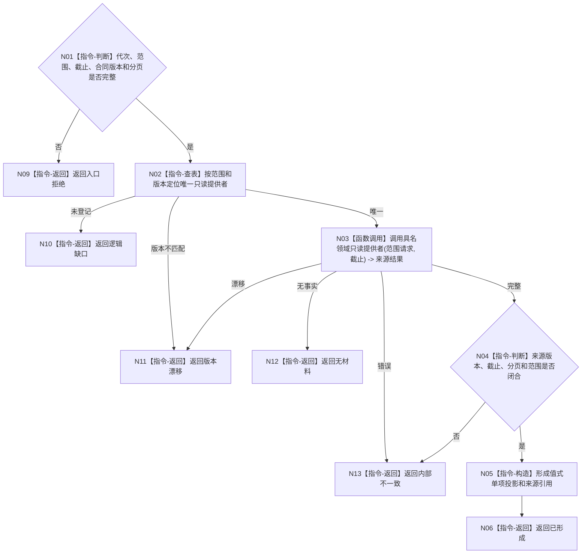

# BIZ-L4-005-03-01-01 按投影提供者读取一项业务投影目标函数流程图 v0.2

更新时间：2026-08-27

## 依据

```text
4020、4030、8120 v0.10；BIZ-L3-005-03-01 v0.2
HEAD d8a692af：不存在控制面板投影提供者注册表
```

## 身份与边界

正式目标函数设计图。按具名范围和合同版本选择一个已登记只读提供者，并在固定事实截止下形成值式单项投影；不直连SQL、日志或缓存补造事实。

## 函数合同

```text
根函数：控制面板投影提供者注册表::按投影提供者读取一项业务投影
归属模块 / 文件 / 层级：控制面板投影提供者 / 海中鱼巣/领域/提供者.控制面板投影.ixx / L4
现有或待新增：待新增；登记具名范围到只读提供者的版本化调度
完整签名：控制面板单项业务投影读取结果 控制面板投影提供者注册表::按投影提供者读取一项业务投影(const 控制面板单项业务投影读取请求& 请求) const
参数：请求为只读借用；含运行代次、具名范围、事实截止、提供者合同版本、分页限制和可选游标
返回结果：不可变值式结果；含已形成、无材料、逻辑缺口、版本漂移或内部不一致，以及值式投影、来源版本和分页游标
被调函数流程图：具体提供者仅使用各领域已登记只读入口；按范围在后续L5设计包展开
父图：BIZ-L3-005-03-01
```

## 流程图



## 节点合同

| 节点 | 类型 | 输入 | 输出 | 事实读写 | 验证 |
| --- | --- | --- | --- | --- | --- |
| N02/N03 | 指令/调用 | 具名范围 | 来源结果 | 只读领域事实 | 唯一提供者 |
| N04—N06 | 指令 | 来源结果 | 单项投影 | 无写入 | 截止和版本闭合 |

## 关键边界

投影提供者不得解析页面材料，也不得用旧值槽、隐式最新或日志填补缺失事实。
