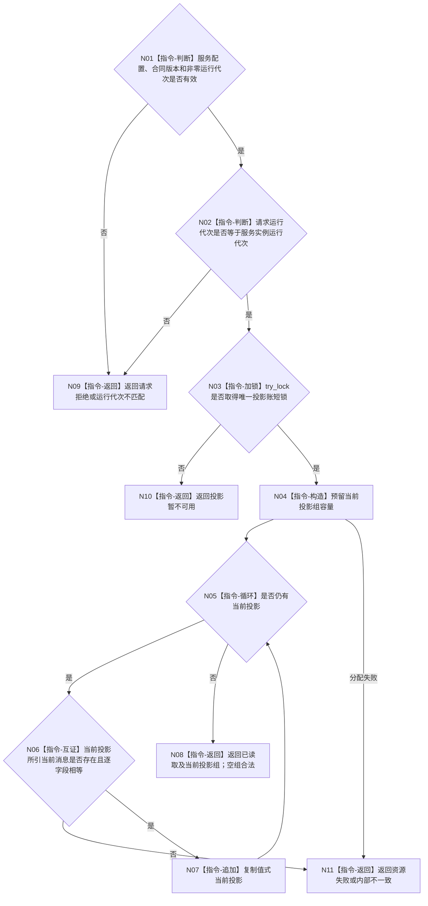

# BIZ-L4-005-03-02-01 读取当前线程投影组目标函数流程图 v0.2

更新时间：2026-08-28

## 依据

```text
4050、8110 v0.3；BIZ-L3-005-03-02 v0.2
HEAD 4a8972db，源码 blob `9f74b91c`：海中鱼巣/线程/投影.线程生命周期.ixx 已发布本入口
```

## 身份与边界

正式目标函数设计图。直接复用已发布线程生命周期投影读取端口，在一次短锁内复制当前运行代次的全部当前线程投影。provider已经互证每项当前消息与消息账，不暴露原始消息枚举、截止分页或第二归并入口。

## 函数合同

```text
根函数：线程生命周期投影读取端口::读取当前线程投影组
归属模块 / 文件 / 目标分解深度：海中鱼巣.线程.投影.线程生命周期 / 海中鱼巣/线程/投影.线程生命周期.ixx / BIZ-L4
现有或待新增：当前复用；已发布代码实现
完整签名：当前线程投影组读取结果 线程生命周期投影读取端口::读取当前线程投影组(const 当前线程投影组读取请求& 请求) const noexcept
参数：请求只含线程生命周期投影合同版本和非零运行代次
返回结果：已读取、请求拒绝、运行代次不匹配、投影暂不可用、资源失败或内部不一致，以及仅在成功时允许的当前投影组；成功空组合法
被调函数流程图：无；公开实现的校验、try_lock、消息账互证和值式复制均为本函数内指令
父图：BIZ-L3-005-03-02
```

## 流程图



## 节点合同

| 节点 | 类型 | 输入 | 输出 | 事实读写 | 验证 |
| --- | --- | --- | --- | --- | --- |
| N01—N03 | 判断/加锁 | 读取请求与服务配置 | 读取资格 | 锁外校验、短锁只读 | 坏合同、错代、锁竞争 |
| N04—N08 | 构造/循环/互证/返回 | 当前投影账与消息账 | 值式当前投影组 | 无写入 | 每项当前消息互证、空组合法 |

## 关键边界

当前线程投影用于线程可见性；它不是任务状态、等待或完成事实。本函数不接受DATA-L1事实截止、线程范围、消息截止、分页或游标，控制面板范围筛选在锁外组合器内完成。
