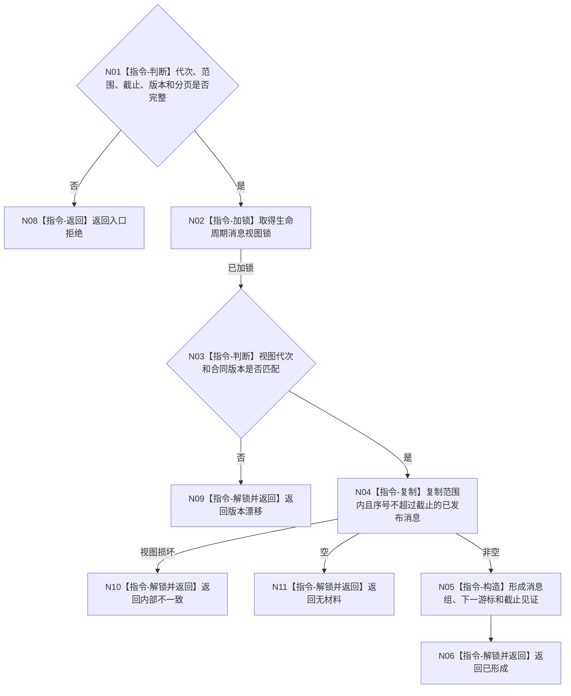

# BIZ-L4-005-03-02-01 读取截止序号内生命周期消息组目标函数流程图 v0.1

更新时间：2026-08-03

## 依据

```text
8110；BIZ-L3-005-03-02
```

## 身份与边界

正式目标函数设计图。从已发布线程生命周期消息视图读取不超过截止序号的值式消息组；不消费消息、不读取候选槽。

## 函数合同

```text
根函数：线程生命周期消息视图::读取截止序号内生命周期消息组
归属模块 / 文件 / 层级：线程生命周期消息视图 / 海中鱼巣/线程/视图.线程生命周期消息.ixx / L4
现有或待新增：待新增；消费8110共用队列的已发布只读视图
完整签名：线程生命周期消息组读取结果 线程生命周期消息视图::读取截止序号内生命周期消息组(const 线程生命周期消息组读取请求& 请求) const
参数：请求为只读借用；含运行代次、线程范围、截止序号、合同版本、分页限制和可选游标
返回结果：不可变值式结果；含已形成、无材料、版本漂移或内部不一致，以及消息组、下一游标和截止见证
被调函数流程图：无；锁内已发布视图复制为简单队列读取
父图：BIZ-L3-005-03-02
```

## 流程图



## 节点合同

| 节点 | 类型 | 输入 | 输出 | 事实读写 | 验证 |
| --- | --- | --- | --- | --- | --- |
| N02—N04 | 指令 | 读取请求 | 已发布消息副本 | 锁内只读 | 候选零可见 |
| N05/N06 | 指令 | 消息副本 | 值式结果 | 无写入 | 稳定分页 |

## 关键边界

生命周期消息用于线程可见性；它不是任务状态、等待或完成事实。

