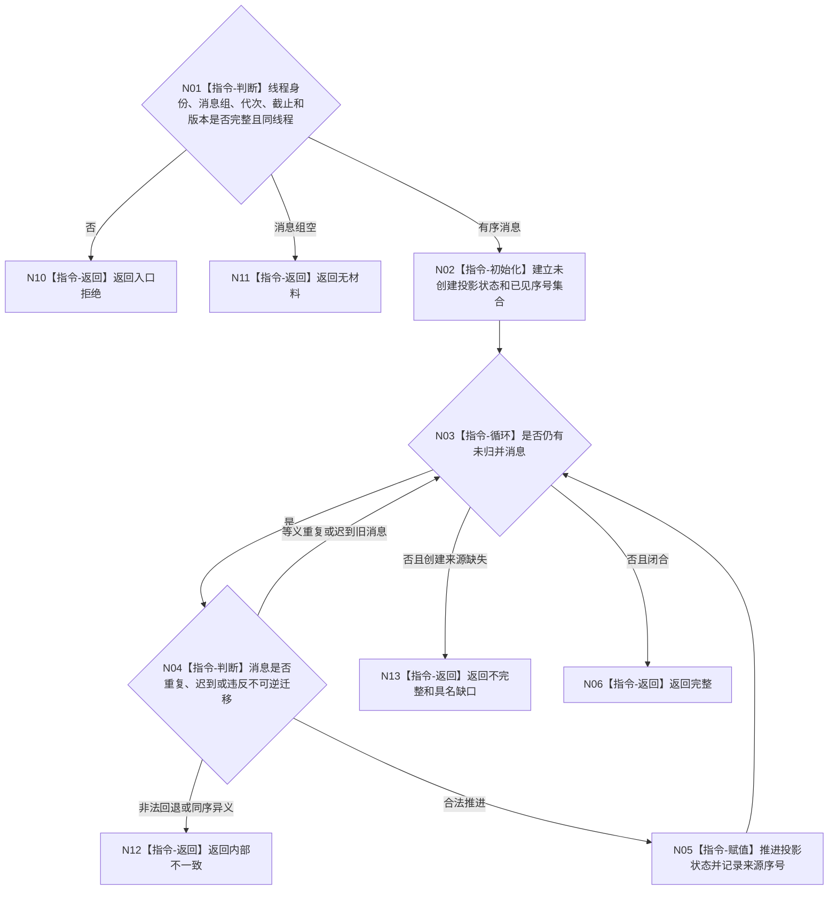

# BIZ-L4-005-03-02-02 按逻辑线程归并生命周期目标函数流程图 v0.1

更新时间：2026-08-03

## 依据

```text
8110；BIZ-L3-005-03-02
```

## 身份与边界

正式目标函数设计图。对一个逻辑线程的有序生命周期消息执行不可逆状态归并；迟到旧消息不覆盖新状态，创建来源缺失形成具名不完整投影。

## 函数合同

```text
根函数：线程生命周期投影服务::按逻辑线程归并生命周期
归属模块 / 文件 / 层级：线程生命周期投影 / 海中鱼巣/线程/服务.线程生命周期投影.ixx / L4
现有或待新增：待新增
完整签名：单线程生命周期归并结果 线程生命周期投影服务::按逻辑线程归并生命周期(const 单线程生命周期归并请求& 请求) const
参数：请求为只读借用；含逻辑线程身份、同线程有序消息组、运行代次、消息截止和投影合同版本
返回结果：不可变值式结果；含完整、不完整、无材料或内部不一致，以及生命周期投影、缺口和来源序号组
被调函数流程图：无；有限状态归并为本函数内算法指令
父图：BIZ-L3-005-03-02
```

## 流程图



## 节点合同

| 节点 | 类型 | 输入 | 输出 | 事实读写 | 验证 |
| --- | --- | --- | --- | --- | --- |
| N02—N05 | 指令 | 有序消息 | 投影状态 | 无业务写入 | 不可逆迁移 |
| N06/N10—N13 | 返回 | 归并状态 | 投影或缺口 | 无写入 | 迟到、重复、非法回退分离 |

## 关键边界

系统线程ID只作诊断；逻辑线程身份和运行代次才参与归并。
