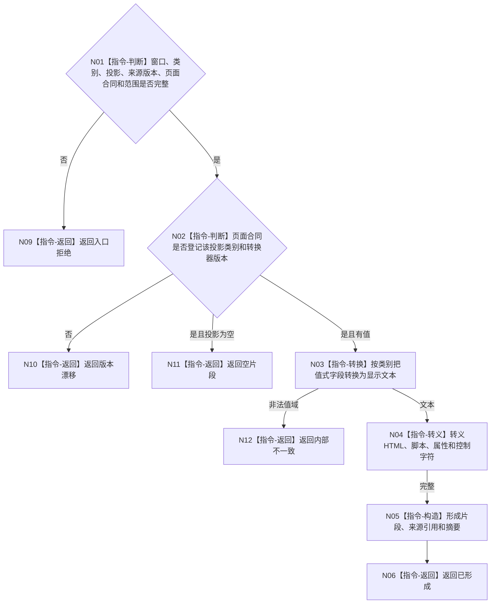

# BIZ-L4-005-04-01-01 按投影类别形成页面片段目标函数流程图 v0.2

更新时间：2026-08-27

## 依据

```text
4020、8110 v0.3、8120 v0.10；BIZ-L3-005-04-01 v0.2
HEAD d8a692af：不存在控制面板页面投影器或现有类别转换器
```

## 身份与边界

正式目标函数设计图。把一个值式投影项按页面合同转义并形成具名人读片段；不解析文本为机器语义，不反写业务事实。

## 函数合同

```text
根函数：控制面板页面投影器::按投影类别形成页面片段
归属模块 / 文件 / 层级：控制面板页面投影 / 海中鱼巣/界面/投影.控制面板页面.ixx / L4
现有或待新增：待新增统一调度和具名类别转换器；不得把日志文本或隐式字符串处理冒充已实现转换器
完整签名：控制面板页面片段形成结果 控制面板页面投影器::按投影类别形成页面片段(const 控制面板页面片段形成请求& 请求) const
参数：请求为只读借用；含窗口实例、投影类别、值式投影项、来源版本、页面合同版本和显示范围
返回结果：不可变值式结果；含已形成、空片段、版本漂移或内部不一致，以及已转义片段、来源引用和片段摘要
被调函数流程图：具体类别的纯表示转换在后续L5页面设计中展开
父图：BIZ-L3-005-04-01
```

## 流程图



## 节点合同

| 节点 | 类型 | 输入 | 输出 | 事实读写 | 验证 |
| --- | --- | --- | --- | --- | --- |
| N02/N03 | 指令 | 类别与值式投影 | 显示文本 | 人读转换 | 版本登记 |
| N04—N06 | 指令 | 文本 | 安全片段 | 无业务写入 | 完整转义、来源引用 |

## 关键边界

片段摘要只服务传输和刷新判重；HTML、颜色、布局、按钮和文本都不得被业务入口反向解析。
