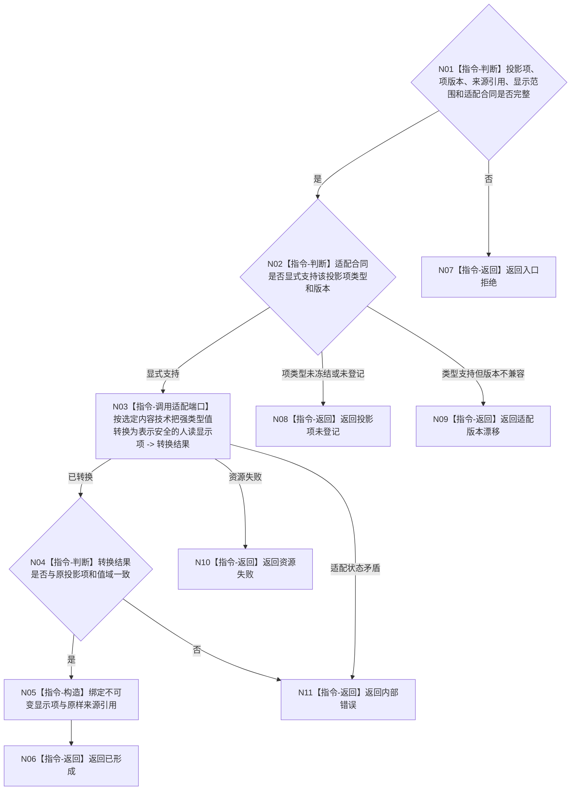

# BIZ-L4-005-04-01-01 按投影项合同形成人读显示项目标函数流程图 v0.2

更新时间：2026-08-27

## 依据

```text
4020、8110 v0.3、8120 v0.10；BIZ-L3-005-04-01 v0.2
BIZ-L2-005-03 v0.2；BIZ-L4-005-01-01-03 v0.2
HEAD 302fb76c：不存在控制面板投影项显示转换器或内容适配实现
```

## 身份与边界

正式目标职责图。该目标只把005-03结果中的一个已冻结强类型投影项，经选定内容适配合同转换为一个人读显示项，并原样绑定该项的来源引用。它不枚举业务 provider、不解释投影为新机器结论，也不规定 HTML、控件、文本模板或平台转义规则。

当前005-03尚未冻结业务投影项集合、逐项强类型和版本；内容技术也未选择。因此本图只冻结单项转换边界和失败分类，不构成可实现的类别分派表或公开 ABI。

## 函数合同

```text
根目标：内容适配端口::按投影项合同形成人读显示项
归属模块 / 文件 / 目标分解深度：选定控制面板内容适配实现 / 具体文件待详细设计选择 / BIZ-L4
现有或待新增：待新增；职责已冻结，最终函数身份、项类型联合和适配版本待详细设计
候选签名：控制面板人读显示项形成结果 内容适配端口::按投影项合同形成人读显示项(const 控制面板人读显示项形成请求& 请求) const
参数最低职责：一个已冻结强类型投影项、该项原样来源引用、选定内容适配合同版本和显示范围
返回结果最低分类：已形成、入口拒绝、投影项未登记、适配版本漂移、资源失败、内部错误；成功载荷为适配端口拥有的不可变显示项和原样来源引用
被调函数流程图：无；具体表示编码与资源形成属于选定内容适配实现的叶边界
父图：BIZ-L3-005-04-01
施工门禁：005-03逐项类型 / 版本和单一内容适配合同已冻结
```

## 流程图



## 节点合同

| 节点 | 类型 | 参数 / 输入绑定 | 结果 / 输出绑定 | 事实读写 | 后继条件 | 验证 |
| --- | --- | --- | --- | --- | --- | --- |
| N01/N02 | 指令 | 强类型项、版本、来源、适配合同 | 支持、未登记或漂移 | 纯值读取 | 分类完成 | 未知类型、未知版本、来源缺失 |
| N03/N04 | 适配端口调用/指令 | 已支持投影项 | 表示安全的显示项 | 纯表示转换或UI材料资源 | 具名结果 | 特殊字符、二进制材料、值域矛盾 |
| N05/N06 | 指令 | 已转换显示项与原来源 | 不可变显示项 | 无业务写入 | 构造完成 | 来源逐字段原样保留 |

## 关键边界

- “表示安全”只表示满足已选内容技术的编码和资源生命周期要求；不能从本图推出 HTML 转义、脚本过滤、控件树或任何具体机制。
- 投影项未登记是设计 / 版本缺口，不得退化为通用字符串、任意 JSON、日志文本或静默丢弃。
- 显示项的文本、图形、颜色、布局、排序键和摘要都不取得机器语义，也不得被业务入口反向解析。
- 来源引用必须原样保留；转换器不能合并业务事实截止与线程当前消息身份，也不能建立第二权威缓存。
- 当前没有完整投影项宇宙或内容适配合同，故本图不是 provider 注册表、运行时发现机制或可施工类别转换器。

本图完成的是单项人读转换边界校正；精确项联合、适配版本和物理实现仍待详细设计。
