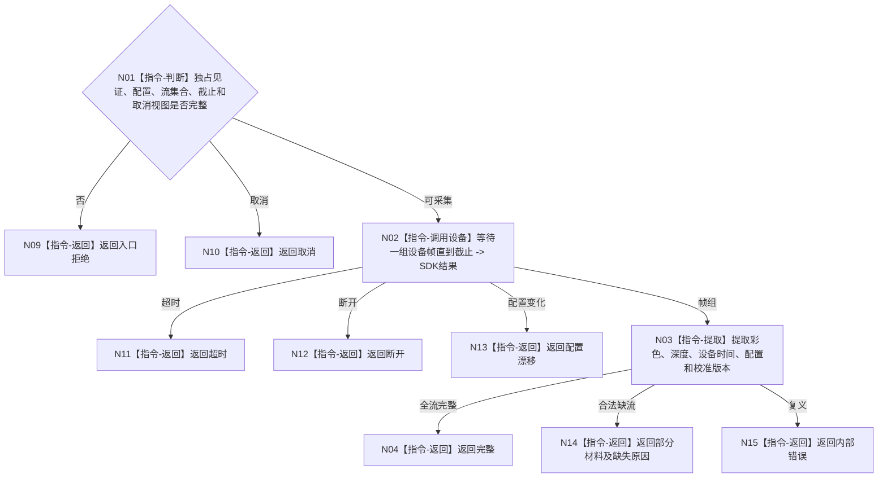

# BIZ-L4-006-01-02-01 双目相机采集适配器采集一次目标函数流程图 v0.1

更新时间：2026-08-03

## 依据

```text
6340、6350；BIZ-L3-006-01-02
```

## 身份与边界

正式目标函数设计图。在双目相机独占控制线程上采集一组同步候选帧和设备元数据；不形成通用报告、成熟度或世界事实。

## 函数合同

```text
根函数：双目相机采集适配器::采集一次
归属模块 / 文件 / 层级：双目相机采集适配 / 海中鱼巣/外设/适配.双目相机采集.ixx / L4
现有或待新增：适配扩展；承接现有D455采集器并冻结结构化结果
完整签名：双目相机单次采集结果 双目相机采集适配器::采集一次(const 双目相机单次采集请求& 请求)
参数：请求为只读借用；含实例独占控制见证、采集配置、期望流集合、截止和取消令牌只读视图
返回结果：值式结果；含完整、部分材料、超时、断开、取消、配置漂移或内部错误，以及彩色/深度/设备时间候选、配置与校准版本
被调函数流程图：无；D455 SDK调用为叶子外部边界
父图：BIZ-L3-006-01-02
```

## 流程图



## 节点合同

| 节点 | 类型 | 输入 | 输出 | 事实读写 | 验证 |
| --- | --- | --- | --- | --- | --- |
| N02 | 指令 | 采集请求 | SDK帧组 | 外设I/O | 超时、断连、取消 |
| N03/N04 | 指令 | 帧组 | 私有采集结果 | 只形成材料 | 来源版本可回查 |

## 关键边界

采集成功只形成主题私有材料；不得直接声称L3成熟、报告可用、存在确认或任务完成。

