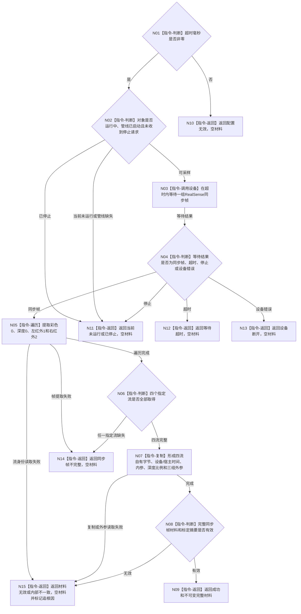

# BIZ-L4-006-01-02-01 双目相机采集适配器采集一次目标函数流程图 v0.2

更新时间：2026-08-28

## 依据

```text
6340 v0.6、6350 v0.6；BIZ-L3-006-01-02 v0.2
发布源码证据基线 `472914a8`：D455协议 blob `f110508f`、采集器 blob `9009c0c8`
```

## 身份与边界

正式目标与当前代码对照图。当前真实实现函数在已经打开的`D455相机采集器`对象上等待一组同步帧，并只在彩色、深度、左右红外、标定/配置和采集元数据全部完整时返回成功。调用方经`D455帧来源`虚接口分派到该覆盖实现。它不接收任务、等待项、订阅项、控制权见证或取消令牌，也不形成6350报告产品和世界事实。

## 函数合同

```text
根函数：D455相机采集器::采样一次
归属模块 / 文件 / 目标分解深度：海中鱼巣.适配.采集器.D455相机 / 海中鱼巣/适配/采集器.D455相机.ixx / BIZ-L4；虚接口声明在海中鱼巣.适配.协议.D455采样材料
现有或待新增：HEAD已实现；由D455相机采集器覆盖虚函数
当前完整签名：D455采集结果 D455相机采集器::采样一次(std::uint32_t 超时毫秒) override
参数：超时毫秒，非零；对象内部持有实际设备、管线、配置、状态和停止请求
返回结果：D455采集结果；成功时shared_ptr<const D455同步帧材料>非空且完整有效；失败时材料为空并给出配置无效、当前未运行、已停止、等待超时、设备断开、同步帧不完整、材料无效或内部不一致
被调函数流程图：无；RealSense SDK是项目外叶子边界
父图：BIZ-L3-006-01-02 v0.2
```

## 流程图



## 节点合同

| 节点 | 类型 | 参数 / 输入绑定 | 结果 / 输出绑定 | 事实读写 | 验证 |
| --- | --- | --- | --- | --- | --- |
| N01/N02 | 本函数内指令 | 超时和对象内部状态 | 采样准入或拒绝 | 只读采集器状态 | 零超时、停止、未运行、管线缺失 |
| N03 | 本函数内指令（项目外调用） | 超时毫秒 -> RealSense等待 | 同步帧、超时或SDK错误 | 真实外设I/O | 超时、停止、设备断开 |
| N04—N06 | 本函数内指令 | 同步帧集合 | 四个指定流或具名失败 | 只读SDK帧并接管临时句柄 | 提取失败、身份失败、缺流 |
| N07/N08 | 本函数内指令 | 四流和实际标定 | 自有完整材料 | 复制字节并计算标定版本摘要 | 字节数、内外参、时间、标定摘要、完整性 |
| N09—N15 | 本函数内返回 | 采样/材料分类 | D455采集结果 | 无业务事实写入 | 成功材料非空；全部非成功空材料 |

## 当前代码边界

- `采样一次`没有命令、等待项、订阅项、控制权见证、运行代次或取消令牌参数；控制域对象在创建/打开时持有设备和管线，停止通过对象内部原子状态实现。
- 当前成功形状只有完整同步四流；任一指定流缺失均返回`同步帧不完整`和空材料，不存在合法部分成功。
- 成功材料已经复制到自有`vector<byte>`并由`shared_ptr<const>`承载，不暴露RealSense缓冲区寿命。
- 工程默认未必启用RealSense编译，普通启动链也没有构造本采集器；叶子代码存在不等于T06生产接线成立。

## 关键边界

采集成功只形成D455私有L0原始材料。它不证明外设报告已经形成/发布、任务域已经承接、观察成立、任务完成或需求满足。
