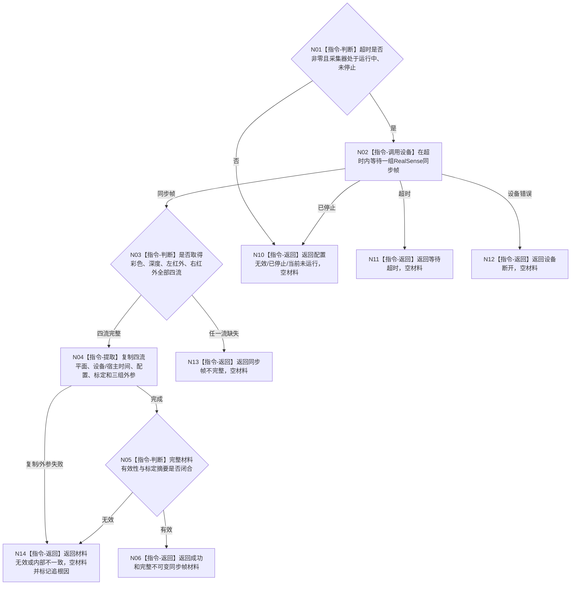

# BIZ-L4-006-01-02-01 双目相机采集适配器采集一次目标函数流程图 v0.2

更新时间：2026-08-27

## 依据

```text
6340 v0.6、6350 v0.6；BIZ-L3-006-01-02 v0.2
HEAD 05b086e7：海中鱼巣/适配/协议.D455采样材料.ixx、海中鱼巣/适配/采集器.D455相机.ixx
```

## 身份与边界

正式目标函数设计图。在D455独占控制域内采集一组同步彩色、深度、左红外、右红外材料及设备/标定/配置元数据；不形成通用报告、主题产品、成熟度或世界事实。当前HEAD只允许四流全部完整时成功，没有合法“部分成功”。

## 函数合同

```text
根函数：D455帧来源::采样一次
归属模块 / 文件 / 目标分解深度：D455采集适配器 / 海中鱼巣/适配/采集器.D455相机.ixx / BIZ-L4
现有或待新增：HEAD已实现私有采集叶；通用主题路由和生产接线待新增
当前完整签名：D455采集结果 D455帧来源::采样一次(std::uint32_t 超时毫秒)
参数：非零超时毫秒；独占控制、配置和停止状态由D455帧来源对象持有；当前接口没有取消令牌参数
返回结果：值式D455采集结果；成功时材料必须同时含彩色、深度、左右红外、设备时间、宿主接收时间、配置/标定和外参；任一缺流为同步帧不完整且空材料
被调函数流程图：无；RealSense SDK为项目外叶子边界
父图：BIZ-L3-006-01-02 v0.2
```

## 流程图



## 当前代码边界

- 当前`采样一次`参数只有超时毫秒；停止依赖对象内部原子状态，不应在目标图中伪造取消令牌ABI。
- 当前成功形状只有完整四流；“部分材料”不是已实现状态。若未来允许合法部分成功，必须先冻结强类型缺流语义和下游产品适用矩阵。
- 工程默认未必启用RealSense编译，且普通启动链没有构造本采集器；叶子实现存在不等于T06生产接线成立。

## 关键边界

采集成功只形成D455私有原始材料；不得直接声称产品形成、报告可用、观察成立、任务完成或需求满足。
