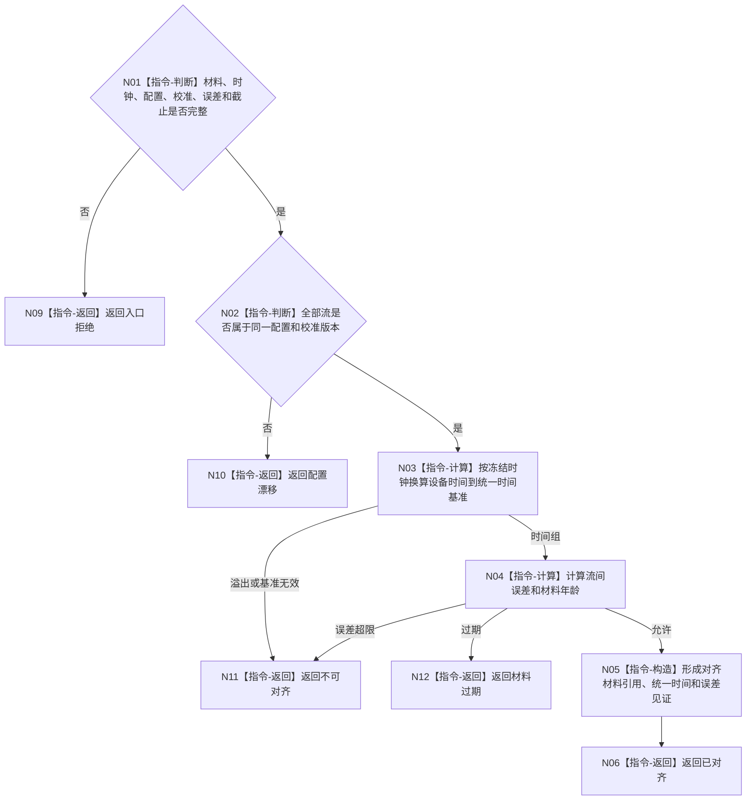

# BIZ-L4-006-03-02-01 双目相机时间对齐适配器对齐目标函数流程图 v0.1

更新时间：2026-08-03

## 依据

```text
6210、6340、6350；BIZ-L3-006-03-02
```

## 身份与边界

正式目标函数设计图。按设备时钟、流时间戳和配置/校准版本对齐双目相机材料；不做空间位姿补偿、不生成变化结论。

## 函数合同

```text
根函数：双目相机时间对齐适配器::对齐
归属模块 / 文件 / 层级：双目相机时间对齐 / 海中鱼巣/外设/适配.双目相机时间对齐.ixx / L4
现有或待新增：待新增；封装D455设备时间对齐规则
完整签名：双目相机时间对齐结果 双目相机时间对齐适配器::对齐(const 双目相机时间对齐请求& 请求) const
参数：请求为只读借用；含私有采集材料、设备/系统时钟版本、配置/校准版本、允许误差和截止
返回结果：值式结果；含已对齐、不可对齐、材料过期、配置漂移或内部错误，以及对齐材料引用、统一时间和误差见证
被调函数流程图：无；时间换算与误差裁决为本函数内指令
父图：BIZ-L3-006-03-02
```

## 流程图



## 节点合同

| 节点 | 类型 | 输入 | 输出 | 事实读写 | 验证 |
| --- | --- | --- | --- | --- | --- |
| N02—N04 | 指令 | 私有材料与时钟 | 时间与误差 | 无业务写入 | 不跨配置拼接 |
| N05/N06 | 指令 | 合法时间组 | 对齐材料 | 只形成派生材料 | 来源时间可回查 |

## 关键边界

时间对齐只建立可比性；空间坐标、位姿和变化判断由后续具名规则处理。
