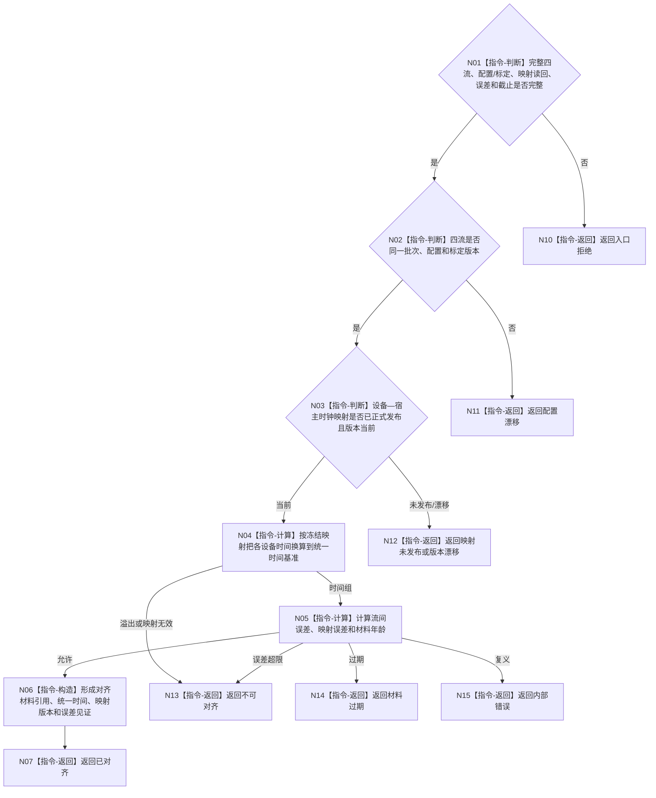

# BIZ-L4-006-03-02-01 双目相机时间对齐适配器对齐目标函数流程图 v0.2

更新时间：2026-08-27

## 依据

```text
6210、6340 v0.6、6350 v0.6；BIZ-L3-006-03-02 v0.2
HEAD 05b086e7：协议.D455采样材料.ixx、采集器.D455相机.ixx
```

## 身份与边界

正式目标函数设计图。按D455设备时间、宿主接收单调时间和版本化设备—宿主时钟映射对齐四流材料；不做空间位姿补偿，不把一次SDK同步帧直接当成跨时钟正式对齐，不生成变化结论。

## 函数合同

```text
根函数：D455时间对齐适配器::对齐
归属模块 / 文件 / 目标分解深度：D455时间对齐 / 海中鱼巣/适配/适配.D455时间对齐.ixx / BIZ-L4
现有或待新增：待新增；HEAD只提供设备时间和宿主接收时间材料
完整签名：D455时间对齐结果 D455时间对齐适配器::对齐(const D455时间对齐请求& 请求) const noexcept
参数：请求为只读借用；含完整D455同步帧、配置/标定版本、版本化设备—宿主时钟映射正式读回、允许误差和截止
返回结果：值式结果；含已对齐、映射未发布、不可对齐、材料过期、配置漂移、版本漂移或内部错误，以及统一时间、映射版本、对齐材料引用和误差见证
被调函数流程图：无；映射应用和误差计算为本函数内指令
父图：BIZ-L3-006-03-02 v0.2
```

## 流程图



## 当前代码边界

HEAD材料含设备时间戳和宿主接收单调时间戳，但没有版本化时钟映射事实、正式读回或本适配器。仅因四流来自同一SDK帧组，不能证明设备时钟已与系统治理时间同义。

## 关键边界

时间对齐只建立时间可比性；空间坐标、产品形成、状态变化和因果判断由后续具名合同处理。
