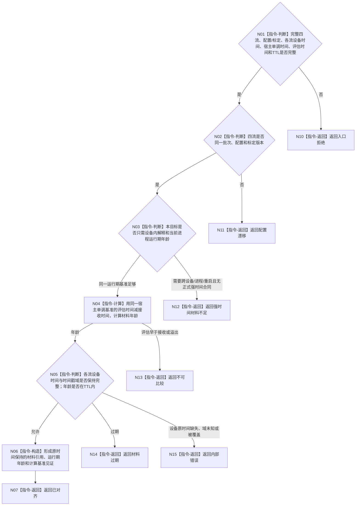

# BIZ-L4-006-03-02-01 双目相机时间对齐适配器对齐目标函数流程图 v0.2

更新时间：2026-08-28

## 依据

```text
6210、6340 v0.6、6350 v0.6；BIZ-L3-006-03-02 v0.2
HEAD `4bb65c22`：D455协议 blob `f110508f`同时保留每流设备时间戳和宿主接收单调时间戳；缓存 blob `ec93dd07`已按宿主单调时间计算运行期TTL
```

## 身份与边界

正式目标职责图。核对D455四流原始时间材料，在宿主单调时间基准内计算运行期年龄，并保留各流设备原时间用于设备内材料解释；不做空间位姿补偿，不把宿主时间覆盖设备时间，不生成变化结论。只有目标确需跨设备、跨进程或跨重启比较时，才消费另行冻结的正式强时间合同。

## 函数合同

```text
根目标：D455时间材料核对与运行期年龄计算
归属模块 / 文件 / 目标分解深度：D455控制域私有时间适配边界 / 具体文件待详细设计 / BIZ-L4
现有或待新增：职责已定位，ABI未冻结；HEAD已有原时间材料和同基准TTL算法，但没有独立目标适配器
候选签名：D455时间对齐结果 核对时间并计算年龄(const D455时间对齐请求& 请求) noexcept
参数最低职责：完整D455同步帧、配置/标定、各流设备时间及时间戳域、宿主接收单调时间、当前宿主单调评估时间、TTL；只有跨基准比较时才附正式强时间材料
返回结果最低分类：已对齐/可比、强时间材料不足、不可比较、材料过期、配置漂移、入口拒绝或内部错误；成功保持全部原时间并携带材料年龄和计算基准见证
被调函数流程图：无；同批次核对、同基准年龄计算和原时间保持均为本函数内指令
父图：BIZ-L3-006-03-02 v0.2
```

## 流程图



## 当前代码边界

HEAD已经保存各流设备时间戳/时间戳域和宿主接收单调时间戳，`D455帧材料缓存`也以当前宿主单调时间减材料接收时间判断TTL；该运行期年龄算法可直接复用。HEAD没有跨设备、跨进程或跨重启强时间合同，因此不能把设备时间解释为系统治理时间，也不能补造版本化设备—宿主时钟映射owner。

## 关键边界

本图只证明当前运行期内同基准年龄与设备原时间保持。跨时间基准可比性、空间坐标、产品形成、状态变化和因果判断由后续具名合同处理。
