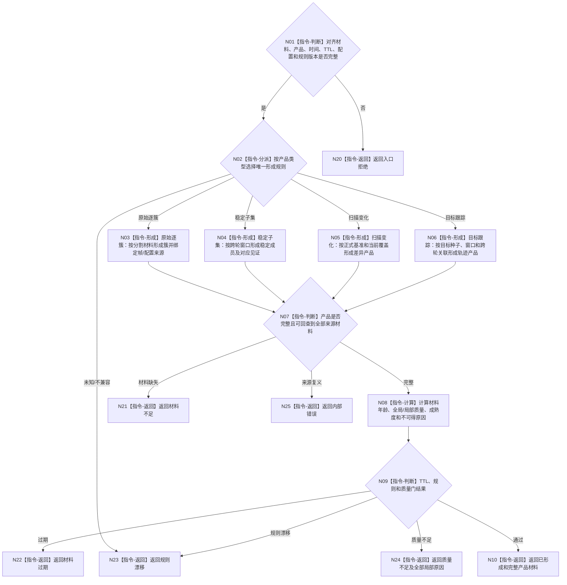

# BIZ-L4-006-03-03-01 双目相机产品形成与质量适配器形成并评估目标函数流程图 v0.2

更新时间：2026-08-27

## 依据

```text
6310、6340 v0.6、6350 v0.6；BIZ-L3-006-03-03 v0.2
HEAD 05b086e7：协议.D455采样材料.ixx、采集器.D455相机.ixx
```

## 身份与边界

正式目标函数设计图。按产品类型先形成D455主题产品，再计算年龄、全局/局部质量和成熟度。不得用“同步四流材料有效”替代原始逐簇、稳定子集、扫描变化或目标跟踪产品形成，也不得把成熟度当作产品类型。

## 函数合同

```text
根函数：D455产品形成与质量适配器::形成并评估
归属模块 / 文件 / 目标分解深度：D455产品形成与质量 / 海中鱼巣/适配/适配.D455产品形成与质量.ixx / BIZ-L4
现有或待新增：待新增；HEAD没有四产品形成、跨轮稳定、扫描基准或目标跟踪实现
完整签名：D455主题产品形成结果 D455产品形成与质量适配器::形成并评估(const D455主题产品形成请求& 请求) const noexcept
参数：请求为只读借用；含对齐D455材料、产品类型、发生/评估时间、TTL、配置、产品形成/成熟度/质量规则版本及产品专属材料
返回结果：值式结果；含已形成、材料不足、质量不足、材料过期、规则漂移或内部错误，以及强类型主题产品、来源回查、年龄、全局/局部质量、成熟度和不可得原因组
被调函数流程图：无；各产品有限形成规则和质量计算为本函数内指令
父图：BIZ-L3-006-03-03 v0.2
```

## 流程图



## 产品形成门

| 产品 | 必需专属材料 | 当前HEAD |
| --- | --- | --- |
| 原始逐簇 | 分割结果、簇成员、逐簇来源回查 | 未实现 |
| 稳定子集 | 多轮候选、稳定窗口、成员对应 | 未实现 |
| 扫描变化 | 同范围正式基准、当前覆盖、差异材料 | 未实现 |
| 目标跟踪 | 目标种子、跟踪窗口、跨轮关联 | 未实现 |

## 关键边界

HEAD的D455同步材料只是产品形成输入。质量通过仍不证明任务命中、观察成立或世界事实已经发布。
