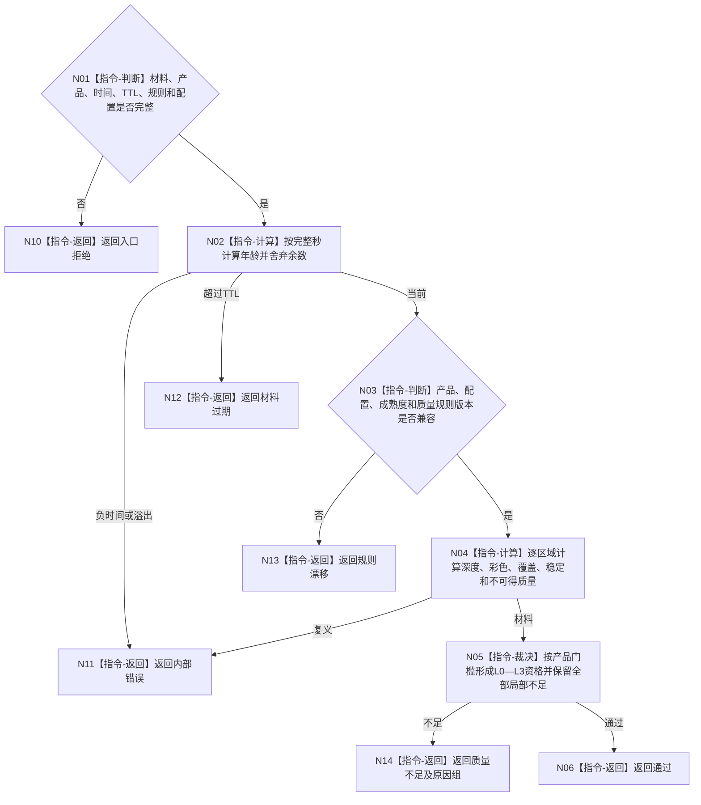

# BIZ-L4-006-03-03-01 双目相机质量适配器评估目标函数流程图 v0.1

更新时间：2026-08-03

## 依据

```text
6310、6340、6350；BIZ-L3-006-03-03
```

## 身份与边界

正式目标函数设计图。按双目相机产品类型、局部材料和成熟度规则评估全局/局部质量、L0—L3资格及不可得原因；不把成熟度当产品类型。

## 函数合同

```text
根函数：双目相机质量适配器::评估
归属模块 / 文件 / 层级：双目相机质量评估 / 海中鱼巣/外设/适配.双目相机质量.ixx / L4
现有或待新增：待新增；吸收D455局部质量和成熟度规则
完整签名：双目相机质量评估结果 双目相机质量适配器::评估(const 双目相机质量评估请求& 请求) const
参数：请求为只读借用；含对齐材料、产品类型、发生/评估完整秒、TTL、成熟度规则、质量规则和配置版本
返回结果：值式结果；含通过、质量不足、材料过期、规则漂移或内部错误，以及年龄、全局质量、逐区域质量、成熟度和不可得原因组
被调函数流程图：无；有限产品/成熟度矩阵与局部质量计算为本函数内指令
父图：BIZ-L3-006-03-03
```

## 流程图



## 节点合同

| 节点 | 类型 | 输入 | 输出 | 事实读写 | 验证 |
| --- | --- | --- | --- | --- | --- |
| N02/N03 | 指令 | 时间与规则 | 时效和版本资格 | 无写入 | 完整秒、规则版本 |
| N04—N06 | 指令 | 局部材料 | 质量与成熟度 | 只形成材料 | 局部不足不被整体覆盖 |

## 关键边界

L0—L3成熟度轴与四类产品轴相互独立；质量通过仍不证明任务命中或世界事实成立。

