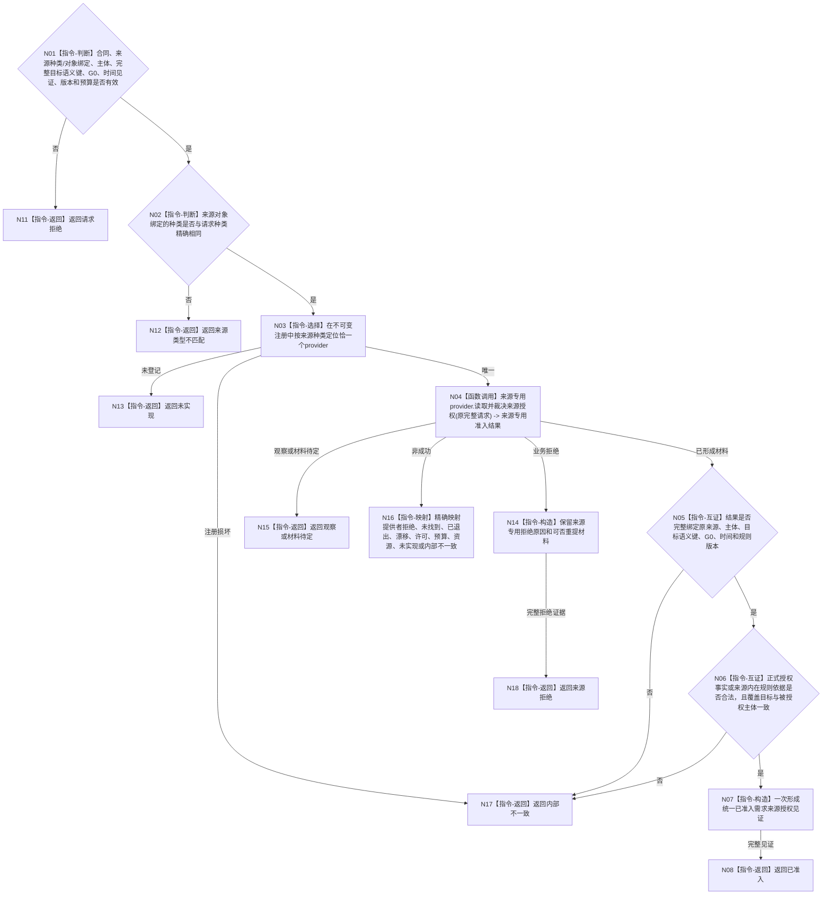

# BIZ-L5-004-02-01-01-01 复核需求来源与主体授权目标函数流程图 v0.1

更新时间：2026-08-16

## 依据

```text
0050、3100、5100、5110、5130、5150；BIZ-L4-004-02-01-01 v0.2
```

## 身份与边界

正式目标函数设计图。统一 BIZ `需求来源准入服务`按来源种类选择恰一个同种类强类型 provider，取得来源专用准入结果，完成跨来源公共字段互证并形成统一值式见证。它不建立第二 DATA 来源授权服务，不直达 DATA-L1，不读取需求树，不裁决根资格、路径角色、任务化或目标差距。

## 函数合同

```text
根函数：需求来源准入服务::复核需求来源与主体授权
归属模块 / 文件 / 层级：需求来源准入领域 / 海中鱼巣/领域/服务.需求来源准入.ixx / BIZ-L5
现有或待新增：待新增；统一分派和公共互证，当前必需来源专用provider组为具名依赖
完整签名：需求来源准入结果 需求来源准入服务::复核需求来源与主体授权(const 需求来源准入请求& 请求) const noexcept
参数：请求为只读借用；含版本化强类型来源种类身份、与种类绑定的来源对象身份、提出主体、被授权需求主体、完整目标语义键及权威引用、同一非零G0、强类型发生时间见证、来源/授权规则版本和来源/授权组预算
返回结果：不可变值式结果；已准入时携带完整来源授权见证，业务拒绝时携带拒绝证据，其它状态零成功见证
被调函数流程图：当前必需来源专用provider的目标图待后继逐项建立；本图只冻结共同调用协议
父图：BIZ-L4-004-02-01-01 v0.2
```

## 当前已识别来源协议

现行规范已识别：复合特征分解、正式因果或条件链、临时因果视图、已确认任务筹办缺口、方法结构化 / 学习 / 方法自检缺口、根特征自检、普通自检、身体反馈、观察候选、外部输入、正式结算后的后续目标。这是当前 provider 设计队列，不是公共 ABI 的封闭枚举；新增正式来源必须先形成具名来源种类身份、专用 provider 合同和规则版本，再进入装配所需来源组。

临时因果视图必须与正式因果或条件链分账；前者只能承载候选或草案来源，不能冒充正式主动致变因果或直接证明普通可任务化路径。

## 流程图



## 节点合同

| 节点 | 类型 | 参数 / 输入绑定 | 结果 / 输出绑定 | 事实读写 | 后继条件 | 验证 |
| --- | --- | --- | --- | --- | --- | --- |
| N01/N02 | 判断 | 统一请求、来源种类与对象绑定 | 有效请求或具名拒绝 | 无读写 | 种类身份与对象绑定一一对应 | 裸稳定编码、空种类和错绑定均在provider前拒绝 |
| N03/N04 | 选择 / 调用 | 原完整请求、不可变注册 | 恰一来源专用结果 | provider内部只读 | 未登记与注册损坏分账 | 每次至多调用一个provider，零广播、零回退猜测 |
| N05/N06 | 互证 | 来源专用材料、采用授权见证组、原请求 | 完整统一见证 | 无写入 | 主体、目标、G0、时间、版本和范围全部闭合 | provider已形成材料后的任一错配都是内部不一致；正式授权事实和来源内在规则分型，内在规则不得虚构L2授权方；业务拒绝只能来自provider明确拒绝 |
| N07/N08 | 构造 / 返回 | 完整值式材料 | 已准入来源授权见证 | 无写入 | 候选一次交付 | 不生成需求、根、路径或任务化结论 |
| N11—N18 | 返回 / 映射 | 具名非成功 | 状态及可选拒绝证据 | 无写入 | 返回父01 | 非成功零成功见证，内部损坏不伪装业务拒绝 |

## 关键边界

- 来源专用 provider 属于 BIZ；它返回与公共结果分型的来源专用材料 / 拒绝 / 非成功，可以组合现有或待实现的中性事实读取并执行本来源规则。DATA 只返回完整事实和中性读取状态。
- DATA 不得返回来源是否合法、是否允许建立根、路径角色是否可用、是否可任务化、是否形成需求或安全 / 服务路由等业务布尔。
- 自我治理消息、任务回执和 D455 材料若正式合同标为非权威，只能作为定位输入，不能直接成为来源或授权事实。
- 本函数只形成来源授权见证；01、04、05、06及父提交入口仍分别负责候选准入、防环、发布、读回和拒绝回执。
