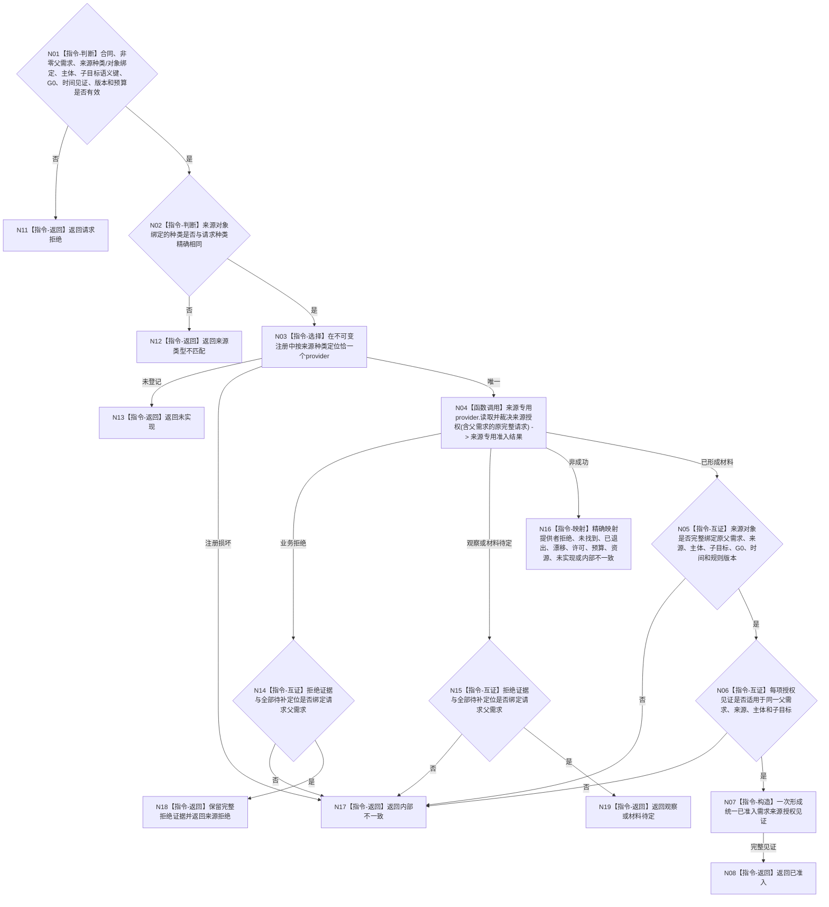

# BIZ-L5-004-02-01-01-01 复核需求来源与主体授权目标函数流程图 v0.2

更新时间：2026-08-16

## 依据

```text
0050、3100、5100、5110、5130、5150；BIZ-L4-004-02-01-01 v0.3
```

## 身份与边界

正式目标函数替代图。统一 BIZ `需求来源准入服务`按来源种类选择恰一个同种类强类型 provider，取得来源专用准入结果，完成跨来源公共字段互证并形成统一值式见证。所有成功材料、业务拒绝和待补定位必须绑定请求中的同一非零 `L2需求身份 父需求`。

本函数不建立第二 DATA 来源授权服务，不直达 DATA-L1，不读取父需求结构，不裁决根资格、路径角色、任务化或目标差距。来源专用 provider 后继按请求父需求从需求结构权威读取父目标；统一服务不把父目标复制进子目标语义键。

## 函数合同

```text
根函数：需求来源准入服务::复核需求来源与主体授权
归属模块 / 文件 / 层级：需求来源准入领域 / 海中鱼巣/领域/服务.需求来源准入.ixx / BIZ-L5
现有或待新增：待新增；统一分派和公共互证，当前必需来源专用provider组为具名依赖
完整签名：需求来源准入结果 需求来源准入服务::复核需求来源与主体授权(const 需求来源准入请求& 请求) const noexcept
参数：请求为只读借用；含非零父需求、版本化强类型来源种类身份、与种类绑定的来源对象身份、提出主体、被授权需求主体、完整子目标语义键及权威引用、同一非零G0、强类型发生时间见证、来源/授权规则版本和来源/授权组预算
返回结果：不可变值式结果；已准入时请求回显、来源对象和每项授权见证都回显同一父需求；业务拒绝与待补定位也回显同一父需求；其它状态零成功见证
被调函数流程图：当前必需来源专用provider的目标图待后继逐项建立；本图只冻结共同调用协议
父图：BIZ-L4-004-02-01-01 v0.3
```

## 当前已识别来源协议

现行规范已识别：复合特征分解、正式因果或条件链、临时因果视图、已确认任务筹办缺口、方法结构化 / 学习 / 方法自检缺口、根特征自检、普通自检、身体反馈、观察候选、外部输入、正式结算后的后续目标。这是当前 provider 设计队列，不是公共 ABI 的封闭枚举。

复合特征分解是当前队列首项，但其后继必须先取得复合定义视图和复合目标分解合同；现有“实际阶次 + 派生直接来源”不等于复合槽位。该缺口不改变本图公共父需求传播合同。

## 流程图



## 节点合同

| 节点 | 类型 | 参数 / 输入绑定 | 结果 / 输出绑定 | 事实读写 | 后继条件 | 验证 |
| --- | --- | --- | --- | --- | --- | --- |
| N01/N02 | 判断 | 统一请求、非零父需求、来源种类与对象绑定 | 有效请求或具名拒绝 | 无读写 | 父需求必须非零；种类身份与对象绑定一一对应 | 零父、裸编码、空种类和错绑定均在 provider 前拒绝 |
| N03/N04 | 选择 / 调用 | 含父需求的原完整请求、不可变注册 | 恰一来源专用结果 | provider内部只读 | 未登记与注册损坏分账 | 每次至多调用一个provider，原请求原样传递，零广播、零回退猜测 |
| N05/N06 | 互证 | 来源对象、采用授权见证组、原请求 | 完整统一见证 | 无写入 | 父需求、主体、目标、G0、时间、版本和范围全部闭合 | 漏父、错父或混父都是坏成功形状；正式授权事实和来源内在规则分型 |
| N07/N08 | 构造 / 返回 | 完整值式材料 | 已准入来源授权见证 | 无写入 | 候选一次交付 | 不生成需求、根、路径或任务化结论 |
| N11—N19 | 返回 / 映射 | 具名非成功或拒绝证据 | 状态及可选拒绝证据 | 无写入 | 返回父01 | 业务拒绝/待定也必须同父；内部损坏不伪装业务拒绝 |

## 关键边界

- `父需求`只限定来源授权适用上下文，不进入子目标内容键，也不由统一服务读取或解释父目标。
- 来源专用 provider 属于 BIZ；DATA 只返回完整中性事实和结构化读取状态。
- 普通请求没有父需求时由 L4 在调用前返回运行期根拒绝；本函数不接受零父作为另一种根入口。
- v0.1 的开放来源种类、恰一分派、OR/AND后置、完整目标语义键判重和父入口写拒绝回执五项裁决全部保留；v0.2仅修复父上下文缺失。
