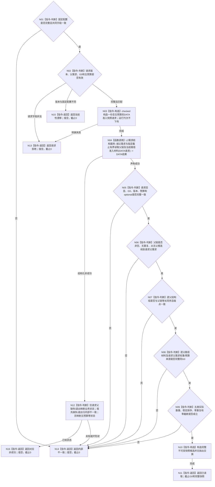

# BIZ-L5-004-02-01-04-01 读取父需求路径准入快照目标函数流程图 v0.1

更新时间：2026-08-16

## 依据

```text
0050、3100、5100、5110、5150
BIZ-L4-004-02-01-04 v0.2
DEMAND-PARENT-PATH-ADMISSION-SNAPSHOT-CONSUME v0.1详细设计
```

## 身份与边界

正式目标函数设计图。本叶只在指定非零 G0 下读取父需求的完整准入结构快照；不判断候选目标重叠、候选成环、路径角色合法性、OR / AND 或权重分配。

## 函数合同

```text
根函数：需求业务服务::读取父需求路径准入快照
归属模块 / 文件 / 层级：需求领域 / 海中鱼巣/领域/服务.需求.ixx / BIZ-L5
现有或待新增：待新增；只经普通应用同实例唯一L2需求结构服务
完整签名：需求父路径准入快照读取结果 需求业务服务::读取父需求路径准入快照(const 需求父路径准入快照读取请求& 请求) const noexcept
参数：请求为只读借用；含固定版本、非零父需求、非零G0和父链/直接子/路径关系/路径组/预算来源五项非零预算
返回结果：值式结果；只有已读取携带完整根到父链和等长同序逐父结构组，全部非成功值为空且截止为0
被调函数流程图：DATA-EXT-12公开操作待最终ABI发布；不为DATA内部建立BIZ图
父图：BIZ-L4-004-02-01-04 v0.2
```

## 流程图



## 节点合同

| 节点 | 类型 | 参数 / 输入绑定 | 结果 / 输出绑定 | 事实读写 | 后继条件 | 验证 |
| --- | --- | --- | --- | --- | --- | --- |
| N01—N03 | 本函数内指令 | 固定配置、请求 | 唯一 DATA 请求或零调用返回 | 无事实读写 | 全字段非零且版本匹配 | 坏配置 / 坏请求 / 漂移分账 |
| N04 | 函数调用 | 父需求、G0、全部版本、五预算 | DATA完整中性结果 | 只读 DATA-EXT-12 | 恰一次完成 | 零L1、owner、分次拼装和重试 |
| N05—N09 | 本函数内判断 | DATA结果 | 完整性结论 | 无事实写入 | 全部互证成立 | 根到父、逐父同序、预算、排序和G0 |
| N10—N16 | 构造 / 返回 | 完整候选或失败状态 | BIZ值式结果 | 无事实写入 | 单一返回 | 只有已读取携带值 |

## 关键边界

```text
父链已有重复或环、祖先缺失或退出 = 已发布结构损坏 = 内部不一致，不是请求父缺失或候选成环业务拒绝。
路径组使用独立总数量预算；即使DATA允许孤立路径组，也不能绕过结果规模上界。
只读请求父需求权重及预算来源，不额外读取祖先权重；本叶不定义类型、W/n、余量或重分配。
DATA只返回中性结构，不返回角色合法、目标重叠、OR/AND、活动、结算或任务化结论。
并发发布导致G0漂移时零自动重试；调用方可重新提交完整新请求。
```
