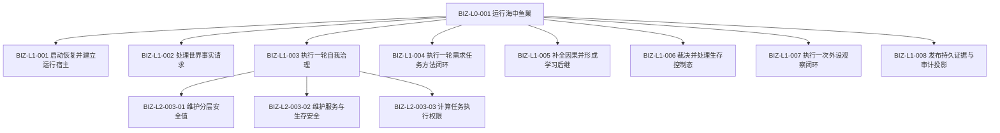

# BIZ-MAP-001 目标业务图到冻结函数与能力证据映射

## 1. 一图一根函数规则

每个 `BIZ-*` 身份唯一对应一个冻结根函数。函数合同取得目标设计权威，不等于代码已经实现；当前状态必须独立标记：

- `当前复用`：能力目录已有静态实现证据，计划前仍须复核当前签名和运行验证。
- `适配扩展`：已有相邻函数，但目标编排、事务或结果不完整。
- `待新增`：当前证据不足以证明目标根函数存在。
- `待核`：正式规范足够冻结目标合同，但当前代码实现状态未完成核对。

## 2. L0 和 L1 根函数

| 图身份 | 唯一根函数完整签名 | 物理位置 | 裁决 | 直接被调层级 |
| --- | --- | --- | --- | --- |
| BIZ-L0-001 | `程序运行结果 运行海中鱼巣(const 启动选项& 选项)` | `海中鱼巣/启动.应用程序.ixx` | 适配扩展，CAP-0001 | L1-001—008 |
| BIZ-L1-001 | `运行宿主建立结果 启动恢复并建立运行宿主(const 启动选项& 选项)` | `海中鱼巣/启动.应用程序.ixx` | 待新增，可组合 CAP-0013/0016 | 启动恢复 L2 |
| BIZ-L1-002 | `世界事实处理结果 世界树业务服务::处理世界事实请求(const 世界事实处理请求& 请求)` | `海中鱼巣/领域/服务.世界树业务.ixx` | 待新增，WORLD-TREE 设计中 | 世界树 L2 |
| BIZ-L1-003 | `自我治理结果 自我治理服务::执行一轮自我治理(const 自我治理请求& 请求)` | `海中鱼巣/领域/服务.自我治理.ixx` | 待新增，CAP-0044仅为线程相邻能力 | L2-003-01—03 |
| BIZ-L1-004 | `需求任务方法闭环结果 需求任务方法治理服务::执行一轮需求任务方法闭环(const 需求任务方法闭环请求& 请求)` | `海中鱼巣/领域/服务.需求任务方法治理.ixx` | 待新增，可组合 CAP-0038—0040 | 需求任务方法 L2 |
| BIZ-L1-005 | `因果学习结果 因果学习服务::补全因果并形成学习后继(const 因果学习请求& 请求)` | `海中鱼巣/领域/服务.因果学习.ixx` | 待新增，CAP-0037不完整 | 因果学习 L2 |
| BIZ-L1-006 | `生存控制处理结果 生存控制服务::裁决并处理生存控制态(const 生存控制处理请求& 请求)` | `海中鱼巣/领域/服务.生存控制.ixx` | 待新增 | 生存控制 L2 |
| BIZ-L1-007 | `外设观察闭环结果 外设观察服务::执行一次外设观察闭环(const 外设观察闭环请求& 请求)` | `海中鱼巣/领域/服务.外设观察.ixx` | 待新增 | 外设观察 L2 |
| BIZ-L1-008 | `证据审计发布结果 业务证据发布服务::发布持久证据与审计投影(const 证据审计发布请求& 请求)` | `海中鱼巣/适配/发布.业务证据与审计.ixx` | 待新增，可组合 CAP-0004/0014/0045 | 证据审计 L2 |

## 3. 已冻结的 L2 根函数

| 图身份 | 唯一根函数完整签名 | 物理位置 | 裁决 | 父函数 |
| --- | --- | --- | --- | --- |
| BIZ-L2-003-01 | `分层安全维护结果 安全维护服务::维护分层安全值(const 分层安全维护请求& 请求)` | `海中鱼巣/领域/服务.安全维护.ixx` | 待新增；底层能力待核 | BIZ-L1-003 |
| BIZ-L2-003-02 | `服务生存维护结果 服务生存治理服务::维护服务与生存安全(const 服务生存维护请求& 请求)` | `海中鱼巣/领域/服务.服务生存治理.ixx` | 待新增；底层能力待核 | BIZ-L1-003 |
| BIZ-L2-003-03 | `任务执行权限结果 任务执行权限服务::计算任务执行权限(const 任务执行权限请求& 请求) const` | `海中鱼巣/领域/服务.任务执行权限.ixx` | 待新增；底层能力待核 | BIZ-L1-003 |

## 4. 待展开的下一层函数

| 父图 | 下一层函数 | 当前证据与边界 |
| --- | --- | --- |
| BIZ-L1-001 | `恢复或建立运行期上下文`、`收口运行宿主` | CAP-0023、CAP-0013/0016；完整恢复仍待设计 |
| BIZ-L1-002 | `确保现实世界已引导`、`读取完整世界事实快照`、创建、更新、移动、移除六函数 | 4200 与 WORLD-TREE 活动设计；不得重复覆盖活动设计切片 |
| BIZ-L1-004 | `确认当前正差距`、`建立或复用需求任务树`、`筹办并冻结方法候选`、`执行一个冻结方法实例`、`独立回读任务实际结果`、`结算任务需求与服务合同` | CAP-0038—0040；独立回读和统一闭环待新增 |
| BIZ-L1-005 | `补全实际结果因果链`、`形成后继方法版本`、`形成外界探索需求` | CAP-0037仅轻量因果候选 |
| BIZ-L1-006 | `处理唤醒请求`、`恢复或建立运行期上下文`、`收口运行宿主` | 6170；共享函数必须引用同一合同，不复制实现 |
| BIZ-L1-007 | `承接外设观察材料`、`解释并提交观察事实`、`独立回读任务实际结果` | 6360；外设报告不得直接写世界事实 |
| BIZ-L1-008 | `发布持久证据批次`、`生成SQL审计投影`、`生成日志投影`、`生成UI只读投影` | CAP-0004/0014/0045仅覆盖部分投影 |
| BIZ-L2-003-01 | `读取安全维护一致事实`、`计算有效未复发时间`、两个安全事务发布函数 | 6140；需要继续冻结 DTO 和事务参与者 |
| BIZ-L2-003-02 | 合同结算、准备补回、安全根计算和服务生存事务发布函数 | 6160、6170；需要继续冻结同秒全参与者合同 |
| BIZ-L2-003-03 | 因果最短深度、五级递归安全权限函数 | 6150；纯值投影，不得持久化第二份当前权限 |

## 5. 目标调用树



## 6. 进入实施计划前的冻结门禁

目标函数图只冻结函数边界和控制过程。任何函数进入实施计划前仍必须由详细设计冻结：

```text
请求和结果 DTO 的逐字段 ABI
+ 枚举稳定数值
+ 提供者构造、所有权和生命周期
+ 精确事务参与者、确认顺序和逆序撤销
+ 规则、材料和格式版本
+ 逻辑内结果、内部错误和验证矩阵
```

缺任一项时保持设计缺口；执行智能体不得根据图中函数名临场补造接口。
