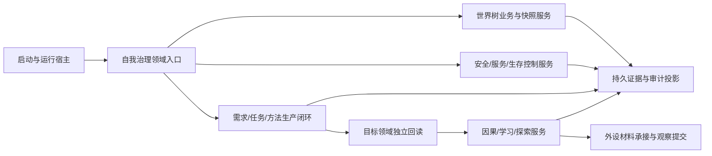

# BIZ-MAP-001 业务节点到能力与目标函数映射

## 1. 作用

本表把 L1 业务叶子映射到目标公开函数组。目标函数名和物理位置是业务架构候选；标记为 `待新增` 或 `适配扩展` 时，不表示当前代码已存在，也不冻结尚未列出的 DTO 字段 ABI。

状态含义：

- `当前复用`：能力目录已有静态实现证据，计划前仍需核对当前签名和验证状态。
- `适配扩展`：已有相邻能力，但目标合同、事务或结果不完整。
- `待新增`：没有足够证据证明存在满足目标合同的公开入口。
- `待核`：能力目录或当前代码证据不足，先核对再决定复用或新增。

## 2. 顶层目标函数组

| 业务节点 | 目标公开函数候选 | 输入 -> 输出 | 建议物理位置 | 裁决 | 当前证据 |
| --- | --- | --- | --- | --- | --- |
| BIZ-L1-001 | `解析并验证启动选项` | 命令行参数 -> 强类型启动选项或拒绝 | `海中鱼巣/启动.程序入口.ixx` | 当前复用 | CAP-0001 / F0002 |
| BIZ-L1-001 | `启动海中鱼巣运行宿主` | 启动选项、装配端口 -> 运行结果 | `海中鱼巣/启动.应用程序.ixx` | 适配扩展 | CAP-0001、CAP-0013 |
| BIZ-L1-001 | `恢复或建立运行期上下文` | 启动恢复请求 -> 隔离候选、发布租约、恢复报告 | `海中鱼巣/启动.运行期恢复.ixx` | 待新增 | 现有 CAP-0023 只证明全新上下文候选 |
| BIZ-L1-002 | `确保现实世界已引导` | 世界树引导请求 -> 世界、自我、场景完整材料 | `海中鱼巣/领域/服务.世界树业务.ixx` | 适配扩展 | 4200 设计链与现有 CAP-0033 |
| BIZ-L1-002 | `读取完整世界事实快照` | 世界快照请求 -> 同代次完整快照 | `海中鱼巣/领域/服务.世界树快照读取.ixx` | 待新增 | 4200 目标合同；当前统一快照未被能力目录证明 |
| BIZ-L1-002 | `创建并接纳世界树存在` | 创建请求 -> 已发布存在完整事实 | `海中鱼巣/领域/服务.世界树业务.ixx` | 待新增 | 世界树设计 WIP，不视为已实现 |
| BIZ-L1-002 | `更新世界树存在事实` | 更新请求 -> 新状态/动态/特征当前值 | `海中鱼巣/领域/服务.世界树业务.ixx` | 待新增 | 4200 |
| BIZ-L1-002 | `移动世界树成员` | 移动请求 -> 新归属和结构版本 | `海中鱼巣/领域/服务.世界树业务.ixx` | 待新增 | 4200 |
| BIZ-L1-002 | `移除世界树存在` | 移除请求 -> 归属退出、退役及读回材料 | `海中鱼巣/领域/服务.世界树业务.ixx` | 待新增 | 4200；禁止旧直接删除兼容路由 |
| BIZ-L1-003 | `执行一轮自我治理` | 治理请求、事实截止版本、单调时间 -> 治理结果 | `海中鱼巣/领域/服务.自我治理.ixx` | 适配扩展 | CAP-0044 只证明线程侧候选，非完整领域闭环 |
| BIZ-L1-003 | `维护分层安全值` | 安全层维护请求 -> 值/状态/动态/维护账 | `海中鱼巣/领域/服务.安全维护.ixx` | 待核 | 6140 正式合同；能力目录未登记完整闭环 |
| BIZ-L1-003 | `维护服务与生存安全` | 完整秒维护请求 -> 服务值、安全根、合同与权限结果 | `海中鱼巣/领域/服务.服务生存治理.ixx` | 待核 | 6160、6170 正式合同 |
| BIZ-L1-003 | `计算任务执行权限` | 一致事实快照 -> 带来源的任务权限投影 | `海中鱼巣/领域/服务.任务执行权限.ixx` | 待核 | 6150、6170 正式合同 |
| BIZ-L1-004 | `确认当前正差距` | 自我与世界完整快照 -> 正差距集合 | `海中鱼巣/领域/服务.自我需求治理.ixx` | 待新增 | 5090、8200 |
| BIZ-L1-004 | `建立或复用需求任务树` | 正差距、来源事实 -> 需求与唯一任务树 | `海中鱼巣/领域/服务.需求任务治理.ixx` | 适配扩展 | CAP-0038、CAP-0039 以只读/候选为主 |
| BIZ-L1-004 | `筹办并冻结方法候选` | 任务权威材料 -> 最多三个冻结候选 | `海中鱼巣/领域/服务.任务方法筹办.ixx` | 适配扩展 | CAP-0040 |
| BIZ-L1-004 | `执行一个冻结方法实例` | 执行授权、冻结候选、上下文 -> 方法执行回执 | `海中鱼巣/领域/执行.方法实例.ixx` | 待核 | 需按方法类型与工作线程边界核对 |
| BIZ-L1-004 | `独立回读任务实际结果` | 任务目标、执行回执、事实截止版本 -> 实际结果材料 | `海中鱼巣/领域/服务.任务结果验证.ixx` | 待新增 | 8210 要求独立回读，能力目录无统一入口证据 |
| BIZ-L1-004 | `结算任务需求与服务合同` | 实际结果、任务/需求/合同当前版本 -> 原子结算结果 | `海中鱼巣/领域/服务.业务结算.ixx` | 适配扩展 | CAP-0038；6160、5090 |
| BIZ-L1-005 | `补全实际结果因果链` | 前后事实、动作、实际结果 -> 因果发布结果 | `海中鱼巣/领域/服务.因果补完.ixx` | 适配扩展 | CAP-0037 只有轻量因果候选 |
| BIZ-L1-005 | `形成后继方法版本` | 因果证据、方法历史 -> 新方法候选版本 | `海中鱼巣/领域/服务.方法学习.ixx` | 待新增 | 8320 |
| BIZ-L1-005 | `形成外界探索需求` | 具名材料缺口 -> 探索需求或无探索结果 | `海中鱼巣/领域/服务.外界探索.ixx` | 待新增 | 8320 |
| BIZ-L1-006 | `裁决生存控制态` | 安全根、服务值、恢复与停止事实 -> 控制态及开放入口 | `海中鱼巣/领域/服务.生存控制.ixx` | 待核 | 6170 |
| BIZ-L1-006 | `处理唤醒请求` | 合法人类需求合同、完整秒事实 -> 唤醒候选 | `海中鱼巣/领域/服务.生存控制.ixx` | 待新增 | 6170 明确请求不直接写安全值 |
| BIZ-L1-006 | `收口运行宿主` | 停止请求、当前租约 -> 收口结果 | `海中鱼巣/启动.程序运行宿主.ixx` | 适配扩展 | CAP-0016、CAP-0013 |
| BIZ-L1-007 | `承接外设观察材料` | 外设原始材料、来源和版本 -> 已承接材料 | `海中鱼巣/领域/服务.外设材料承接.ixx` | 待核 | 6360 |
| BIZ-L1-007 | `解释并提交观察事实` | 已承接材料、冻结方法 -> 世界领域提交结果 | `海中鱼巣/领域/服务.观察事实提交.ixx` | 待新增 | 6360；外设报告不得直接写世界事实 |
| BIZ-L1-008 | `发布持久证据批次` | 已发布业务事实批次 -> 材料文件证据结果 | `海中鱼巣/适配/持久证据.业务批次.ixx` | 适配扩展 | 当前节点直接持久证据端口正在实施，不在本图包改动范围 |
| BIZ-L1-008 | `生成审计投影` | 已发布一致快照 -> SQL/日志/UI 投影结果 | `海中鱼巣/适配/审计.业务投影.ixx` | 适配扩展 | CAP-0004、CAP-0014、CAP-0045 |

## 3. 公开编排依赖方向

依赖只能沿箭头方向编排；适配层不得反向成为领域事实来源，线程不得成为领域服务的动作来源。

## 4. 下一层冻结要求

下列函数组进入实施计划前必须继续形成 L2/函数规格：

1. `恢复或建立运行期上下文`：恢复包字段、隔离候选、原子切换和时间纪元。
2. 三个安全/服务函数：DTO 数值字段、事实游标、批量完整秒算法、跨领域参与者和错误枚举。
3. `执行一个冻结方法实例`：不同方法类型的共同执行合同与领域特有结果。
4. `独立回读任务实际结果`：按目标特征/状态/关系/世界结构分派的读取合同。
5. `发布持久证据批次`：材料文件格式、校验、恢复来源和失败隔离。

其余函数若现行详细设计已经逐字段闭合，可由计划智能体引用并重新核对；不得从本映射表直接推断 ABI。
