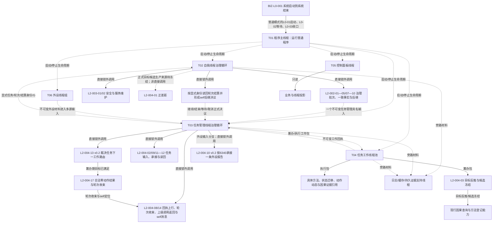

# BIZ-MAP-001 目标业务图到冻结函数与能力证据映射

更新时间：2026-08-28

## 1. 状态与连接类型

目标函数状态：`当前复用 / 适配扩展 / 待新增 / 待核`。目标设计不证明实现；能力目录的静态证据仍须按当前签名、所有权和运行验证重新核对。

连接类型固定为：

```text
直接函数调用：同一线程、队列锁外、同步取得值式结果
异步消息后继：发送阶段结束，接收线程以后独立消费
只读投影：只读且不反写机器事实
支持线程旁路：工程证据 / 缓存 / 日志，失败不改写业务结果
```

## 1.1 2026-08-13 数据服务接口重基线增量

本节是后续新施工的优先口径。下文既有映射保留为历史目标分解证据，其中按旧 L1 通用访问模式、旧世界入口或旧初始化入口形成的接口判断，不得直接用于新计划、详细设计或代码施工。新业务叶必须先按以下顺序落到强类型公开数据服务：

```text
业务叶函数
-> 强类型对象与完整请求 / 结果 DTO
-> 具名公开数据服务
-> 公开操作
-> 一致性、幂等和事务边界
-> 当前 ABI 状态
```

### I1 最小目标函数与能力映射

| 业务节点 / 叶函数 | 目标函数完整签名 | 所需强类型能力 | 具名公开服务与操作 | 裁决 | 完成边界 |
| --- | --- | --- | --- | --- | --- |
| `SYSTEM-WORLD-TREE-ROOT-PUBLISH-I1` 系统具名场景树根建立与正式读回发布 | `系统世界树根初始化结果 初始化并发布系统世界树根(普通应用上下文& 上下文, const 系统世界树根初始化请求& 请求) noexcept` | 当前场景树结构登记、`L2场景树根建立请求`、`L2场景树身份`、当前完整 `L2场景树事实`、调用方拥有的值式发布材料 | 经 A1 取得同实例 `L2场景结构服务`；依次调用 `读取当前场景树结构登记`、`建立场景树根`、再次 `读取当前场景树结构登记`、`读取场景树` | **部分实现并接正式启动**。首次/待收敛路径存在；已发布重复错误要求旧截止等于本轮新截止，无关事实推进后不能刷新副本。另有8120非零项目选择与固定唯一身份冲突 | `运行普通程序` 已映射失败阶段14并把同次成功结果交I2；阶段15永久缺号；两个具名DRIFT闭合前不得声明I1完整实现 |
| `SELF-WORLD-TREE-ROOT-CONSUME-I2` 正式再读回并发布自我世界树根消费材料 | `自我世界树根消费结果 消费并发布自我世界树根(普通应用上下文& 上下文, const 自我世界树根消费请求& 请求) noexcept` | 同次 I1 `已发布根`、当前登记、当前整树、值式消费材料 | 每次经 A1 getter取得同实例 R1；`读取当前场景树结构登记`、`读取场景树`；I2 零根写 | **现行固定身份详细设计已实现并接正式启动**；异请求读前冲突，同请求每次两读并按本轮截止刷新，不含I1重复截止错误 | `运行普通程序` 已映射失败阶段16，成功后进入 SELF-FORM；项目树选择ABI仍依赖I1具名DRIFT，I2不得自行选边 |
| `SELF-FORM` 真实自我形成与共同截止发布 | `真实自我形成结果 真实自我形成提供者::形成(const 真实自我形成请求& 请求) noexcept` | 本次 I2 根材料、固定项目角色、五个固定幂等身份、角色化存在、两个树内场景、成员与宿主正反向事实 | 经 A1 同实例取得最终 `L2存在结构服务`、`L2场景结构服务`；调用角色预读/新增、树内场景新增、成员新增、宿主新增；最终先读当前结构登记取得 `Gnow`，再以同一 `Gnow` 完整读回 | **部分实现并接正式启动**。五步调用边存在，但完整请求锁/同请求重放、当前登记共同截止、双向宿主与唯一性互证、十四状态映射及完整结果谓词均未闭合 | 失败阶段17；成功进入阶段18。三个 SELF-FORM 具名DRIFT闭合前不得声明本叶符合；成功负载未传给阶段20仍是独立消费端漂移 |
| `CONCEPT-ONTOLOGY-ROOTS-PRODUCTION-INIT` 四个语言无关概念本体根生产初始化 | `四本体根生产初始化结果 四本体根生产初始化提供者::初始化(const 四本体根生产初始化请求& 请求) noexcept` | 四个具名非零互异幂等身份、全部当前根组、逐角色完整根读回、首次幂等 / 首次期望代次持久见证、共享直接上位关系类型枚举空组、最终事实截止和值式发布材料 | 经唯一 `L2概念结构聚合服务::取得L2概念结构服务()` 取得同一 C1；读取全部当前根、按缺失角色建立、逐角色正式读回、最终再次读取全组 | **DATA三能力、BIZ DTO/编排/provider、工程登记和正式启动调用均已存在，静态正文对应目标；唯一协调者所有权仍漂移**。选择在首个 DATA 调用前锁定；每角色每调用最多一次漂移重组；禁止直达 L1、复制 CRUD、按语言 / 词性建根或缓存替代读回 | SELF-FORM 成功后进入；失败阶段18。`DRIFT-BIZ-CONCEPT-ROOTS-COORDINATOR-OWNERSHIP-NOT-ENFORCED` 闭合前仍为部分实现；阶段内零语言/普通概念/因果候选，后继能力不属于本叶 |
| `TARGET-STATE-CONTRACT-DEFINITION-CONSUME` 目标状态合同定义消费 | `目标状态合同定义读取结果 需求目标事实提供者::读取目标状态合同与值域定义(const 目标状态合同定义读取请求& 请求) const noexcept` | 合同版本、规则版本、非零G0、目标合同身份、目标特征定义身份、完整目标合同 / 特征定义 / 目标判断比较注册和值式回显 | 经普通应用现有 const 聚合 getter取得同一 `L2结构聚合服务`并构造 provider；依次显式调用`读取完整目标状态合同`、`读取完整统一特征定义`、`读取当前特征比较注册` | **DATA三入口均已发布；BIZ v0.2 完整消费合同已冻结，provider待实现；普通应用持有 / 专用getter为后继NOT_RUN**。第一笔目标缺失 / 退出分账；后两笔缺失为已证明引用后的内部不一致；只闭合I64标量有序比较，零L1、零写、零缓存 | 本叶不读取宿主当前事实、不执行目标差距比较、不裁决目标等价；代码实施和普通应用装配仍 `NOT_RUN`，不得由流程图冒充实现完成 |
| `TARGET-HOST-CURRENT-FEATURE-FACTS-CONSUME` 目标宿主同截止当前特征事实消费 | `目标宿主当前特征事实读取结果 需求目标事实提供者::读取目标宿主同截止当前特征事实(const 目标宿主当前特征事实读取请求& 请求) const noexcept` | 非零G0、预期场景树、目标场景 / 宿主 / 特征定义、树归属、完整场景 / 存在、唯一特征实例及当前值 | 复用上一叶同一 provider 和同一 `L2结构聚合服务`；固定调用 `读取场景树归属`、`读取完整场景`、`读取完整存在`、`按存在读取全部当前特征` | **现有 DATA ABI 足够；BIZ v0.2 完整消费合同已冻结，代码待上一叶结果后串行扩展**。首读缺失、指定场景成员0项、同定义实例0 / 1 / 多、空当前值、DATA漂移 / 许可 / 资源及已证明引用后的矛盾严格分账；四读同一 G0，零状态 / 动态、零L1、零写、零缓存 | BIZ-L3-004-01-01 v0.3 先读合同再调用本叶；差距比较、需求CRUD、普通应用专用getter / 持有及系统闭环 NOT_RUN |
| `TARGET-CURRENT-FACTS-COMPOSE` 需求目标当前事实组合 | `需求目标当前事实结果 需求目标事实提供者::读取需求目标当前事实(const 需求目标当前事实请求& 请求) const noexcept` | 父合同 / 规则版本、非零G0、场景树 / 场景 / 宿主 / 目标合同 / 特征定义五个身份、两个 L4 完整值式材料 | 在同一 `需求目标事实提供者` 中恰一次调用 `读取目标状态合同与值域定义`，再以正式回显定义恰一次调用 `读取目标宿主同截止当前特征事实`；逐字段互证后一次形成完整材料 | **BIZ-L3-004-01-01 v0.3 父组合合同已冻结；代码待两个 L4 前驱真实结果、退出、临时专项清理及同两文件释放后串行扩展**。零 DATA 直达、零写、零重试、零缓存、零截止重选；所有非成功零部分材料 | 不新增 DATA 接口，不修改《数据服务最终需求清单》；目标差距比较、需求 / 任务 CRUD、普通应用持有 / getter / 装配、T02 接线和系统闭环 NOT_RUN |
| `TARGET-GAP-REGISTERED-COMPARE-CONSUME` 注册比较目标差距消费 | `目标差距比较结果 特征判断收束服务::按注册比较合同裁决目标差距(const 目标差距比较请求& 请求) const noexcept` | 非零比较请求身份、完整 `需求目标当前事实结果`、目标合同允许关系位、当前 I64、正式比较注册和同一 G0 | 新服务只持同实例 `L2特征结构服务`；固定构造目标判断、左当前事实 / 右目标状态、预期注册算法族 / 版本及 `具名关系 | 差异材料=6`，恰一次调用 `比较特征` | **DATA 比较 ABI 已实现退出；BIZ-L3-004-01-02 v0.2 与消费合同已冻结，代码待三个目标事实前驱结果后实施**。完整 DATA 结果原样承载；差异不可表示或注册不支持位6为不可比较，不降级仅关系成功；零注册预读、零算法直调、零写 | 不新增 DATA 接口、不修改最终需求清单；父正差距组合、需求 / 任务 CRUD、普通应用持有 / getter / 装配、T02 和系统闭环 NOT_RUN |
| `TARGET-POSITIVE-GAP-CONFIRM-COMPOSE` 当前正差距确认组合 | `需求正差距结果 需求目标裁决服务::确认当前正差距(const 需求正差距请求& 请求) const noexcept` | 父版本、非零G0、五个目标身份、比较请求身份、完整目标当前事实与完整目标差距比较结果 | 新组合服务按值持有目标事实 provider和判断收束服务；恰一次读目标当前事实，再恰一次裁决注册比较，逐字段互证后形成四类业务结果 | **BIZ-L2-004-01 v0.2 合同已冻结，代码待两个子服务真实结果后实施**。函数允许需求尚未建立，零需求身份 / 结构 / owner、零 DATA / L1 直达、零写 / 重试 / 缓存 / 截止重选；旧 `需求业务服务`归属退出 | 不新增 DATA 接口、不修改最终需求清单；普通应用持有 / getter / 装配、T02接线、需求建立、任务树和系统闭环 NOT_RUN |
| `METHOD-REGISTRY-ROOT-PRODUCTION-INIT` 唯一方法登记根生产初始化 | `方法登记根生产初始化结果 方法登记根生产初始化提供者::初始化(const 方法登记根生产初始化请求& 请求) noexcept` | 非零方法登记根幂等身份、方法登记根角色与完整根、首次幂等 / 首次期望代次见证、每次实际请求与结果证据、最终恰一根事实和值式发布材料 | 经唯一 `L2方法结构聚合服务::取得L2方法结构服务()` 取得同实例服务；调用“读取全部当前方法登记根”“建立方法登记根”“按角色读取当前方法登记根”，最终再次读取全组 | **DATA三能力、BIZ DTO/编排/provider、工程登记和正式启动调用均已存在，静态正文对应目标；唯一协调者所有权仍漂移**。发布未知优先原请求重放；只有明确零变化漂移且根仍缺失时同键重组一次；正常重复仍完整读回 | 阶段18成功后进入，任一非成功映射阶段19；`DRIFT-BIZ-METHOD-REGISTRY-ROOT-COORDINATOR-OWNERSHIP-NOT-ENFORCED`闭合前仍为部分实现；本叶不创建方法首、语言或线程 |
| `SELF-THREAD-PRODUCTION-CREATE-AND-PARK` 唯一自我线程生产创建并停门 | `自我线程生产创建结果 自我线程::创建并使自我线程停在治理运行门(const 自我线程生产创建请求& 请求) noexcept` | 本轮 I2 根消费材料、SELF-FORM 真实自我事实、线程逻辑身份、运行代次、有界邮箱、独立关闭门、进入 / 停门 / 完成见证和唯一线程租约 | BIZ 运行期基础设施；调用私有 `自我线程::线程入口()`，生命周期端口仅最佳努力投影；创建停门阶段不以 DATA 读写证明成功 | 创建意图在首个线程前锁定；同意图调用完整串行，成功重复零新线程；失败锁存停止、唤醒、完成见证后 join；诊断超时零 detach且租约守恒 | **类、工程登记和阶段20接线已存在，但当前请求缺 SELF-FORM 正式材料、对象未由普通应用上下文唯一持有且生命周期端口为空，故为部分实现/漂移**；成功终点仍只证明停在关闭门和邮箱零冻结批次 |

### 当前公开服务基座

当前主线已存在六个 `L2...结构服务`、R1、A1、I1/I2、SELF-FORM、概念/方法根 DATA 能力与三个生产 provider；`运行普通程序` 已静态接通 `14 / 16 / 17 / 18 / 19 / 20` 分账。该事实不证明父 `初始化普通系统` 聚合根存在，也不证明 SELF-FORM 目标合同、三个协调者的上下文唯一所有权、SELF-FORM 向阶段20材料交付或全量动态矩阵闭合。

新设计不得把六组直接 getter 写成 A1 的替代入口。A1 正式实现透明持有六个同实例服务引用、零 DTO 解释、零写入所有权；I1 与 I2 均只经 A1 getter消费同实例 R1。

## 2. L0 与活动 L1 线程所有者函数

| 图身份 | 唯一根函数完整签名 | 物理位置 | 裁决 | 直接下层 |
| --- | --- | --- | --- | --- |
| BIZ-L0-001 | `main -> 解析并验证启动选项 -> 运行海中鱼巣 -> 映射进程退出码` | `海中鱼巣/入口.cpp`、`海中鱼巣/启动.程序入口.ixx`、`海中鱼巣/启动.应用程序.ixx` | 适配扩展；现有入口、解析、模式路由和退出码映射可复用，启动/运行/收口按 L0 四阶段继续核对 | L0-01—03 分别连接具名 L1 流程组；L0-04 为终止节点 |
| BIZ-L1-T01 v0.4 | `程序运行结果 运行普通程序(启动模式 模式)` | `海中鱼巣/启动.应用程序.ixx` | 目标只调用14个BIZ-L2根；三来源安装后由001-10锁存本次值式观察结果内首项验真停止请求，T04消费者池先于T03生产者启动，收口末尾只非破坏性重读各来源当前首次锁存。HEAD仍内联001-03六叶、合并且反序启动T03/单个旧尾部线程、只等进程信号，T02/T05未结构化连接 | BIZ-L2-001-01—10、12—15；并发后继T02—T06；生产运行期生命周期及致命分类/来源ABI为独立DRIFT |
| BIZ-L1-T02 v0.6 | `自我治理循环退出结果 自我线程::运行治理循环() noexcept` | `海中鱼巣/线程/创建.自我线程.ixx` | 先按固定九类路由；任务轮次结算定位才走002-04，现实授权请求直接走002-05；002-07只形成具体D及原完整幂等信封，002-09形成self后继决议定位，两者逐项调用002-08 | BIZ-L2-002-01—05、002-07—10、003-01—02共11个来源已闭合直接根；002-06/003-04/004-01/004-06缺正式生产来源，不得伪接线；异步下行到T03 |
| BIZ-L1-T03 v0.5 | `void 任务管理线程::运行结果上行循环() noexcept` | `海中鱼巣/线程/任务管理线程.ixx` | 目标严格调用12个直接根；先恢复已接管内部处理槽，无槽才经004-09公平取三来源输入，主阶段治理槽不作第四来源；执行冻结后由003-03 v0.4 fresh选择0..1项；004-13 v0.2只形成阶段路由，筹办期目标已满足交004-17形成合法无执行短路结果并收束 | BIZ-L2-003-03 v0.4、004-02、04、08—14、16、17；异步连接T02/T04 |
| BIZ-L1-T04 v0.3 | `void 任务工作线程::运行强类型执行循环() noexcept` | `海中鱼巣/线程/任务工作线程.ixx` | 目标只直接调用004-07/004-15 v0.2；004-07 v0.2已冻结在途槽优先恢复、接收门开放后取包和结构化工作结果定位交付；HEAD仍只运行已形成结果尾部并形成/上交旧回执，目标强类型循环、筹办/执行工作包和生命周期发布调用均未接线 | BIZ-L2-004-07/004-15 v0.2；004-03/05及执行细节只在004-07内部；目标子合同已闭合，代码仍待校正 |
| BIZ-L1-T05 v0.4 | `void 控制面板线程::运行只读消息循环() noexcept` | 目标`海中鱼巣/线程/控制面板线程.ixx`；当前不存在 | 待新增；当前只有按模式启动bool空壳和可复用8110读写provider，普通模式仍走无窗口宿主 | BIZ-L2-005-01—06 v0.2六个直接根；业务G与线程消息身份分账，停止异步到T01 |
| BIZ-L1-T06 v0.4 | `void 外设线程::运行采集循环() noexcept` | 目标`海中鱼巣/线程/外设线程.ixx`；当前不存在 | 待新增；当前启动/收口为空壳，D455仅有完整四流采集、缓存和标量上行桥，无四产品/恢复/强类型报告队列生产接线 | BIZ-L2-006-01—05五个直接根；006-05只投影真实生命周期，报告异步到BIZ-L2-004-10 v0.2 |

跨线程业务顺序不由任一 BIZ-L1 根函数独占，统一读取 `BIZ-MAIN-001_自我治理到需求任务方法结果结算_目标业务流程图_v0.4.md`；其每个阶段再落到本表中的单函数合同。v0.4 已把工作结果定位、本轮收束、0..1 上级调用返回、外设恢复前置和唯一共同作用场景接到现行粗层顺序；下层仍须逐图校正实现与合同残留。

## 3. 已冻结 L2 的线程归属

| 图身份 | 唯一根函数完整签名 | 物理位置 | 父线程 | 连接类型 | 裁决 |
| --- | --- | --- | --- | --- | --- |
| BIZ-L2-001-01 v0.2 | `普通应用装配结果 构造普通应用上下文(const 普通应用配置& 配置)` | `海中鱼巣/装配.普通应用.ixx` | T01 | 直接 | 复用现行 L1 / L2 服务、聚合与筹办提供者装配；初始返回零物理线程。阶段20由001-03/03-11创建自我线程并把唯一租约交普通应用上下文持有；当前服务链已实现，后继租约接纳边界未闭合 |
| BIZ-L2-001-02 v0.2 | `程序停止来源安装结果 安装程序停止来源(const 程序停止来源安装请求& 请求) noexcept` | `海中鱼巣/启动.程序运行宿主.ixx` | T01 | 直接 | 适配扩展；一次形成信号、程序控制停止来源和致命线程故障停止来源三类同代次租约；后两者均为一次锁存/首次记录拥有体，不是邮箱；致命分类/来源逐字段ABI仍有具名DRIFT |
| BIZ-L2-001-03 v0.2 | `系统初始化结果 初始化普通系统(普通应用上下文& 上下文, const 系统初始化请求& 请求) noexcept` | `海中鱼巣/启动.系统初始化.ixx` | T01 | 直接 | 现行链由L3-001-03-00/07—11冻结；HEAD仍由`运行普通程序`内联六叶，聚合根函数/DTO未实现；阶段20还缺SELF-FORM材料且所有权漂移 |
| BIZ-L2-001-04 | `支持线程组启动结果 启动支持线程组(const 支持线程组启动请求& 请求)` | `海中鱼巣/启动.线程组协调.ixx` | T01 | 支持旁路 | 目标根/DTO未实现；HEAD只有无参`bool`固定成功空壳，且父调用把false升级整体失败。EVENT叶已实现但零生产调用，CACHE/持久叶不存在 |
| BIZ-L2-001-05 | `任务工作线程池启动结果 启动任务工作线程池(const 任务工作线程池启动请求& 请求)` | `海中鱼巣/启动.线程组协调.ixx` | T01 -> T04 | 线程池启动 | 父根/DTO/池租约未实现；HEAD运行包先启动T03、后启动一个旧结果尾部线程，与消费者池先进入的目标顺序和工作包语义均漂移 |
| BIZ-L2-001-06 | `任务管理线程启动结果 启动任务管理线程(const 任务管理线程启动请求& 请求)` | `海中鱼巣/启动.线程组协调.ixx` | T01 -> T03 | 线程启动与T04门联锁 | 未实现；先以关闭门T04池租约启动T03候选，T03进入后原子开门并组合发布三项见证 |
| BIZ-L2-001-07 | `外设线程组启动结果 启动外设线程组(const 外设线程组启动请求& 请求)` | 目标`海中鱼巣/启动.线程组协调.ixx`；当前只有`启动.应用程序.ixx`恒真空壳 | T01 -> T06 | 0项无需启动；N项全部进入后发布完整组；半失败普通回收或材料/租约转001-13 | 待新增；D455工厂和模拟线程均未接生产 |
| BIZ-L2-001-08 | `自我治理开放结果 开放自我线程治理循环(const 自我治理开放请求& 请求) noexcept` | 目标`海中鱼巣/启动.线程组协调.ixx`；当前同名函数位于`启动.应用程序.ixx` | T01 -> T02 | 停门及001-04—07同代次完整结果 -> 一次开门 -> 治理循环进入见证 | 目标根未实现；HEAD同名函数恒真，真实void开门由父函数旁路调用 |
| BIZ-L2-001-09 | `控制面板线程启动结果 按模式启动控制面板线程(const 控制面板线程启动请求& 请求) noexcept` | 目标`海中鱼巣/启动.线程组协调.ixx`；当前同名bool空壳位于`启动.应用程序.ixx` | T01 -> T05 | 无窗口空租约无需启动；普通模式取得唯一T05租约和内部窗口/循环进入见证；失败回收或转共同收口 | 目标根未实现；HEAD普通模式仍走无窗口宿主 |
| BIZ-L2-001-10 | `程序停止等待结果 等待程序停止请求(const 程序停止等待请求& 请求)` | `海中鱼巣/启动.程序运行宿主.ixx` | T01 | 直接 | 待新增；通知只唤醒，非破坏性重读三来源当前锁存并验真后由T01不可逆锁存本次首项停止请求；本地观察批标记不进入来源，重复/并发候选只作本次值式补充 |
| BIZ-L2-001-12 | `任务治理停产结果 停止自我新任务意图并冻结任务工作包派发(const 任务治理停产请求& 请求) noexcept` | `海中鱼巣/启动.分阶段停止.ixx` | T01 -> T02/T03 | 先T02意图停产、后T03统一派发冻结、只排空和当前快照 | 待新增；HEAD只存在T03执行请求停止锁存，不覆盖完整目标 |
| BIZ-L2-001-13 | `在途生产者收口结果 收口并连接外设线程组与任务工作线程池(const 在途生产者收口请求& 请求)` | `海中鱼巣/启动.分阶段停止.ixx` | T01 -> T06/T04 | 在途收口 | 待新增 |
| BIZ-L2-001-14 v0.2 | `治理线程收口结果 共同排空双向治理材料并连接任务管理自我和控制面板线程(治理线程租约组&&, const 治理线程共同收口请求&) noexcept` | `海中鱼巣/启动.分阶段停止.ixx` | T01 -> T03/T02/T05 | 治理共同收口 | 待新增；L3-001-14-01—04和10项L4冻结双门、T05退出、根循环共同排空、线性化静止屏障和逐线程连接；外部逐项消费、通用接管owner和顺序排空退出 |
| BIZ-L2-001-15 v0.2 | `支持线程组收口结果 刷新并连接支持线程组(支持线程租约组&& 线程租约组, const 支持线程组收口请求& 请求) noexcept` | `海中鱼巣/启动.分阶段停止.ixx` | T01 | 支持旁路收口 | 待新增；逐线程停收取截止、材料资格和强类型停止连接；正常收口、异常资源回收与未连接租约分账 |
| BIZ-L2-002-01 v0.2 | `自我治理批次组合结果 自我治理批次路由::冻结当前治理批次(const 自我治理批次组合请求& 请求) noexcept` | `海中鱼巣/线程/路由.自我治理批次.ixx` | T02 | 直接 | 待新增；有状态路由接管邮箱值式批次，同批补证重试零再次读邮箱；v0.1 已被替代 |
| BIZ-L2-002-02 | `自我治理一致事实结果 读取自我治理一致事实(const 自我治理一致事实请求& 请求) noexcept` | `海中鱼巣/领域/服务.L2治理函数骨架.ixx` | T02 | 直接只读 | 适配扩展 |
| BIZ-L2-002-03 v0.4 | `治理批次路由结果 自我治理批次路由::复核并路由治理批次(const 治理批次路由请求& 请求) const noexcept` | `海中鱼巣/线程/路由.自我治理批次.ixx` | T02 | 直接 | 适配扩展；按邮箱冻结顺序复核九类强类型输入，任务结果分支替换为任务轮次结算定位分支 |
| BIZ-L2-002-04 v0.4 | `任务轮次结算定位复核结果 复核任务轮次结算定位绑定事实(const 任务轮次结算定位复核请求& 请求) noexcept` | `海中鱼巣/领域/服务.L2治理函数骨架.ixx` | T02 | 直接只读 | 替换当前任务结果混合入口；只按显式T/R/轮次结算身份/G独立读回完整结算和轮次已收束阶段，其它类别不推进 |
| BIZ-L2-002-05 v0.2 | `现实执行授权前置裁决结果 自我治理裁决组合器::裁决生存控制与现实执行授权前置(const 现实执行授权前置裁决请求& 请求) const noexcept` | `海中鱼巣/领域/组合.自我治理裁决.ixx` | T02 | 直接 | 待新增；同G0控制态+当前冻结互证，零通用许可账 |
| BIZ-L2-002-06 v0.2 | `需求父链回流复核结果 需求父链回流组合器::按显式需求核算结果回流复核父需求(const 需求父链回流复核请求& 请求) const noexcept` | `海中鱼巣/领域/组合.需求父链回流.ixx` | 取得显式需求核算结果的合法入口；T02来源未冻结 | 待接线 | 只消费0..N项显式需求核算结果；合法空组不证明父级已取得生产来源，禁止从任务结果或其它路由结果补造 |
| BIZ-L2-002-07 v0.2 | `当前具体需求承接后继结果 自我治理裁决组合器::裁决生存控制与当前具体需求承接后继(const 当前具体需求承接后继请求& 请求) const noexcept` | `海中鱼巣/领域/组合.自我治理裁决.ixx` | T02 | 直接 | 生存控制和具体D承接边界已冻结；承接成功载荷保留原输入键、来源关系承接键、准备键和六阶段键组。多候选主需求比较规则未冻结，整体不可施工 |
| BIZ-L2-002-08 v0.2 | `任务管理具名输入提交结果 任务治理下行桥::提交一个任务管理具名输入(const 任务管理具名输入提交请求& 请求) noexcept` | `海中鱼巣/线程/任务治理下行桥.ixx` | T02 -> T03 | 异步单项强类型输入 | 待新增；当前只允许D及原完整承接幂等信封，或self后继决议定位 |
| BIZ-L2-002-09 v0.1 | `自我任务后继决议结果 自我任务后继决议提供者::发布或读取自我任务后继决议(const 自我任务后继决议请求& 请求) noexcept` | `海中鱼巣/领域/自我治理/服务.自我任务后继决议.ixx` | T02 -> T03 | 自我治理正式事实 | HEAD未实现；SELF详细设计已冻结按显式T/R/结算/G发布与独立读回，消息只携带定位且不复制指令 |
| BIZ-L2-002-10 v0.2 | `自我现实执行授权结果 自我现实执行授权提供者::发布或读取自我现实执行授权(const 自我现实执行授权请求& 请求) noexcept` | `海中鱼巣/领域/自我治理/服务.自我现实执行授权.ixx` | T02 -> T03 | 自我业务正式授权 | HEAD未实现；只消费002-05需要授权前置，不混入硬否决、技术许可或调度资格 |
| BIZ-L2-003-01 v0.2 | `安全维护结果 分层安全维护服务::评估并维护安全层(const 安全维护请求& 请求)` | `海中鱼巣/领域/服务.分层安全维护.ixx` | T02 | 直接 | 目标唯一根；HEAD只有治理函数骨架空壳和纯值算法，生产组合待实现，禁止新建第二套入口 |
| BIZ-L2-003-02 v0.2 | `服务生存维护结果 服务生存治理服务::维护服务与生存安全(const 服务生存维护请求& 请求)` | `海中鱼巣/领域/服务.服务生存治理.ixx` | T02 v0.6 | 直接 | 待新增；N=0合法零写、新纪元恢复、全部分段候选、统一事务、来源G0/首次G1与完整状态矩阵已冻结 |
| BIZ-L2-003-03 v0.4 | `任务普通派发选择结果 任务普通派发选择组合器::选择一个冻结后当前可普通派发任务(const 任务普通派发选择请求& 请求) const noexcept` | `海中鱼巣/领域/内部治理/服务.任务普通派发选择.ixx` | BIZ-L1-T03 v0.5直接调用 | 待新增；旧骨架仅固定返回材料缺口 | 05闭合候选全集，06复用正式安全根读回，07展开T→D/目标/B/安全/服务材料，08—10完成投影、选择和守卫；共同作用场景按6150 v0.12/5230 v1.6由目标/方法约束与路径/冻结显式字段在Gnow互证 |
| BIZ-L2-003-04 v0.2 | `服务合同建立结果 服务合同服务::建立或读取服务合同(const 服务合同建立请求& 请求) noexcept` | `海中鱼巣/领域/服务.服务合同.ixx` | 人类服务需求正式准入完成后的合法入口；T02来源未冻结 | 待接线 | 目标合同有效；缺需求身份、首次事件、合同代次、正式读取键和版本组的生产交付，不能扩展九类消息补造 |
| BIZ-L2-004-01 | `需求正差距结果 需求目标裁决服务::确认当前正差距(const 需求正差距请求& 请求) const noexcept` | `海中鱼巣/领域/服务.需求目标裁决.ixx` | 目标候选正式形成后的合法入口；T02来源未冻结 | 待接线 | v0.2目标合同有效；派生需求消息不携带完整五身份和比较请求身份，不能直接冒充调用请求 |
| BIZ-L2-004-02 v0.2 | `具体需求任务承接结果 任务承接组合器::按具体需求承接或复用任务(const 具体需求任务承接请求& 请求) noexcept` | `海中鱼巣/领域/组合.任务承接.ixx` | T03 | 直接 | 待新增；一个D+原完整幂等信封，0项T走正式E/T/R1/首态六阶段链，1项T只按来源关系承接键写/重复T→D；旧需求创建、任务树和目标等价事务退出 |
| BIZ-L2-004-03 | `任务筹办闭合结果 任务筹办服务::筹办并冻结方法候选(const 任务筹办请求& 请求)` | `海中鱼巣/领域/服务.任务筹办.ixx` | T04 | 直接；输入来自筹办工作包 | 待新增 |
| BIZ-L2-004-04 | `任务工作调度结果 任务工作调度路由::派发一个不可变任务工作包(const 任务工作调度请求& 请求) const` | `海中鱼巣/线程/路由.任务工作调度.ixx` | T03 -> T04 | 异步筹办 / 执行工作包 | 适配扩展；筹办包零调度材料，执行包只冻结003-03已选择结果的选择/冻结/实例/完整调度投影和按需自我授权，零重新选择/通用许可 |
| BIZ-L2-004-05 | `任务实际结果回读结果 运行期只读查询组合器::独立回读任务实际结果(const 任务实际结果回读请求& 请求) const` | `海中鱼巣/领域/组合.运行期只读查询.ixx` | T03 | 直接只读 | 适配扩展 |
| BIZ-L2-004-06 v0.2 | `需求独立核算结果 需求独立核算组合器::按需求实际使用时fresh独立核算(const 需求独立核算请求& 请求) const noexcept` | `海中鱼巣/领域/组合.需求独立核算.ixx` | 具名需求实际使用入口；T02来源未冻结 | 待接线 | 每个需求按自身目标与同G0当前事实核算；调用方必须交付显式需求、目标合同和实际使用触发，来源任务结果仅为可选线索 |
| BIZ-L2-004-07 | `任务工作线程受控消费结果 任务工作线程::消费并推进一个不可变任务工作包(任务工作调度路由& 调度路由, std::uint64_t 当前时间戳)` | `海中鱼巣/线程/任务工作线程.ixx` | T04 | 直接；接收门开放后按异步工作包种类调用筹办或执行 | 适配扩展；当前v0.1仍以旧回执为结果材料且缺接收门前置/等待矩阵，BIZ-L2细化必须改为结构化工作结果定位 |
| BIZ-L2-004-08 v0.2 | `任务管理上行处理结果 任务管理上行桥::上报一条任务工作结果(const 任务工作结果定位& 定位) noexcept` | `海中鱼巣/线程/任务管理上行桥.ixx` | T03 | 直接；输入来自共享结果队列的筹办 / 执行定位 | 适配扩展；按来源独立读回后闭合正式结果、轮次收束、0..1上级调用返回/槽结算和self定位，004-14由父T03独立提交 |
| BIZ-L2-004-09 v0.3 | `任务管理输入取出结果 任务管理线程::取出一个不可变任务管理输入() noexcept` | `海中鱼巣/线程/任务管理线程.ixx` | T03 | 直接；锁内三来源输入仲裁 | 适配扩展；T02具名输入、6340报告和T04工作结果定位公平取出，旧回执退出目标联合 |
| BIZ-L2-004-10 v0.2 | `外设报告承接结果 任务外设材料承接服务::按6340承接一条外设报告(const 外设报告承接请求& 请求)` | `海中鱼巣/领域/服务.任务外设材料承接.ixx` | T03 | 直接；报告身份唯一一次承接；匹配任务、等待、订阅和活跃需求 | 待新增；四类业务承接产物与普通处置分账，派生需求三件套只交self治理，不直接建立需求或任务 |
| BIZ-L2-004-11 v0.2 | `任务承接活动路径读回结果 运行期只读查询组合器::完整读回任务承接与需求活动路径(const 任务承接活动路径读回请求& 请求) const noexcept` | `海中鱼巣/领域/组合.运行期只读查询.ixx` | T03 | 直接只读 | 待新增目标组合；同G0读取正式T→E/E、当前R/ARCH-L2阶段、完整T→D、逐需求目标/活动路径和阶段可空材料；旧治理存在/状态及新合同许可分支退出 |
| BIZ-L2-004-12 v0.2 | `任务等待回流重判结果 任务等待回流重判组合器::按单项具名回流重判受影响任务(const 任务等待回流重判请求& 请求) const noexcept` | `海中鱼巣/领域/内部治理/服务.任务等待回流重判.ixx` | T03 | 直接只读 | 待新增；正式回流逐字段绑定T/R/等待槽，fresh比较目标、重算阻塞并只形成值式同轮后继来源；保持等待零写、零许可裁决，旧父任务联合事务退出 |
| BIZ-L2-004-13 v0.2 | `任务下一工作阶段结果 任务主阶段治理组合器::裁决任务下一工作阶段(const 任务下一工作阶段请求& 请求) const noexcept` | `海中鱼巣/领域/内部治理/服务.任务主阶段治理.ixx` | T03 | A00纯值裁决 | 待新增；只消费004-11/12同G0快照，按正式ARCH-L2阶段形成工作路由；不读取DATA、不产生许可结论，控制态与调度资格归003-03 |
| BIZ-L2-004-14 v0.2 | `任务管理到self输入提交结果 任务管理上行桥::提交一个任务管理到self具名输入(const 任务管理到self输入提交请求& 请求) noexcept` | `海中鱼巣/线程/任务管理上行桥.ixx` | T03 -> T02 | 异步消息 | 适配扩展；每次只提交轮次结算定位、现实执行授权请求、派生需求三件套或结构化治理缺口定位之一，T03原处理槽持有重试材料，桥不建第二重发状态 |
| BIZ-L2-004-15 v0.2 | `线程生命周期发布结果 任务工作线程::报告一次生命周期故障(const 任务工作线程生命周期故障报告请求& 请求) noexcept` | `海中鱼巣/线程/任务工作线程.ixx` | T04 | 支持旁路 | 待适配；构造一次真实故障事件并复用已发布发布端口，投影与004-07业务结果分账；投影未接受不阻塞业务恢复或建立重试槽 |
| BIZ-L2-004-16 v0.2 | `任务后继消费结果 任务主阶段治理提供者::消费自我任务后继决议(const 任务后继消费请求& 请求) noexcept` | `海中鱼巣/领域/内部治理/服务.任务主阶段治理.ixx` | T03 | 直接；四分支正式后继消费 | HEAD未实现；业务语义由3200/4260/5210冻结，详细设计ABI待同步。继续按task/阶段两owner分段收敛并切换当前R/P引用；等待只有状态/指令且截止0；结束/普通取消复核轮次已收束，不重复接收停止证据 |
| BIZ-L2-004-17 v0.2 | `任务零动作收束结果 任务零动作收束提供者::形成合法无执行短路结果并收束当前任务轮次(const 任务零动作收束请求& 请求) noexcept` | `海中鱼巣/领域/内部治理/服务.任务零动作收束.ixx` | T03 | 直接；仅消费004-13零动作路由 | 用户业务口径已裁决；同一任务结果owner发布实际执行/合法短路互斥分支后复用004-08-03—05；来源G0与各owner截止分账，self只收T/R/结算身份/G；正式规范/ABI待同步 |
| BIZ-L2-005-01 v0.2 | `控制面板窗口创建结果 控制面板窗口端口::创建并显示控制面板窗口(const 控制面板窗口创建请求& 请求) noexcept` | 目标`海中鱼巣/界面/控制面板窗口.cpp`；当前不存在 | T05 | 直接 | 待新增；无窗口模式不进入，UI载体不是业务事实；8120未选择WebView等具体内容技术，HEAD只有启动bool空壳且普通模式仍运行无窗口宿主 |
| BIZ-L2-005-02 v0.2 | `线程生命周期发布结果 控制面板线程::报告一次生命周期投影(const 控制面板线程生命周期报告请求& 请求) noexcept` | 目标`海中鱼巣/线程/控制面板线程.ixx`；复用当前`投影.线程生命周期.ixx` | T05 | 支持旁路 | provider已发布、适配待新增；所有真实生命周期事件共用同一薄适配，但一次调用只承载一个事件；原样保留容量/冲突可携带既有当前投影的公开矩阵，消息循环根不报告物理已退出，不裁决业务失败 |
| BIZ-L2-005-03 v0.2 | `控制面板只读投影结果 控制面板投影服务::读取控制面板只读投影(const 控制面板只读投影请求& 请求) const noexcept` | 目标`海中鱼巣/领域/组合.控制面板投影.ixx`；当前不存在 | T05 | 直接只读 | 业务事实G与线程当前消息身份分账、只做人读组合的职责已冻结；业务provider集合/强类型键/版本/分页与状态载荷ABI待详细设计，当前不可施工 |
| BIZ-L2-005-04 v0.2 | `控制面板窗口端口::显示只读投影`（候选签名待冻结） | 物理文件与内容技术待详细设计选择；当前不存在 | BIZ-L1-T05 | 直接 | 技术中性显示职责已冻结；不反写、不比较异证据域数值。最终ABI等待005-03输出与005-01单一内容适配合同，当前不可施工 |
| BIZ-L2-005-05 v0.2 | `程序控制提交端口::提交程序停止请求`（候选身份待冻结） | 与001-02/001-10共享的程序控制来源物理模块待详细设计；当前不存在 | BIZ-L1-T05 -> BIZ-L2-001-10 | 同一来源提交/读回 | 强类型停止请求、幂等优先序、首次记录与锁存同线性化、通知仅唤醒已冻结；最终DTO/租约/关闭ABI待同一详细设计，当前不可施工 |
| BIZ-L2-005-06 v0.2 | `控制面板窗口端口::关闭控制面板窗口`（候选签名待冻结） | 物理文件与窗口/内容技术待详细设计；当前不存在 | BIZ-L1-T05 | 直接 | 只收口当前实例；呈现结束与零剩余资源共同证明成功，未完成保留唯一租约。不预选平台关闭或资源类型，最终ABI待005-01同一详细设计 |
| BIZ-L2-006-01 v0.2 | 候选`外设原始采集结果 外设采集端口::采集一次外设原始材料(const 外设原始采集请求& 请求)` | 具体文件待详细设计；当前D455叶位于`海中鱼巣/适配/采集器.D455相机.ixx` | T06 | 直接 | 职责已校正、通用ABI未冻结；控制域创建时绑定适配器，等待/订阅不作每帧采样许可，D455只支持完整四流成功 |
| BIZ-L2-006-02 v0.2 | 候选`外设非成功收束结果 分类并收束一次外设非成功材料(const 外设非成功收束请求& 请求) noexcept` | 控制域私有收束边界，具体文件待详细设计 | T06 | 纯值收束 / 不可舍弃报告回流 | 职责已校正、ABI未冻结；零诊断队列/生命周期发布；实例级错误报告作用范围/产品承载待6340/6350冻结 |
| BIZ-L2-006-03 v0.2 | 候选 `时间对齐并形成强类型外设报告(请求)` | 具体文件待详细设计 | T06 | 直接 | 职责已冻结、ABI未冻结；保持主题原时间，以同基准计算运行期年龄，再形成四类主题产品之一和强类型报告 |
| BIZ-L2-006-04 v0.2 | 候选 `外设材料发布结果 发布外设材料(const 外设材料发布请求& 请求)` | 具体文件待详细设计 | T06 -> T03 | 异步消息 | 职责已冻结、ABI未冻结；先复核，再按需闭合可恢复前置，最后发布唯一物理队列/对应分类索引 |
| BIZ-L2-006-05 v0.1 | 候选 `线程生命周期发布结果 报告一次外设线程生命周期投影(线程生命周期发布端口& 端口, const 线程生命周期发布请求& 请求) noexcept` | 外设线程module-private helper；具体文件待T06详细设计 | T06 -> 8110 | 只写投影 | 待新增薄适配；直接复用现行8110 DTO/端口，不建外设专用请求；一次调用只报告一个真实事件，采集循环根不发布已退出/异常退出终态或线程完成见证 |

## 3.1 已冻结的启动协调 L3

| 图身份 | 唯一根函数完整签名 | 物理位置 | 父图 | 裁决 |
| --- | --- | --- | --- | --- |
| BIZ-L3-001-03-00 | `系统世界树根初始化结果 初始化并发布系统世界树根(普通应用上下文& 上下文, const 系统世界树根初始化请求& 请求) noexcept` | `海中鱼巣/业务/初始化.系统世界树根.inl` + `海中鱼巣/装配.普通应用.ixx` | L2-001-03 | 部分实现并接启动；失败14、成功同次进入I2已接线，但重复截止过约束和项目选择合同冲突未闭合 |
| BIZ-L3-001-03-07 | `自我世界树根消费结果 消费并发布自我世界树根(普通应用上下文& 上下文, const 自我世界树根消费请求& 请求) noexcept` | `海中鱼巣/业务/消费.自我世界树根.inl` + `海中鱼巣/装配.普通应用.ixx` | L2-001-03 | 现行固定身份详细设计已实现并接启动；失败16、成功进入SELF-FORM；项目树选择ABI依赖I1具名DRIFT |
| BIZ-L3-001-03-01 | 历史冻结函数合同 | 历史物理位置，仅保留证据 | L2-001-03（历史） | 已退出当前初始化链；不得施工、改名或自动改挂03-10；未来后继须独立重新设计 |
| BIZ-L3-001-03-02 | 历史冻结函数合同 | 历史物理位置，仅保留证据 | L2-001-03（历史） | 已退出当前初始化链；不得施工、改名或自动改挂03-11；未来后继须独立重新设计 |
| BIZ-L3-001-03-03 | 历史冻结函数合同 | 历史物理位置，仅保留证据 | L2-001-03（历史） | 已退出当前初始化链；不得施工、改名或自动改挂03-11；未来后继须独立重新设计 |
| BIZ-L3-001-03-04 | 历史冻结函数合同 | 历史物理位置，仅保留证据 | L2-001-03（历史） | 已退出当前初始化链；不得施工、改名或自动改挂03-11；未来后继须独立重新设计 |
| BIZ-L3-001-03-05 | 历史失效函数合同 | 历史物理位置，仅保留证据 | L2-001-03（历史） | 已由 BIZ-L3-001-03-09 正式替代；旧四对象领域、关系12和固定生命周期状态语义不得复用 |
| BIZ-L3-001-03-08 | `真实自我形成结果 真实自我形成提供者::形成(const 真实自我形成请求& 请求) noexcept` | `海中鱼巣/业务/提供者.真实自我形成.ixx` | L2-001-03 | 部分实现并接启动；失败17调用边存在，但请求锁/重复重放、当前登记共同截止完整读回、状态矩阵和结果完整性均漂移；成功负载未交阶段20 |
| BIZ-L3-001-03-09 | `四本体根生产初始化结果 四本体根生产初始化提供者::初始化(const 四本体根生产初始化请求& 请求) noexcept` | `海中鱼巣/业务/初始化.四本体根.inl` + `海中鱼巣/业务/提供者.四本体根生产初始化.ixx` | L2-001-03 | DATA三能力、编排与provider静态对应目标并接启动；失败18；同上下文唯一协调者所有权未强制，保持部分实现 |
| BIZ-L3-001-03-10 | `方法登记根生产初始化结果 方法登记根生产初始化提供者::初始化(const 方法登记根生产初始化请求& 请求) noexcept` | `海中鱼巣/业务/提供者.方法登记根生产初始化.ixx` | L2-001-03 | DATA三能力与provider编排静态对应目标并接启动；失败19；同上下文唯一协调者所有权未强制，保持部分实现 |
| BIZ-L3-001-03-11 | `自我线程生产创建结果 自我线程::创建并使自我线程停在治理运行门(const 自我线程生产创建请求& 请求) noexcept` | `海中鱼巣/线程/创建.自我线程.ixx` | L2-001-03 | 部分实现并接阶段20；请求缺SELF-FORM正式材料、对象未由普通应用上下文唯一持有、生命周期端口为空 |
| BIZ-L4-001-03-11-01 | `void 自我线程::执行线程入口正文()` | `海中鱼巣/线程/创建.自我线程.ixx` | L3-001-03-11；进入见证交L3-001-08-03 | 私有正文部分实现；停门和T02调用边存在，循环进入见证/通知与退出结果保存未实现；`线程入口() noexcept`只作异常wrapper |
| BIZ-L3-001-03-06 | 历史冻结函数合同 | 历史物理位置，仅保留证据 | L2-001-03（历史） | 已退出当前初始化链；不得施工、改名或自动改挂03-10；未来后继须独立重新设计 |
| BIZ-L4-001-03-02-01 | 历史冻结函数合同 | 历史物理位置，仅保留证据 | L3-001-03-02（历史） | 已退出当前初始化链；不得施工或自动改挂03-11 |
| BIZ-L4-001-03-02-02 | 历史冻结函数合同 | 历史物理位置，仅保留证据 | L3-001-03-02（历史） | 已退出当前初始化链；不得施工或自动改挂03-11 |
| BIZ-L4-001-03-02-03 | 历史冻结函数合同 | 历史物理位置，仅保留证据 | L3-001-03-02（历史） | 已退出当前初始化链；不得施工或自动改挂03-11 |
| BIZ-L4-001-03-02-04 | 历史冻结函数合同 | 历史物理位置，仅保留证据 | L3-001-03-02（历史） | 已退出当前初始化链；不得施工或自动改挂03-11 |
| BIZ-L4-001-03-05-01 | 历史失效函数合同 | 历史物理位置 | L3-001-03-05（历史） | 不得继续新增或适配；由 BIZ-L3-001-03-09 的“读取全部当前本体根”公开能力需求取代 |
| BIZ-L4-001-03-05-02 | 历史失效函数合同 | 历史物理位置 | L3-001-03-05（历史） | 不得继续新增或适配；由 BIZ-L3-001-03-09 的“建立一个本体根”公开能力需求取代 |
| BIZ-L4-001-03-05-03 | 历史失效函数合同 | 历史物理位置 | L3-001-03-05（历史） | 固定生命周期状态组不属于现行四本体根合同 |
| BIZ-L4-001-03-05-04 | 历史失效函数合同 | 历史物理位置 | L3-001-03-05（历史） | 关系12不承载四本体根永久活跃语义 |
| BIZ-L4-001-03-05-05 | 历史失效函数合同 | 历史物理位置 | L3-001-03-05（历史） | 由 BIZ-L3-001-03-09 的逐角色读回与最终全组读回需求取代 |
| BIZ-L4-001-03-06-01 | 历史冻结函数合同 | 历史物理位置，仅保留证据 | L3-001-03-06（历史） | 已退出当前初始化链；不得施工或自动改挂03-10 |
| BIZ-L4-001-03-06-02 | 历史冻结函数合同 | 历史物理位置，仅保留证据 | L3-001-03-06（历史） | 已退出当前初始化链；不得施工或自动改挂03-10 |
| BIZ-L4-001-03-06-03 | 历史冻结函数合同 | 历史物理位置，仅保留证据 | L3-001-03-06（历史） | 已退出当前初始化链；不得施工或自动改挂03-10 |
| BIZ-L4-001-04-00-01 | `支持线程候选创建结果 创建支持线程候选(const 支持线程候选创建请求& 请求, 支持线程入口端口& 入口端口, 线程生命周期发布端口& 生命周期端口) noexcept` | `海中鱼巣/线程/候选.支持线程.ixx` | L3-001-04-01—03 | `fd1c8852` 已实现；进程级身份墓碑守卫防止第二物理线程，只接收一个具名入口端口，租约只允许移动构造；8110 非接受只形成诊断降级 |
| BIZ-L4-001-04-00-02 | `支持线程进入等待结果 等待支持线程进入见证(const 支持线程候选租约& 候选租约, const 支持线程进入等待请求& 请求) noexcept` | `海中鱼巣/线程/候选.支持线程.ixx` | L3-001-04-01—03 | `fd1c8852` 已实现；只读内部见证，不读 8110 投影，完成未进入为内部不一致，超时不消费租约 |
| BIZ-L4-001-04-00-03 | `支持线程候选回收结果 停止并连接支持线程启动候选(支持线程候选租约&& 候选租约, const 支持线程候选回收请求& 请求) noexcept` | `海中鱼巣/线程/候选.支持线程.ixx` | L3-001-04-01—03 | `fd1c8852` 已实现；request_stop 后由 SUPPORT 包装收束入口终态并安全 join，零 detach |
| BIZ-L4-001-04-01-01 | `支持线程入口结果 事件日志线程入口::运行线程入口(std::stop_token 停止令牌)` | `海中鱼巣/线程/运行.事件日志线程.ixx` | L3-001-04-01 | HEAD已实现模块私有override；stop callback覆盖等待，锁内FIFO移动、锁外机械写人读日志、锁内推进位置，stop/冻结后零新取出且当前项最多一次；所属EVENT provider零生产调用 |
| BIZ-L4-001-04-02-01 | `支持线程入口结果 缓存统计线程入口::运行线程入口(std::stop_token 停止令牌) override` | `海中鱼巣/线程/运行.缓存统计线程.ixx` | L3-001-04-02 | v0.2 待新增模块私有 override；每个合法刷新经 const 8110 端口恰一次组读，空组全零，完整候选一次替换；统计可丢弃且零 DATA / 业务事实写入 |
| BIZ-L4-001-04-03-01 | `持久证据端口探测结果 探测持久证据端口(const 持久证据端口探测请求& 请求) noexcept` | `海中鱼巣/线程/协议.持久证据工作者.ixx` | L3-001-04-03 | 待新增；非写探测 |
| BIZ-L4-001-04-03-02 | `void 持久证据工作者::运行线程入口(持久证据工作者入口材料 入口材料) noexcept` | `海中鱼巣/线程/持久证据工作者.ixx` | L3-001-04-03 | 待新增；已发布证据追写 |
| BIZ-L4-001-05-01-01 | `任务工作线程候选创建结果 任务工作线程::创建启动候选(const 任务工作线程候选创建请求& 请求)` | `海中鱼巣/线程/任务工作线程.ixx` | L3-001-05-01 | 未实现；HEAD无参启动只内嵌平台线程创建，无关闭门、候选身份或唯一移动租约 |
| BIZ-L4-001-05-01-02 | `void 任务工作线程::运行线程入口(任务工作线程入口材料 入口材料) noexcept` | `海中鱼巣/线程/任务工作线程.ixx` | L3-001-05-01 | 未实现；目标只接入BIZ-L1-T04唯一根循环并发布内部见证；HEAD旧入口自行消费已形成结果材料，属于职责漂移 |
| BIZ-L4-001-05-01-03 | `任务工作线程进入等待结果 任务工作线程::等待进入见证(const 任务工作线程进入等待请求& 请求) const` | `海中鱼巣/线程/任务工作线程.ixx` | L3-001-05-01 | 未实现；无内部进入见证或零消费等待结果 |
| BIZ-L4-001-05-02-01 | `任务工作线程候选停止结果 请求一个任务工作线程启动候选停止(const 任务工作线程候选停止请求& 请求) noexcept` | `海中鱼巣/启动.线程组协调.ixx` | L3-001-05-02 | 未实现；相邻本地停止锁存不识别未发布候选和幂等身份 |
| BIZ-L4-001-05-02-02 | `任务工作线程候选连接结果 连接一个任务工作线程启动候选(任务工作线程候选租约&& 候选租约, const 任务工作线程候选连接请求& 请求) noexcept` | `海中鱼巣/启动.线程组协调.ixx` | L3-001-05-02 | 未实现；相邻无时限join不验证完成见证且不能返还租约 |
| BIZ-L4-001-06-01-01 | `任务管理线程候选创建结果 任务管理线程::创建启动候选(const 任务管理线程候选创建请求& 请求)` | `海中鱼巣/线程/任务管理线程.ixx` | L3-001-06-01 | 未实现；关闭门T04绑定、三类输入、幂等身份和唯一候选租约 |
| BIZ-L4-001-06-01-02 | `void 任务管理线程::运行线程入口(任务管理线程入口材料 入口材料) noexcept` | `海中鱼巣/线程/任务管理线程.ixx` | L3-001-06-01 | 未实现；先发布进入见证并等待T04开门，再调用唯一治理循环 |
| BIZ-L4-001-06-01-03 | `任务管理线程进入等待结果 任务管理线程::等待进入多源输入等待态(const 任务管理线程进入等待请求& 请求) const` | `海中鱼巣/线程/任务管理线程.ixx` | L3-001-06-01 | 未实现；三类输入、关闭门状态绑定和单调等待 |
| BIZ-L4-001-06-02-01 | `任务管理线程候选停止结果 请求任务管理线程启动候选停止(const 任务管理线程候选停止请求& 请求) noexcept` | `海中鱼巣/启动.线程组协调.ixx` | L3-001-06-02 | 未实现；父级开门前未发布候选原子停止 |
| BIZ-L4-001-06-02-02 | `任务管理线程候选连接结果 连接任务管理线程启动候选(任务管理线程候选租约&& 候选租约, const 任务管理线程候选连接请求& 请求) noexcept` | `海中鱼巣/启动.线程组协调.ixx` | L3-001-06-02 | 未实现；完成见证后连接，超时返还租约 |
| BIZ-L4-001-07-01-01 | `外设启动适配器解析结果 外设启动适配器注册表::解析(const 外设启动适配器解析请求& 请求) const` | 目标`海中鱼巣/启动.外设适配器注册.ixx`；当前不存在 | L3-001-07-01 | 待新增；只读进程启动配置，不建立L1/DATA登记；未知主题具名拒绝 |
| BIZ-L4-001-07-01-02 | `双目相机外设线程候选创建结果 双目相机外设线程适配器::创建启动候选(const 双目相机外设线程候选创建请求& 请求)` | 目标`海中鱼巣/线程/外设.双目相机线程.ixx`；当前不存在 | L3-001-07-01 | 待新增；独占驱动、停止生产门、空在途槽和通用采集循环入口 |
| BIZ-L4-001-07-01-03 | `外设线程进入等待结果 等待外设线程进入采集等待态(const 外设线程进入等待请求& 请求) noexcept` | 目标`海中鱼巣/启动.线程组协调.ixx`；当前不存在 | L3-001-07-01 | 待新增；内部见证只证明可响应采集/停止，不采信8110投影或报告 |
| BIZ-L4-001-07-02-01 | `外设线程候选停止结果 停止一个外设线程启动候选(const 外设线程候选停止请求& 请求) noexcept` | 目标`海中鱼巣/启动.线程组协调.ixx`；当前不存在 | L3-001-07-02 | 待新增；按主题关闭生产门并唤醒等待，不舍弃材料 |
| BIZ-L4-001-07-02-02 | `外设候选材料复核结果 复核候选未产生待承接不可舍弃材料(const 外设候选材料复核请求& 请求)` | 目标`海中鱼巣/启动.线程组协调.ixx`；当前不存在 | L3-001-07-02 | 待新增；只读唯一在途槽及发布/恢复见证，未封存不可舍弃材料要求转001-13 |
| BIZ-L4-001-07-02-03 | `外设线程候选连接结果 连接一个外设线程候选(外设线程候选租约&& 候选租约, const 外设线程候选连接请求& 请求) noexcept` | 目标`海中鱼巣/启动.线程组协调.ixx`；当前不存在 | L3-001-07-02 | 待新增；仅普通回收见证成立后join，超时/非成功返还租约 |
| BIZ-L4-001-09-01-01 | `控制面板线程候选创建结果 创建控制面板线程候选(const 控制面板线程候选创建请求& 请求) noexcept` | 目标`海中鱼巣/线程/控制面板线程.ixx`；当前不存在 | L3-001-09-01 | 待新增；物理线程真实创建后归入唯一租约，8110创建事件只作旁路 |
| BIZ-L4-001-09-03-01 | `控制面板候选窗口关闭结果 请求关闭控制面板线程候选窗口(const 控制面板候选窗口关闭请求& 请求) noexcept` | `海中鱼巣/线程/控制面板线程.ixx` | L3-001-09-03 | 待新增；窗口线程亲和关闭投递和无窗口锁存 |
| BIZ-L4-001-09-03-02 | `控制面板消息循环退出等待结果 等待控制面板消息循环退出(const 控制面板消息循环退出等待请求& 请求) noexcept` | 目标`海中鱼巣/线程/控制面板线程.ixx`；当前不存在 | L3-001-09-03 | 待新增；请求不预带未来见证，等待正常退出、未进入终止或故障终止 |
| BIZ-L4-001-09-03-03 | `控制面板线程候选连接结果 连接控制面板线程候选(控制面板线程候选租约&& 候选租约, const 控制面板线程候选连接请求& 请求) noexcept` | 目标`海中鱼巣/启动.线程组协调.ixx`；当前不存在 | L3-001-09-03 | 待新增；循环终止后等待wrapper内部完成再join，未连接返还租约 |
| BIZ-L4-001-10-01-01 | `进程停止信号候选结果 读取进程停止信号候选(const 进程停止信号候选读取请求& 请求) noexcept` | `海中鱼巣/启动.程序运行宿主.ixx` | L3-001-10-01 | 适配扩展；异步安全锁存只读 |
| BIZ-L4-001-10-01-02 | `程序控制停止锁存候选结果 程序控制停止来源读取端::读取停止锁存候选(const 程序控制停止锁存候选读取请求& 请求) const noexcept` | 物理模块待停止来源详细设计统一选择 | L3-001-10-01 | 待新增；锁内复制并互证当前代次停止锁存与首次不可变记录，不出队、不消费；零观察序号 |
| BIZ-L4-001-10-01-03 | `致命线程故障停止候选结果 致命线程故障停止来源读取端::读取停止锁存候选(const 致命线程故障停止候选读取请求& 请求) const noexcept` | `海中鱼巣/启动.程序运行宿主.ixx` | L3-001-10-01 | 待新增；非破坏性读首次锁存；零观察游标/批序号/业务事实截止；致命分类与来源ABI受具名DRIFT限制 |
| BIZ-L4-001-13-01-01 | `外设采集生产门冻结结果 冻结一个外设采集生产门(const 外设采集生产门冻结请求& 请求) noexcept` | `海中鱼巣/线程/协议.外设生产门.ixx` | L3-001-13-01 | 待新增；禁止新采集轮次 |
| BIZ-L4-001-13-01-02 | `外设停产收尾读取结果 等待并读取一个外设停产收尾见证(const 外设停产收尾读取请求& 请求)` | `海中鱼巣/线程/协议.外设生产门.ixx` | L3-001-13-01 | 待新增；等待门前轮次发布或外设owner合法封存后给出最终生产截止 |
| BIZ-L4-001-13-02-01 | `冻结边界工作观察结果 读取冻结边界工作包与结果定位观察快照(const 冻结边界工作观察请求& 请求)` | `海中鱼巣/线程/任务工作线程池.ixx` | L3-001-13-02 | 待新增；同截止读取工作包、动作后槽和结果定位交付状态 |
| BIZ-L4-001-13-04-01 | `已收口生产线程连接结果 连接一个已收口生产线程(在途生产线程租约&& 线程租约, const 已收口生产线程连接请求& 请求) noexcept` | `海中鱼巣/启动.分阶段停止.ixx` | L3-001-13-04 | 待新增；函数内部等待完成见证再join，未连接返还租约 |
| BIZ-L4-001-15-01-01 v0.2 | `支持线程接受截止结果 停止接收并取得一个支持线程接受截止(支持线程租约& 线程租约, const 支持线程停止接收请求& 请求) noexcept` | `海中鱼巣/启动.支持线程收口.ixx` | L3-001-15-01 v0.2 | 待新增组合适配；EVENT专属入口已实现，不再虚构通用刷新目标 |
| BIZ-L4-001-15-01-02 v0.2 | `支持线程截止材料结果 等待或冻结一个支持线程截止材料(支持线程租约& 线程租约, const 支持线程截止材料请求& 请求) noexcept` | `海中鱼巣/启动.支持线程收口.ixx` | L3-001-15-01 v0.2 | 待新增组合适配；EVENT等待、位置和同截止快照已实现 |
| BIZ-L4-001-15-03-01 v0.2 | `支持线程单项停止连接结果 停止并连接一个已取得资格的支持线程(支持线程租约&& 线程租约, const 支持线程单项停止连接请求& 请求) noexcept` | `海中鱼巣/启动.支持线程收口.ixx` | L3-001-15-03 v0.2 | 待新增组合适配；EVENT直接调用现有右值停止连接，移动前拒绝无资格项 |
| BIZ-L4-001-15-03-02 v0.2 | `支持线程单项收口分类结果 核对一个支持线程停止连接结果(const 支持线程单项停止资格& 资格, const 支持线程单项停止连接结果& 原始结果) noexcept` | `海中鱼巣/启动.支持线程收口.ixx` | L3-001-15-03 v0.2 | 待新增纯值适配；正常收口、降级资源回收与前置未闭合但已安全连接分账 |
| BIZ-L3-001-02-01 | `停止信号安装结果 安装程序停止信号(程序信号安装函数 安装函数 = 程序信号安装函数{&std::signal}) noexcept` | `海中鱼巣/启动.程序运行宿主.ixx` | L2-001-02 v0.2 | 平台调用和唯一租约基础可复用；目标改为处理器只写进程级`sig_atomic_t`、安装前取得独占权、从首个新处理器生效起零丢失，并验真逆序恢复；恢复不完整时保留租约。当前代码仅部分实现 |
| BIZ-L3-001-02-02 | `程序控制停止来源构造结果 构造程序控制停止来源(const 程序控制停止来源构造请求& 请求) noexcept` | 物理模块待停止来源详细设计统一选择 | L2-001-02 v0.2 | 待新增；同代次唯一拥有体、提交/读取分面、一次锁存和首次记录；零队列/容量/默认请求，逐字段ABI待详细设计 |
| BIZ-L3-001-02-03 | `致命线程故障停止来源构造结果 构造致命线程故障停止来源(const 致命线程故障停止来源构造请求& 请求) noexcept` | `海中鱼巣/启动.程序运行宿主.ixx` | L2-001-02 v0.2 | 待新增；一次锁存/首次记录、零队列/游标/事实截止；只接受外部已分类致命材料，不读8110反推；分类生产者、来源ABI和后到历史语义受具名DRIFT限制 |
| BIZ-L3-001-04-01 | `事件日志线程启动结果 启动事件日志线程(const 事件日志线程启动请求& 请求, 线程生命周期发布端口& 生命周期端口) noexcept` | `海中鱼巣/线程/运行.事件日志线程.ixx` | L2-001-04 | HEAD已实现并登记工程；固定EVENT类别—模块、SUPPORT创建/等待/失败安全回收、唯一移动租约及提交/停收/位置/等待/快照/右值停止连接均存在；零生产调用，未接父组与阶段15 |
| BIZ-L3-001-04-02 | `缓存统计线程启动结果 启动缓存统计线程(const 缓存统计线程启动请求& 请求, const 线程生命周期投影读取端口& 读取端口, 线程生命周期发布端口& 发布端口) noexcept` | `海中鱼巣/线程/运行.缓存统计线程.ixx` | L2-001-04 | v0.2 待新增自由函数；复用 SUPPORT 创建/等待/失败安全回收，成功返回唯一移动 CACHE 租约；不读当前租约、不提供同义复用、不依赖 EVENT 完成 |
| BIZ-L3-001-04-03 | `持久证据工作者启动结果 持久证据工作者::按配置启动(const 持久证据工作者启动请求& 请求)` | `海中鱼巣/线程/持久证据工作者.ixx` | L2-001-04 | 待新增 |
| BIZ-L3-001-05-01 | `任务工作线程启动结果 任务工作线程::启动(const 任务工作线程启动请求& 请求)` | `海中鱼巣/线程/任务工作线程.ixx` | L2-001-05 | 目标签名未实现；HEAD同名无参启动只创建旧结果尾部线程，属于同名语义漂移 |
| BIZ-L3-001-05-02 | `任务工作线程候选回收结果 停止并连接本轮已启动工作线程(const 任务工作线程候选回收请求& 请求)` | `海中鱼巣/启动.线程组协调.ixx` | L2-001-05 | 未实现；现有单线程停止/连接仅是旧正式收口相邻能力 |
| BIZ-L3-001-06-01 | `任务管理线程启动结果 任务管理线程::启动(const 任务管理线程启动请求& 请求)` | `海中鱼巣/线程/任务管理线程.ixx` | L2-001-06 | 目标签名未实现；只返回停在T04关闭门联锁上的已进入候选 |
| BIZ-L3-001-06-02 | `任务管理线程候选回收结果 停止并连接任务管理线程启动候选(const 任务管理线程候选租约& 候选租约, const 线程候选回收时限& 回收时限)` | `海中鱼巣/启动.线程组协调.ixx` | L2-001-06 | 未实现；只回收父级开门前未发布候选 |
| BIZ-L3-001-07-01 | `外设单线程启动结果 启动一个外设线程(const 外设单线程启动请求& 请求)` | 目标`海中鱼巣/启动.线程组协调.ixx`；当前不存在 | L2-001-07 | 待新增；进程内主题路由、独占控制域和内部进入见证 |
| BIZ-L3-001-07-02 | `外设线程候选回收结果 停止并连接本轮外设线程(外设线程候选租约组&&, const 外设线程候选回收请求&) noexcept` | 目标`海中鱼巣/启动.线程组协调.ixx`；当前不存在 | L2-001-07 | 待新增；先停全部，再普通连接或转001-13，所有未连接租约返还 |
| BIZ-L3-001-08-01 | `自我治理运行门读取结果 自我线程::读取治理运行门(const 自我治理运行门读取请求& 请求) const noexcept` | `海中鱼巣/线程/创建.自我线程.ixx` | L2-001-08 | 部分相邻能力；HEAD只有停门见证读取，目标当前门/版本/开放身份/循环见证读取待新增 |
| BIZ-L3-001-08-02 | `自我治理运行门确认结果 自我线程::确认治理运行门(const 自我治理运行门确认请求& 请求) noexcept` | `海中鱼巣/线程/创建.自我线程.ixx` | L2-001-08 | 原位替换现有无返回void开门；完整前置、幂等、版本、提交见证和读回待实现 |
| BIZ-L3-001-08-03 | `自我治理循环进入等待结果 自我线程::等待进入治理循环(const 自我治理循环进入等待请求& 请求) const noexcept` | `海中鱼巣/线程/创建.自我线程.ixx` | L2-001-08 | T02真实调用边存在；内部循环进入见证、通知和结构化等待入口待新增，不再要求空闲等待态 |
| BIZ-L3-001-09-01 | `控制面板线程入口启动结果 控制面板线程::启动(const 控制面板线程入口启动请求& 请求) noexcept` | 目标`海中鱼巣/线程/控制面板线程.ixx`；当前不存在 | L2-001-09 | 待新增；只创建候选，不读取8110投影裁决资源或成功 |
| BIZ-L3-001-09-02 | `控制面板线程进入见证结果 控制面板线程::读取进入见证(const 控制面板线程进入见证请求& 请求) const noexcept` | 目标`海中鱼巣/线程/控制面板线程.ixx`；当前不存在 | L2-001-09 | 待新增；只读内部窗口/循环进入或终止槽，8110不参与成功 |
| BIZ-L3-001-09-03 | `控制面板线程候选回收结果 停止并连接控制面板线程启动候选(控制面板线程候选租约&& 候选租约, const 控制面板线程候选回收请求& 请求) noexcept` | 目标`海中鱼巣/启动.线程组协调.ixx`；当前不存在 | L2-001-09 | 待新增；停止、终止、完成、join全链，未连接返还唯一租约 |
| BIZ-L3-001-10-01 | `程序停止来源观察结果 等待任一停止来源(const 程序停止来源等待请求& 请求)` | `海中鱼巣/启动.程序运行宿主.ixx` | L2-001-10 | 待新增；三来源非破坏性读回后只形成一次本地值式观察结果；本地批标记不进入来源，不选择首要原因、不锁存停止阶段、不保存历史 |
| BIZ-L3-001-12-00 | `自我新任务意图门冻结结果 自我线程::冻结新任务承接意图生产门(const 自我新任务意图门冻结请求& 请求) noexcept` | `海中鱼巣/线程/创建.自我线程.ixx` | L2-001-12 | 待新增；只冻结新D承接意图产生，不阻断结算定位、self决议或已接管批次 |
| BIZ-L3-001-12-01 | `任务工作包派发门冻结结果 任务管理线程::冻结工作包派发门(const 任务工作包派发门冻结请求& 请求)` | `海中鱼巣/线程/任务管理线程.ixx` | L2-001-12 | 待新增 |
| BIZ-L3-001-12-02 | `在途工作包快照结果 任务管理线程::读取当前在途工作包快照(const 在途工作包快照请求& 请求) const` | `海中鱼巣/线程/任务管理线程.ixx` | L2-001-12 | 待新增 |
| BIZ-L3-001-12-03 | `任务管理只排空通知结果 任务管理线程::通知进入只排空阶段(const 任务管理只排空通知请求& 请求)` | `海中鱼巣/线程/任务管理线程.ixx` | L2-001-12 | 待新增；只绑定派发门版本与最后派发序号，不绑定动态快照 |
| BIZ-L3-001-13-01 | `外设线程组停产结果 停止外设线程组产生新材料(const 外设线程组停产请求& 请求)` | `海中鱼巣/启动.分阶段停止.ixx` | L2-001-13 | 待新增 |
| BIZ-L3-001-13-02 | `任务工作线程池排空结果 停止任务工作线程池领取并排空冻结边界工作(const 任务工作线程池排空请求& 请求)` | `海中鱼巣/启动.分阶段停止.ixx` | L2-001-13 | 待新增；正常终点为全部边界内结果定位交付T03 |
| BIZ-L3-001-13-03 | `生产线程收口资格核对结果 核对生产线程剩余材料收口见证(const 生产线程收口资格核对请求& 请求)` | `海中鱼巣/启动.分阶段停止.ixx` | L2-001-13 | 待新增；只读各专属owner见证，不建通用持久owner |
| BIZ-L3-001-13-04 | `在途生产线程连接结果 连接已具备收口资格的生产线程(在途生产线程租约组&& 线程租约组, const 在途生产线程连接请求& 请求)` | `海中鱼巣/启动.分阶段停止.ixx` | L2-001-13 | 待新增；逐项连接并返还未合格租约 |
| BIZ-L3-001-15-01 v0.2 | `支持线程刷新结果 请求支持线程刷新当前已接受材料(const 支持线程租约组& 线程租约组, const 支持线程刷新请求& 请求) noexcept` | `海中鱼巣/启动.分阶段停止.ixx` | L2-001-15 v0.2 | 待新增；逐线程停收取截止并等待或冻结同截止材料；EVENT叶已实现，CACHE/持久能力未实现 |
| BIZ-L3-001-15-02 v0.2 | `未刷新旁路材料收口结果 核对未刷新旁路材料收口见证(const 未刷新旁路材料收口请求& 请求) noexcept` | `海中鱼巣/启动.分阶段停止.ixx` | L2-001-15 v0.2 | 待新增；正常、具名降级和无停止资格分账；不可舍弃材料缺owner保留原租约 |
| BIZ-L3-001-15-03 v0.2 | `支持线程组停止连接结果 请求停止并连接支持线程组(支持线程租约组&& 线程租约组, const 支持线程组停止连接请求& 请求) noexcept` | `海中鱼巣/启动.分阶段停止.ixx` | L2-001-15 v0.2 | 待新增；只移动有资格租约。EVENT必须调用专属右值结构化停止连接；正常前置为已停收且完成到截止或同截止快照已读回。`前置未闭合但已安全连接`只记异常资源回收，不得计正常收口 |
| BIZ-L3-002-01-01 | `自我治理冻结结果 有界自我治理邮箱::等待并冻结下一批(std::chrono::milliseconds 最大等待时间) noexcept` | `海中鱼巣/线程/有界自我治理队列.ixx` | L2-002-01 | 现有等待、停止和稳定顺序复用；待补负等待拒绝、序号耗尽守卫及异常零变化提交 |
| BIZ-L3-002-01-02 | `完整秒边界读取结果 完整秒时钟服务::读取当前完整秒边界(const 完整秒边界读取请求& 请求) const noexcept` | `海中鱼巣/领域/服务.完整秒时钟.ixx` | L2-002-01 | 预冻结；依赖 L4 单调时间证据 provider 真实结果后激活 |
| BIZ-L3-002-01-03 | `共享事实截止读取结果 运行期事实版本服务::读取当前已发布共享事实截止(const 共享事实截止读取请求& 请求) const noexcept` | `海中鱼巣/领域/组合.运行期事实版本.ixx` | L2-002-01；L2-002-02复用 | v0.2 待实现；经同实例聚合调用存在服务现有无对象入口，返回单一 L1 非零事实截止；无 owner 组或第二见证 |
| BIZ-L3-002-02-01 | `世界自我共享截止快照结果 运行期只读查询组合器::读取共享截止世界与自我快照(const 世界自我共享截止快照请求& 请求) const noexcept` | `海中鱼巣/领域/组合.运行期只读查询.ixx` | L2-002-02 | v0.5 待实现；场景/存在全部读取统一使用一个共享截止并互证，L2许可拒绝映射为提供者拒绝；旧节点直接入口和两个 owner 可异截止语义退出 |
| BIZ-L3-002-02-02 | `生存服务共享截止快照结果 运行期只读查询组合器::读取生存安全与服务维护当前快照(const 生存服务共享截止快照请求& 请求) const noexcept` | `海中鱼巣/领域/组合.运行期只读查询.ixx` | L2-002-02 | v0.2 待实现；复用服务生存治理共享截止读取，全部材料截止等于父级 G0 后一次形成值式快照；旧截止子向量与逐 owner 见证退出 |
| BIZ-L3-002-02-03 | `需求结构任务快照结果 运行期只读查询组合器::读取需求结构与任务后继快照(const 需求结构任务快照请求& 请求) const noexcept` | `海中鱼巣/领域/组合.运行期只读查询.ixx` | L2-002-02 | 适配扩展 |
| BIZ-L3-002-03-01 | `自我治理准入结果 复核自我治理消息(const 自我治理消息& 消息, const 自我治理准入上下文& 上下文)` | `海中鱼巣/线程/自我治理消息协议.ixx` | L2-002-03 | 当前复用 |
| BIZ-L3-002-04-01 v0.3 | `任务轮次结算定位复核结果 任务轮次结算定位复核器::复核任务轮次结算定位(const 任务轮次结算定位复核请求& 请求) noexcept` | `海中鱼巣/线程/协议.任务轮次结算定位.ixx` | L2-002-04 v0.4 | 待新增纯值复核；只形成T/R/轮次结算身份/G规范投影，禁止携带实际结果正文或从当前实例猜测 |
| BIZ-L3-002-04-02 v0.4 | `任务轮次结算独立读回结果 运行期只读查询组合器::按显式身份独立读回任务轮次结算(const 任务轮次结算独立读回请求& 请求) const noexcept` | `海中鱼巣/领域/组合.运行期只读查询.ixx` | L2-002-04 v0.4 | 待修订目标组合器；按T/R/轮次结算身份和同G0独立读回首次完整结算与轮次已收束阶段，旧当前实例/实际结果路径不得补位 |
| BIZ-L3-002-05-01 v0.2 | `生存控制态读取结果 生存控制读取组合器::读取同G0生存控制态(const 生存控制态读取请求& 请求) const noexcept` | `海中鱼巣/领域/组合.生存控制读取.ixx` | L2-002-05 v0.2 | 待新增；不接受声明控制态 |
| BIZ-L3-002-05-02 v0.2 | `现实执行授权请求冻结复核结果 现实执行授权前置组合器::复核现实执行授权请求与当前冻结(const 现实执行授权请求冻结复核请求& 请求) const noexcept` | `海中鱼巣/领域/组合.现实执行授权前置.ixx` | L2-002-05 v0.2 | 待新增；组合任务owner正式读回 |
| BIZ-L3-002-06-01 v0.2 | `核算需求直接父关系读取结果 需求父关系回流读取组合器::读取核算需求当前直接父关系(const 核算需求直接父关系读取请求& 请求) const noexcept` | `海中鱼巣/领域/组合.需求父关系回流读取.ixx` | L2-002-06 v0.2；复用BIZ-L4-004-11-03-01 v0.3 | 待新增组合器；已发布L2按子需求读取当前父需求为DATA基础，无父合法成功；不枚举祖先、活动、权重、预算或历史结算 |
| BIZ-L3-002-07-01 v0.2 | `生存控制根后继结果 自我治理裁决组合器::裁决生存控制根后继(const 生存控制根后继请求& 请求) const noexcept` | `海中鱼巣/领域/组合.自我治理裁决.ixx` | L2-002-07 v0.2 | 待新增；纯消费正式控制态读回 |
| BIZ-L3-002-07-02 v0.2 | `选择当前主需求`目标身份；完整签名未冻结 | 目标模块待比较规则裁决后冻结 | L2-002-07 v0.2 | 设计缺口；不得形成代码计划 |
| BIZ-L3-002-07-03 v0.2 | `具体需求任务承接意图结果 自我治理裁决组合器::形成当前具体需求任务承接意图(const 具体需求任务承接意图请求& 请求) const noexcept` | `海中鱼巣/领域/组合.自我治理裁决.ixx` | L2-002-07 v0.2 | 待新增；只形成具体D及T02一次分配的输入键、来源关系承接键、准备键和六阶段键组，不查任务或形成许可 |
| BIZ-L3-002-08-01 v0.2 | `任务管理具名输入复核结果 复核一个任务管理具名输入(const 任务管理具名输入提交请求& 请求) noexcept` | `海中鱼巣/线程/任务治理消息协议.ixx` | L2-002-08 v0.2 | 待新增；纯值协议复核；D载荷验证准备键=P1键、六键非零且两两不同，不生成或派生键 |
| BIZ-L3-002-08-02 v0.2 | `任务管理具名输入队列结果 任务管理输入队列::原子提交一个已复核任务管理具名输入(const 任务管理具名输入提交请求& 请求) noexcept` | `海中鱼巣/线程/任务管理输入队列.ixx` | L2-002-08 v0.2 | 待新增；锁内原子可见，不建立外露候选 |
| BIZ-L3-003-01-01 v0.2 | `安全维护事实来源结果 安全维护事实提供者::读取已发布安全维护事实(const 安全维护事实来源请求& 请求) const` | `海中鱼巣/领域/提供者.分层安全维护事实.ixx` | L2-003-01 v0.2 | 当前只有来源DTO；公开端口、具体提供者和装配待新增，来源请求需扩展为具名提供者见证向量 |
| BIZ-L3-003-01-02 v0.2 | `安全维护结果 计算分层安全维护候选(const 安全层定义快照& 定义, const 安全层当前快照& 当前, const 安全维护事实来源载荷& 事实, const 安全维护请求& 请求) noexcept` | `海中鱼巣/领域/算法.分层安全维护.ixx` | L2-003-01 v0.2 | 当前函数存在但需退出纯值 `精确重复` 权威结论，只形成候选 |
| BIZ-L3-003-01-03 v0.2 | `安全维护外部事实参与结果 安全维护外部事实参与提供者::形成安全维护外部事实参与包(const 安全维护外部事实规格& 规格)` | `海中鱼巣/领域/提供者.分层安全外部事实.ixx` | L2-003-01 v0.2 | 目标合同已闭合：调用方稳定主键退出，四互异写集本地键形成后值、后状态、迁移动能和动作动态候选；公开端口/实现/装配待新增 |
| BIZ-L3-003-01-04 v0.2 | `安全维护结果 分层安全数据操作::提交安全维护候选(const 安全维护请求& 请求, const 安全维护载荷& 候选, std::optional<安全维护外部事实参与载荷>&& 外部参与) noexcept` | `海中鱼巣/领域/数据操作.分层安全.ixx` | L2-003-01 v0.2 | 目标数据操作待新增；来源G0、首次G1、四项新编码映射、已可能发布和联合读回均已冻结 |
| BIZ-L3-003-02-01 v0.2 | `合同终态结算结果 服务合同服务::形成合同终态与完工余款候选(const 合同终态结算请求& 请求) const noexcept` | `海中鱼巣/领域/服务.服务合同.ixx` | L2-003-02 v0.2 | 待新增；同G0读回0/N合同并只形成候选，权威重复留给统一发布入口 |
| BIZ-L3-003-02-02 v0.2 | `服务准备补回结果 服务准备结算服务::形成服务准备补回候选(const 服务准备补回请求& 请求) const noexcept` | `海中鱼巣/领域/服务.服务准备结算.ixx` | L2-003-02 v0.2 | 待新增；正式成果与0/N唯一归属衰减段同G0读回，补回/舍弃分账 |
| BIZ-L3-003-02-03 v0.2 | `服务衰减计算结果 计算服务值时间衰减段(const 服务衰减计算请求& 请求) noexcept` | `海中鱼巣/领域/算法.服务时间维护.ixx` | L2-003-02 v0.2 | 待新增；纯值批量算法，入口/版本/材料/算术分账 |
| BIZ-L3-003-02-04 v0.2 | `生存安全根回归结果 计算服务调节生存安全根回归(const 生存安全根回归请求& 请求) noexcept` | `海中鱼巣/领域/算法.服务生存回归.ixx` | L2-003-02 v0.2 | 待新增；主动安全优先、A=0先行、低位上升门禁完整 |
| BIZ-L3-003-02-05 v0.2 | `服务生存事务发布结果 服务生存数据操作::发布服务生存维护事务(服务生存事务发布请求&& 请求) noexcept` | `海中鱼巣/领域/数据操作.服务生存治理.ixx` | L2-003-02 v0.2 | 待新增；统一写集、来源G0/首次G1、首次重复载荷与已可能发布闭合 |
| BIZ-L4-003-02-01-01 v0.2 | `服务合同终态一致事实结果 服务合同服务::读取合同终态一致事实(const 服务合同终态一致事实请求& 请求) const noexcept` | `海中鱼巣/领域/服务.服务合同.ixx` | L3-003-02-01 v0.2 | 待新增；0/N合同按G0双守卫完整读取 |
| BIZ-L4-003-02-01-02 v0.2 | `服务合同终态裁决结果 裁决服务合同同秒唯一终态(const 服务合同终态裁决请求& 请求) noexcept` | `海中鱼巣/领域/算法.服务合同终态.ixx` | L3-003-02-01 v0.2 | 待新增纯值函数；发生秒、正式发布序和稳定身份裁决，零权威重复 |
| BIZ-L4-003-02-02-01 v0.2 | `服务准备实际结果读取结果 服务准备结算服务::读取准备完成实际结果(const 服务准备实际结果读取请求& 请求) const noexcept` | `海中鱼巣/领域/服务.服务准备结算.ixx` | L3-003-02-02 v0.2 | 待新增；任务、方法、状态动态和验证事实同G0互证 |
| BIZ-L4-003-02-02-02 v0.2 | `服务准备衰减归属读取结果 服务准备结算服务::读取唯一归属未补回衰减段(const 服务准备衰减归属读取请求& 请求) const noexcept` | `海中鱼巣/领域/服务.服务准备结算.ixx` | L3-003-02-02 v0.2 | 待新增；0/N完整组、覆盖见证、本秒新段排除 |
| BIZ-L4-003-02-05-01 v0.2 | `服务生存参与者形成结果 服务生存数据操作::形成服务生存事务参与者组(const 服务生存事务发布请求& 请求) noexcept` | `海中鱼巣/领域/数据操作.服务生存治理.ixx` | L3-003-02-05 v0.2 | 待新增；时间/合同/服务/准备/安全/维护参与者、G0和CAS闭合 |
| BIZ-L4-003-02-05-02 v0.2 | `服务生存写集执行结果 服务生存数据操作::执行服务生存统一事实写集(服务生存事务参与者组&& 参与者组) noexcept` | `海中鱼巣/领域/数据操作.服务生存治理.ixx` | L3-003-02-05 v0.2 | 待新增；全准备/确认、逆序撤销、最后交换、首次G1和已可能发布 |
| BIZ-L4-003-02-05-03 v0.2 | `服务生存联合读回结果 服务生存数据操作::联合读回已发布服务生存维护结果(const 服务生存联合读回请求& 请求) const noexcept` | `海中鱼巣/领域/数据操作.服务生存治理.ixx` | L3-003-02-05 v0.2 | 待新增；按原键和首次G1读取首次历史载荷，不拼当前最新值 |
| BIZ-L4-003-03-02-01/03、003-03-03-01/02 v0.1 | 历史候选函数合同 | 历史物理位置及相邻算法证据 | 已退出的L3-003-03-02/03 v0.1 | 不得施工或自动改挂；新L3-05—10已建立，下一批只按其真实隐藏读取逐项裁决L4复用或新建 |
| BIZ-L4-003-04-01-01 v0.2 | `服务需求来源互证结果 服务合同准入事实提供者::读取提出者首次提出与需求来源互证(const 服务需求来源互证请求& 请求) const noexcept` | `海中鱼巣/领域/提供者.服务合同准入事实.ixx` | L3-003-04-01 v0.2 | 待新增；G0双守卫，提出事件/需求/目标范围/有效期与合同建立身份版本材料完整互证 |
| BIZ-L4-003-04-01-02 v0.2 | `法规准入读取结果 法规准入服务::读取服务需求法规准入结论(const 法规准入读取请求& 请求) const noexcept` | `海中鱼巣/领域/服务.法规准入.ixx` | L3-003-04-01 v0.2 | 待新增或适配；完整覆盖后的三态法规结论，待确认不等于准入 |
| BIZ-L4-003-04-02-01 v0.2 | `服务合同候选定位结果 服务合同读取服务::定位同一有效需求合同候选(const 当前服务合同读取请求& 请求) const noexcept` | `海中鱼巣/领域/服务.服务合同读取.ixx` | L3-003-04-02 v0.2 | 待新增；正式关系证明0/N完整性，索引只作提示和审计 |
| BIZ-L4-003-04-02-02 v0.2 | `服务合同完整投影读取结果 服务合同读取服务::回读当前服务合同完整投影(const 服务合同完整投影读取请求& 请求) const noexcept` | `海中鱼巣/领域/服务.服务合同读取.ixx` | L3-003-04-02 v0.2 | 待新增；关系/记录/状态/结算/服务值/幂等及首次载荷完整互证 |
| BIZ-L4-003-04-04-01 v0.2 | `合同建立参与者形成结果 服务合同数据操作::形成合同建立预支事务参与者组(const 合同建立预支事务请求& 请求) noexcept` | `海中鱼巣/领域/数据操作.服务合同.ixx` | L3-003-04-04 v0.2 | 待新增；正式身份版本材料、各owner CAS、G0和首次读回规格形成唯一移动包 |
| BIZ-L4-003-04-04-02 v0.2 | `合同建立写集执行结果 服务合同数据操作::执行合同建立预支统一事实写集(合同建立预支事务参与者组&& 参与者组) noexcept` | `海中鱼巣/领域/数据操作.服务合同.ixx` | L3-003-04-04 v0.2 | 待新增；全准备/确认、逆序撤销、最后发布、首次G1和已可能发布分账 |
| BIZ-L4-003-04-04-03 v0.2 | `合同建立联合读回结果 服务合同数据操作::联合读回已发布合同建立预支结果(const 合同建立联合读回请求& 请求) const noexcept` | `海中鱼巣/领域/数据操作.服务合同.ixx` | L3-003-04-04 v0.2 | 待新增；按原键和首次G1历史读回，不拼当前最新值 |
| BIZ-L4-004-01-01-01 | `目标状态合同定义读取结果 需求目标事实提供者::读取目标状态合同与值域定义(const 目标状态合同定义读取请求& 请求) const noexcept` | `海中鱼巣/领域/提供者.需求目标事实.ixx` | L3-004-01-01 v0.3 | v0.2 当前有效；同一非零 G0 下目标合同、完整特征定义和目标判断注册三读的请求、状态映射和成功形状已冻结，provider 代码待实现 |
| BIZ-L4-004-01-01-02 | `目标宿主当前特征事实读取结果 需求目标事实提供者::读取目标宿主同截止当前特征事实(const 目标宿主当前特征事实读取请求& 请求) const noexcept` | `海中鱼巣/领域/提供者.需求目标事实.ixx` | L3-004-01-01 v0.3 | v0.2 当前有效；复用同一 provider 和聚合，固定四个公开当前读取同一 G0，按指定场景直接成员及目标定义选择唯一当前实例和值；非成功空载荷，代码待上一叶结果后串行扩展 |
| BIZ-L4-004-02-01-01—06 及其 L5 叶 | 历史需求形成候选组 | 物理文件原位保留 | 已退出 BIZ-L3-004-02 当前父图 | 以下逐项映射只作待重归属历史材料，不是当前有效施工合同，T03 当前承接流程不得调用 |
| BIZ-L4-004-02-01-01 v0.3 | `需求候选准入结果 需求业务服务::复核需求候选准入(const 需求候选准入请求& 请求) const noexcept` | `海中鱼巣/领域/服务.需求.ixx` | 已退出 BIZ-L3-004-02 当前父图 | 历史候选；待重归属，当前不得施工或由 T03 调用 |
| BIZ-L5-004-02-01-01-01 v0.2 | `需求来源准入结果 需求来源准入服务::复核需求来源与主体授权(const 需求来源准入请求& 请求) const noexcept` | `海中鱼巣/领域/服务.需求来源准入.ixx` | BIZ-L4-004-02-01-01 v0.3 | 待新增统一BIZ provider；版本化强类型来源种类经不可变注册恰一分派到来源专用provider，请求、来源对象、授权、拒绝和待补定位全部绑定同一非零父需求；不新增第二DATA服务，不裁决根、路径、任务化或目标差距 |
| BIZ-L4-004-02-01-02 v0.3 | `同父同目标需求读取结果 需求业务服务::读取同父同目标当前需求(const 同父同目标需求读取请求& 请求) const noexcept` | `海中鱼巣/领域/服务.需求.ixx` | L3-004-02-01 | 待新增；要求 DATA-EXT-12 按主体、可空父和精确目标语义键同一G0一次有界读完整当前组，BIZ裁决零/一/多；目标合同 / 比较注册身份只作权威引用；路径不参与去重，唯一项完整返回全部当前路径关系组并分账需求 / 来源授权 / 路径预算，同父同目标不同路径仍复用同一需求 |
| BIZ-L4-004-02-01-03 v0.2 | `需求来源路径合并结果 需求业务服务::合并来源与当前路径材料(const 需求来源路径合并请求& 请求) const noexcept` | `海中鱼巣/领域/服务.需求.ixx` | L3-004-02-01 | 待新增纯值函数；复用02唯一完整需求和全部当前来源 / 授权 / 路径组，结合01后继准入见证形成无需补充、仅来源补充或必须经04复核的新增路径候选；零DATA调用、零写入，不形成DATA内部写集 |
| BIZ-L4-004-02-01-04 v0.2 | `需求业务服务::复核父需求路径角色与防环`（完整签名待04-02/04-03裁决后冻结） | `海中鱼巣/领域/服务.需求.ixx` | BIZ-L3-004-02-01 v0.4 | 部分重基线；拆为04-01中性快照读取、04-02权重分配、04-03角色 / 重叠 / 候选防环。只有04-01合同冻结，04根不得施工，旧v0.1根见证和虚构路径治理读取退出 |
| BIZ-L5-004-02-01-04-01 v0.1 | `需求父路径准入快照读取结果 需求业务服务::读取父需求路径准入快照(const 需求父路径准入快照读取请求& 请求) const noexcept` | `海中鱼巣/领域/服务.需求.ixx` | BIZ-L4-004-02-01-04 v0.2 | 待新增；只经同实例唯一L2需求结构服务按非零G0和父链 / 直接子 / 路径关系 / 路径组 / 预算来源五预算，一次读取完整根到父链、逐父全部当前直接子 / 路径，以及请求父需求唯一权重 / 全部预算来源，稳定排序、零截断；零角色 / 重叠 / 候选成环 / OR / AND / 权重算法 |
| BIZ-L4-004-02-01-05 v0.2 | `单目标需求结构发布结果 需求业务服务::发布单目标需求结构(const 单目标需求结构发布请求& 请求) const noexcept` | `海中鱼巣/领域/服务.需求.ixx` | BIZ-L3-004-02-01 v0.4 | 待新增；把已裁决建立/补充候选转换为DATA中性强类型结构，恰一次调用唯一DATA-EXT-12公开写入口并回显首次G0 / 原G1；父L3 v0.4验证首次`G1=G0+1`和精确重复沿用原G0/G1，完整首次请求见证只留给父级与06投影互证；零BIZ事务/L1/owner/撤销/5150写入。当前状态材料、满足关系、路径权重 / 分配 / 预算仍须随04和DATA最终合同补齐 |
| BIZ-L4-004-02-01-06 v0.2 | `单目标需求完整读回结果 需求业务服务::完整读回需求目标来源与路径(const 单目标需求完整读回请求& 请求) const noexcept` | `海中鱼巣/领域/服务.需求.ixx` | BIZ-L3-004-02-01 v0.4 | 待新增；先经既有运行期事实版本服务取得G读，再以G读守卫、原G1历史截止恰一次调用DATA-EXT-12完整历史读；一次返回目标、当前状态材料/满足关系、可空父、全部来源授权、全部路径及权重/分配/预算、生命周期和版本。06零私有见证/L1/owner/拼装/重试，父级独立比较05见证；DATA最终ABI待实现，计划待激活 |
| BIZ-L4-004-02-02-01—07 | 旧任务树读取候选组 | 物理文件原位保留 | 已退出 BIZ-L3-004-02 当前父图 | 以下逐项映射不是当前有效施工合同；当前必要叶已由02-08—11重建 |
| BIZ-L4-004-02-02-01 | `当前承接任务组读取结果 任务业务服务::按来源需求读取当前承接任务组(const 当前承接任务组读取请求& 请求) const noexcept` | `海中鱼巣/领域/服务.任务.ixx` | 已退出 BIZ-L3-004-02 当前父图 | 历史候选；不得按旧任务树读取路线施工 |
| BIZ-L4-004-02-02-02 v0.2 | `任务完整承接生命周期读取结果 任务业务服务::读取各任务完整承接与生命周期事实(const 任务完整承接生命周期读取请求& 请求) const noexcept` | `海中鱼巣/领域/服务.任务.ixx` | L3-004-02-02 | 待实现；扩展同一任务业务服务，只经DATA-EXT-13按任务组、同一非零G0和任务/来源两总预算恰一次批量读取全部当前来源、唯一目标、唯一场景和唯一当前生命周期；BIZ只互证结构与入口来源，不判断目标等价、当前根、阶段业务含义、完成或调度 |
| BIZ-L4-004-02-02-03 v0.2 | `当前子任务拓扑治理存在读取结果 任务业务服务::读取当前子任务拓扑和运行态治理存在(const 当前子任务拓扑治理存在读取请求& 请求) const noexcept` | `海中鱼巣/领域/服务.任务.ixx` | L3-004-02-02 | 待实现；扩展02-01/02-02同一任务业务服务，只经DATA-EXT-13按父级已裁决根、同一非零G0和节点/关系两总预算恰一次读取完整有根子任务拓扑与每任务独占唯一治理存在；治理存在复用L2存在身份载体，但必须回显任务关系和世界成员排除资格。BIZ不重复读取来源/目标/场景/任务生命周期，不判断当前根资格、阶段、完成或调度 |
| BIZ-L4-004-02-02-04 v0.1 | `后继任务完整承接生命周期读取结果 任务业务服务::读取全部后继任务完整承接与生命周期事实(const 后继任务完整承接生命周期读取请求& 请求) const noexcept` | `海中鱼巣/领域/服务.任务.ixx` | L3-004-02-02 | 待实现；互证03完整成功读取结果的状态、回显、固定版本、节点/关系预算、G0和optional快照后排除根，空后继组零DATA调用合法成功；非空时复用02要求的DATA-EXT-13批量完整读取且恰一次调用，返回全部非根任务完整来源、唯一目标/场景/当前生命周期，零根/父子/治理存在重复读取和业务裁决 |
| BIZ-L4-004-02-02-05 v0.1 | `候选任务当前父关系读取结果 任务业务服务::读取候选任务当前父关系组(const 候选任务当前父关系读取请求& 请求) const noexcept` | `海中鱼巣/领域/服务.任务.ixx` | L3-004-02-02 | 待实现；互证02完整成功结果后，只经DATA-EXT-13按候选任务组、同一非零G0和候选/父关系两预算恰一次读取逐任务可空唯一当前父关系及完整父端点；提供根预选材料但不选择根、不读取完整拓扑/治理存在或判断目标等价 |
| BIZ-L4-004-02-02-06 v0.1 | `候选任务来源需求目标读取结果 任务来源目标事实提供者::读取候选任务全部来源需求目标材料组(const 候选任务来源需求目标读取请求& 请求) const noexcept` | `海中鱼巣/领域/提供者.任务来源目标事实.ixx` | L3-004-02-02 | 待实现；互证02完整成功结果，提取并去重全部来源需求后复用同一需求业务服务逐唯一需求在同一G0恰一次读取，返回目标宿主、目标特征和目标合同引用；不直接取得DATA服务、不读取目标正文、不裁决等价或当前根 |
| BIZ-L4-004-02-02-07 v0.1 | `候选任务目标等价裁决结果 任务目标等价裁决服务::复核候选任务与全部来源需求目标等价(const 候选任务目标等价裁决请求& 请求) const noexcept` | `海中鱼巣/领域/服务.任务目标等价.ixx` | L3-004-02-02 | 待实现；消费02/06同一G0完整材料，经需求目标事实提供者对D个唯一来源目标和T个候选任务目标各恰读一次定义，再按`L2存在身份目标宿主 + L2特征定义身份 + 唯一目标状态语义键`逐任务、逐来源全量互证；不调用比较特征、不读取当前值、不新增DATA接口或选择根 |
| BIZ-L4-004-02-02-08 v0.1 | `具体需求列表归属读取结果 任务承接组合器::读取具体需求及唯一当前列表项(const 具体需求列表归属读取请求& 请求) const noexcept` | `海中鱼巣/领域/组合.任务承接.ixx` | BIZ-L3-004-02-02 v0.2 | 待新增；同G0读取D、身份来源、恰一当前成员关系与L，零列表成员枚举、任务读取或目标裁决 |
| BIZ-L4-004-02-02-09 v0.1 | `L2按同类任务查询锚点读取当前任务结果 L2任务结构服务::按同类任务查询锚点读取当前任务(L2按同类任务查询锚点读取当前任务请求 请求) const noexcept` | `海中鱼巣/领域/服务.L2任务结构.ixx` | BIZ-L3-004-02-02 v0.2 | 待新增正式新名/G0合同；按L严格0/1/>1，空是已读取成功，多项内部不一致 |
| BIZ-L4-004-02-02-10 v0.1 | `L2按任务读取来源需求关系组结果 L2任务结构服务::按任务读取来源需求关系组(L2按任务读取来源需求关系组请求 请求) const noexcept` | `海中鱼巣/领域/服务.L2任务结构.ixx` | BIZ-L3-004-02-02 v0.2 | 待新增；同G0读取0..N正式T→D，按D身份/关系身份严格升序；空组结构成功但不能形成目标 |
| BIZ-L4-004-02-02-11 v0.1 | `任务来源需求目标材料读取结果 任务来源目标事实提供者::逐项读取任务来源需求当前目标材料(const 任务来源需求目标材料读取请求& 请求) const noexcept` | `海中鱼巣/领域/提供者.任务来源目标事实.ixx` | BIZ-L3-004-02-02 v0.2 | 待新增；对每条T→D在同G0恰读一份当前需求、目标定义和宿主事实，完整保留逐关系材料，零部分成功 |
| BIZ-L4-004-02-03-01—05 | 旧目标等价任务事务候选组 | 物理文件原位保留 | 已退出 BIZ-L3-004-02 当前父图 | 以下逐项映射不是当前有效施工合同；当前必要叶已由03-06—08重建 |
| BIZ-L4-004-02-03-01 | `任务化闸门复核结果 任务业务服务::复核全部来源目标等价与任务化闸门(const 任务化闸门复核请求& 请求) const` | `海中鱼巣/领域/服务.任务.ixx` | 已退出 BIZ-L3-004-02 当前父图 | 历史候选；不得恢复统一目标等价任务事务 |
| BIZ-L4-004-02-03-02 | `任务来源扩展候选准备结果 任务数据操作::准备扩展任务来源事务(const 任务来源扩展候选准备请求& 请求)` | `海中鱼巣/领域/数据操作.任务.ixx` | L3-004-02-03 | 待新增；只追加来源的不可见事务候选 |
| BIZ-L4-004-02-03-03 | `任务创建候选准备结果 任务数据操作::准备任务治理存在承接初态事务(const 任务创建候选准备请求& 请求)` | `海中鱼巣/领域/数据操作.任务.ixx` | L3-004-02-03 | 待新增；新任务完整结构全准备 |
| BIZ-L4-004-02-03-04 | `目标等价任务确认发布结果 任务数据操作::确认并发布目标等价任务事务(目标等价任务事务候选&& 候选)` | `海中鱼巣/领域/数据操作.任务.ixx` | L3-004-02-03 | 待新增；创建/扩展候选统一确认和最后发布 |
| BIZ-L4-004-02-03-05 | `目标等价任务完整读回结果 任务业务服务::完整读回任务承接治理存在初态与全部来源(const 目标等价任务完整读回请求& 请求) const` | `海中鱼巣/领域/服务.任务.ixx` | L3-004-02-03 | 待新增；发布后独立完整读回 |
| BIZ-L4-004-02-03-06 v0.1 | `需求初次筹办准备结果 需求初次筹办准备提供者::形成唯一任务与初次筹办工作包(需求初次筹办准备请求 请求) noexcept` | `海中鱼巣/领域/内部治理/服务.需求初次筹办准备.ixx` | BIZ-L3-004-02-03 v0.2 | 目标v2待实现；按准备键/六阶段键依次形成正式E、T/R1、阶段定义/实例、首态、P1/A1和首迁移，各owner原键恢复并独立读回 |
| BIZ-L4-004-02-03-07 v0.1 | `L2承接具体来源需求结果 L2任务结构服务::承接具体来源需求(L2承接具体来源需求请求 请求) noexcept` | `海中鱼巣/领域/服务.L2任务结构.ixx` | BIZ-L3-004-02-03 v0.2 | 待新增；既有T以独立关系键只写/精确重复一条T→D，同键异义冲突，零E/R1/首态副作用 |
| BIZ-L4-004-02-03-08 v0.1 | `既有任务来源承接完整读回结果 任务承接组合器::完整读回既有任务新增来源承接(const 既有任务来源承接完整读回请求& 请求) const noexcept` | `海中鱼巣/领域/组合.任务承接.ixx` | BIZ-L3-004-02-03 v0.2 | 待新增；按Gread独立互证T/身份来源/T→L/完整T→D/T→E/E来源/R1，精确重复不以首次关系旧G1拼当前组 |
| BIZ-L4-004-03-01-01 | `任务筹办占用历史读取结果 任务筹办数据操作::读取任务当前筹办占用与历史(const 任务筹办占用历史读取请求& 请求) const` | `海中鱼巣/领域/数据操作.任务筹办.ixx` | L3-004-03-01 | 待新增；筹办轮次、当前占用、来源代次和旧冻结同截止读取 |
| BIZ-L4-004-03-01-02 | `任务筹办占用发布结果 任务筹办数据操作::发布任务筹办占用事务(const 任务筹办占用发布请求& 请求)` | `海中鱼巣/领域/数据操作.任务筹办.ixx` | L3-004-03-01 | 待新增；占用与旧冻结失效统一事务 |
| BIZ-L4-004-03-01-03 | `任务筹办执行权读回结果 任务筹办数据操作::读回唯一当前占用与执行权(const 任务筹办执行权读回请求& 请求) const` | `海中鱼巣/领域/数据操作.任务筹办.ixx` | L3-004-03-01 | 待新增；值式执行权绑定任务、轮次、代次和占用版本 |
| BIZ-L4-004-03-02-01 | `筹办方法登记基线读取结果 方法筹办事实提供者::读取筹办方法登记基线(const 筹办方法登记基线读取请求& 请求) const` | `海中鱼巣/领域/提供者.方法筹办事实.ixx` | L3-004-03-02 | 待新增；方法登记权威基线，不以结果索引裁决事实 |
| BIZ-L4-004-03-02-02 v0.2 | `筹办运行事实读取结果 任务筹办运行事实提供者::读取筹办运行输入与等待(const 筹办运行事实读取请求& 请求) const noexcept` | `海中鱼巣/领域/提供者.任务筹办运行事实.ixx` | L3-004-03-02 | 待新增；只读世界输入、禁止项和等待，普通派发调度不进入筹办 |
| BIZ-L4-004-03-04-01 | `方法结果索引查询结果 方法结果索引::按结果规格查询(const 方法结果索引查询请求& 请求) const` | `海中鱼巣/核心/索引.方法结果.ixx` | L3-004-03-04 | 适配扩展；非权威稳定候选起点 |
| BIZ-L4-004-03-04-02 | `方法结果索引重建结果 方法结果索引::从已发布方法登记事实重建(const 方法结果索引重建请求& 请求)` | `海中鱼巣/核心/索引.方法结果.ixx` | L3-004-03-04 | 适配扩展；完整重建并一次替换 |
| BIZ-L4-004-03-04-03 | `方法召回候选事实读取结果 方法召回事实提供者::回读候选方法登记生命周期内容与结果规格(const 方法召回候选事实读取请求& 请求) const` | `海中鱼巣/领域/提供者.方法召回事实.ixx` | L3-004-03-04 | 待新增；候选登记/生命周期/内容/结果规格回源互证 |
| BIZ-L4-004-03-05-01 | `方法完整执行规格读取结果 方法事实服务::读取方法完整执行规格(const 方法完整执行规格读取请求& 请求) const` | `海中鱼巣/领域/服务.方法事实.ixx` | L3-004-03-05 | 待新增；完整动作和契约规格同版本读取 |
| BIZ-L4-004-03-05-02 | `方法前置事实比较结果 方法候选复判服务::比较方法条件输入参数禁止项与当前事实(const 方法前置事实比较请求& 请求) const` | `海中鱼巣/领域/服务.方法候选复判.ixx` | L3-004-03-05 | 待新增；登记比较/参数绑定形成就绪、等待或缺口 |
| BIZ-L4-004-03-06-01 | `任务方法选择冻结候选准备结果 任务方法选择冻结数据操作::准备事务候选(const 任务方法选择冻结候选准备请求& 请求)` | `海中鱼巣/领域/数据操作.任务方法选择冻结.ixx` | L3-004-03-06 | 待新增；完整选择冻结事务全准备 |
| BIZ-L4-004-03-06-02 | `任务方法选择冻结候选读回结果 任务方法选择冻结数据操作::读回全部未发布参与者候选(const 任务方法选择冻结事务候选& 候选) const` | `海中鱼巣/领域/数据操作.任务方法选择冻结.ixx` | L3-004-03-06 | 待新增；未发布候选逐项等值读回 |
| BIZ-L4-004-03-06-03 | `任务方法选择冻结撤销结果 任务方法选择冻结数据操作::逆序撤销事务(任务方法选择冻结事务候选&& 候选) noexcept` | `海中鱼巣/领域/数据操作.任务方法选择冻结.ixx` | L3-004-03-06 | 待新增；逆序撤销且不掩盖未知 |
| BIZ-L4-004-03-06-04 | `任务方法选择冻结确认发布结果 任务方法选择冻结数据操作::确认并原子发布事务(任务方法选择冻结事务候选&& 候选)` | `海中鱼巣/领域/数据操作.任务方法选择冻结.ixx` | L3-004-03-06 | 待新增；全确认后最后发布 |
| BIZ-L4-004-03-06-05 | `任务方法选择冻结联合读回结果 任务方法选择冻结数据操作::联合读回已发布选择与冻结(const 任务方法选择冻结联合读回请求& 请求) const` | `海中鱼巣/领域/数据操作.任务方法选择冻结.ixx` | L3-004-03-06 | 待新增；选择/实例/挂载/冻结/关系联合读回 |
| BIZ-L4-004-04-01-01 | `筹办工作冻结前置读取结果 任务工作冻结事实提供者::读取筹办工作冻结前置(const 筹办工作冻结前置读取请求& 请求) const` | `海中鱼巣/领域/提供者.任务工作冻结事实.ixx` | L3-004-04-01 | 待新增；筹办触发、轮次、路径和占用前置 |
| BIZ-L4-004-04-01-02 v0.2 | `执行工作冻结前置读取结果 任务工作冻结事实提供者::读取执行工作冻结前置(const 执行工作冻结前置读取请求& 请求) const noexcept` | `海中鱼巣/领域/提供者.任务工作冻结事实.ixx` | L3-004-04-01 | 待新增；只消费003-03已选择结果并复核选择/冻结/实例/调度投影/按需自我授权，不重新调度 |
| BIZ-L4-004-04-03-01 | `任务排队前置事实读取结果 任务排队数据操作::读取任务排队前置事实(const 任务排队前置事实读取请求& 请求) const` | `海中鱼巣/领域/数据操作.任务排队.ixx` | L3-004-04-03 | 待新增；生命周期、在途项、互斥和幂等同截止读取 |
| BIZ-L4-004-04-03-02 | `任务排队事务发布结果 任务排队数据操作::发布排队事实与恢复锚点事务(const 任务排队事务发布请求& 请求)` | `海中鱼巣/领域/数据操作.任务排队.ixx` | L3-004-04-03 | 待新增；排队生命周期、恢复锚点、旧当前退出和见证同事务发布 |
| BIZ-L4-004-04-06-01 | `任务排队锚点读取结果 任务排队数据操作::读取任务排队事实与恢复锚点(const 任务排队锚点读取请求& 请求) const` | `海中鱼巣/领域/数据操作.任务排队.ixx` | L3-004-04-06 | 待新增；排队生命周期、锚点、摘要和发布见证同代次读回 |
| BIZ-L4-004-04-06-02 | `任务工作项状态查询结果 任务工作队列::查询同工作项状态(const 任务工作项状态查询请求& 请求) const` | `海中鱼巣/线程/任务工作队列.ixx` | L3-004-04-06 | 适配扩展；锁内只读同义预留、可消费、已取出和停止阶段 |
| BIZ-L4-004-04-06-03 | `任务工作包重建结果 任务工作恢复服务::按恢复锚点重建同一不可变工作包(const 任务工作包重建请求& 请求) const` | `海中鱼巣/领域/服务.任务工作恢复.ixx` | L3-004-04-06 | 待新增；从锚点确定性重建同一筹办/重筹办/执行工作包 |
| BIZ-L4-004-05-02-01 | `任务结果前置事实读取结果 任务结果事实提供者::读取任务承接目标生命周期与来源需求(const 任务结果前置事实读取请求& 请求) const` | `海中鱼巣/领域/提供者.任务结果事实.ixx` | L3-004-05-02 | 待新增；同截止任务承接、目标、生命周期和全部来源需求 |
| BIZ-L4-004-05-02-02 | `任务执行冻结事实读取结果 任务执行冻结事实提供者::读取本轮选择实例与动作入口(const 任务执行冻结事实读取请求& 请求) const` | `海中鱼巣/领域/提供者.任务执行冻结事实.ixx` | L3-004-05-02 | 待新增；已发布选择、实例、冻结和动作入口联合读取 |
| BIZ-L4-004-05-02-03 | `动作实际事实读取结果 动作结果事实提供者::读取实际状态与动态证据(const 动作实际事实读取请求& 请求) const` | `海中鱼巣/领域/提供者.动作结果事实.ixx` | L3-004-05-02 | 待新增；实际前后状态与恰一动作动态互证 |
| BIZ-L4-004-05-02-04 | `可选因果材料读取结果 因果业务服务::按来源和截止读取可选因果材料(const 可选因果材料读取请求& 请求) const` | `海中鱼巣/领域/服务.因果.ixx` | L3-004-05-02 | 适配扩展；可选因果有界读取，无材料不推翻实际事实 |
| BIZ-L4-004-06-02-01 v0.2 | `需求独立结算前置读取结果 需求结算数据操作::读取需求独立结算前置事实(const 需求独立结算前置读取请求& 请求) const noexcept` | `海中鱼巣/领域/数据操作.需求结算.ixx` | L3-004-06-02 v0.2 | 待新增或迁移；本需求核算/结算、目标当前事实引用和可选来源引用同截止读取 |
| BIZ-L4-004-06-02-02 v0.2 | `需求独立结算事务结果 需求结算数据操作::发布需求独立正式结算事务(const 需求独立结算事务请求& 请求) noexcept` | `海中鱼巣/领域/数据操作.需求结算.ixx` | L3-004-06-02 v0.2 | 待新增或迁移；发布唯一已满足结算并按首次身份独立读回 |
| BIZ-L4-004-06-03-01 v0.2 | `当前服务合同读取结果 服务合同数据操作::读取需求当前服务合同(const 当前服务合同读取请求& 请求) const` | `海中鱼巣/领域/数据操作.服务合同.ixx` | L3-004-06-03 v0.2 | 待新增；合同状态、预算阶段和有效期同截止读取 |
| BIZ-L4-004-06-03-02 v0.2 | `服务准备归属读取结果 服务准备数据操作::读取任务服务准备与衰减段归属(const 服务准备归属读取请求& 请求) const` | `海中鱼巣/领域/数据操作.服务准备.ixx` | L3-004-06-03 v0.2 | 待新增；仅合法可选来源任务分支读取准备结果、验证和衰减段归属 |
| BIZ-L4-004-07-02-01 | `任务执行输入事实读取结果 任务执行输入事实提供者::读取冻结输入场景与绑定条件当前事实(const 任务执行输入事实读取请求& 请求) const` | `海中鱼巣/领域/提供者.任务执行输入事实.ixx` | L3-004-07-02 | 待新增；输入快照与绑定条件同代次读取 |
| BIZ-L4-004-07-02-02 | `动作开始治理事实读取结果 动作治理事实提供者::读取动作开始治理事实(const 动作开始治理事实读取请求& 请求) const` | `海中鱼巣/领域/提供者.动作治理事实.ixx` | L3-004-07-02 | 待新增；fresh冻结/控制/调度/按需自我授权/技术许可/硬否决读取 |
| BIZ-L4-004-07-04-01 | `动作致变动态发布结果 动态业务服务::发布动作致变动态(const 动作致变动态发布请求& 请求)` | `海中鱼巣/领域/服务.动态.ixx` | L3-004-07-04 | 适配扩展；引用已发布迁移和方法运行发布4220动态 |
| BIZ-L4-004-07-04-02 | `动作后实际状态读取结果 动作实际回读路由::按实在域读取动作后实际状态(const 动作后实际状态读取请求& 请求) const` | `海中鱼巣/领域/路由.动作实际回读.ixx` | L3-004-07-04 | 待新增；只使用实在域权威回读，排除调度请求、预计动态、完成消息和日志补值 |
| BIZ-L4-004-07-04-03 | `动作结果校准结果 动作结果校准器::比较动作前状态预计动态与实际状态(const 动作结果校准请求& 请求) const` | `海中鱼巣/领域/算法.动作结果校准.ixx` | L3-004-07-04 | 待新增；复用4180具名比较算法，纯值形成实际变化、预计残差和误差裁决 |
| BIZ-L4-004-07-05-01 | `状态迁移动能定位读取结果 世界树业务服务::按状态身份读取状态与迁移动能(const 状态迁移动能定位读取请求& 请求) const` | `海中鱼巣/领域/服务.世界树.ixx` | L3-004-07-05 | 待新增；轻量稳定身份定位读取 |
| BIZ-L4-004-07-05-02 | `动作致变动态定位读取结果 动态业务服务::按身份读取动作致变动态(const 动作致变动态定位读取请求& 请求) const` | `海中鱼巣/领域/服务.动态.ixx` | L3-004-07-05 | 适配扩展；动态和关系20来源角色同许可读取 |
| BIZ-L4-004-07-08-01 | `动作完成消息发布结果 动作完成消息队列::发布或重试动作完成消息(const 动作完成消息& 消息)` | `海中鱼巣/线程/动作完成消息队列.ixx` | L3-004-07-08 | 待新增；暂不可用时只重试同一消息，不得重新执行动作 |
| BIZ-L4-004-07-08-02 | `动作运行绑定读取结果 动作运行业务服务::读取动作完成消息与运行绑定(const 动作运行绑定读取请求& 请求) const` | `海中鱼巣/领域/服务.动作运行.ixx` | L3-004-07-08 | 待新增；从动作运行实例和独立消费见证逐项验真，不信任发送方回执或日志 |
| BIZ-L4-004-08-02-01 | `工作定位权威结果读取结果 任务动作权威结果读回提供者::按工作定位读取动作后权威结果(const 任务工作结果定位& 定位) const noexcept` | `海中鱼巣/领域/组合.任务动作权威结果读回.ixx` | L3-004-08-02 | 适配当前工作区；三元键完成消息和动作后权威快照逐字段互证 |
| BIZ-L4-004-08-02-02 | `任务正式结果发布读回结果 任务实际结果上行桥::发布并独立读回正式任务实际结果(const 任务正式结果发布读回请求& 请求) noexcept` | `海中鱼巣/线程/上行桥.任务实际结果.ixx` | L3-004-08-02 | 适配当前工作区；task owner发布并按身份/截止独立读回正式结果 |
| BIZ-L4-004-08-03-01 v0.2 | `任务轮次收束前置读取结果 任务轮次收束提供者::读取任务轮次收束正式前置(const 任务轮次收束前置读取请求& 请求) const noexcept` | `海中鱼巣/领域/内部治理/服务.任务结果消费分配与轮次结算.ixx`（待改名） | L3-004-08-03 v0.3 | 以共同来源G0读取正式任务实际结果或合法无执行短路结果恰一及其必要收口 |
| BIZ-L4-004-08-03-02 v0.2 | `L2任务轮次结算结果 L2任务结构服务::建立或读取任务轮次结算(const L2任务轮次结算请求& 请求) noexcept` | `海中鱼巣/领域/服务.L2任务结构.ixx` | L3-004-08-03 v0.3 | 现有ABI待迁移；task owner引用唯一结果分支并返回自己的正式读回截止 |
| BIZ-L4-004-08-03-03 v0.2 | `任务阶段迁移结果 任务阶段结构消费端口::发布并读回轮次已收束阶段迁移(const 任务阶段迁移请求& 请求) noexcept` | `海中鱼巣/领域/内部治理/服务.任务阶段结构消费端口.ixx` | L3-004-08-03 v0.3 | 适配ARCH-L2状态动态迁移；提交后读回失败返回已可能发布见证，阶段历史永久可读 |
| BIZ-L4-004-08-04-01 v0.1 | `L2按子任务轮次读取发起调用结果_v1 L2任务结构服务::按子任务轮次读取发起调用_v1(const L2按子任务轮次读取发起调用请求_v1& 请求) const noexcept` | `海中鱼巣/领域/服务.L2任务结构.ixx` | L3-004-08-04 v0.2 | 0..1正式调用读取；生产实现待接线 |
| BIZ-L4-004-08-04-02 v0.2 | `L2发布任务轮次调用返回结果_v2 L2任务结构服务::发布或读取任务轮次调用返回_v2(const L2发布任务轮次调用返回请求_v2& 请求) noexcept` | `海中鱼巣/领域/服务.L2任务结构.ixx` | L3-004-08-04 v0.2 | 实际结果/合法零动作判别联合；提交后读回失败保留见证，不写上级满足 |
| BIZ-L4-004-08-04-03 v0.2 | `L2结算任务轮次上级调用槽结果_v2 L2任务结构服务::结算或读取任务轮次上级调用槽_v2(const L2结算任务轮次上级调用槽请求_v2& 请求) noexcept` | `海中鱼巣/领域/服务.L2任务结构.ixx` | L3-004-08-04 v0.2 | 只结算唯一上级调用槽；提交后读回失败保留槽结算见证 |
| BIZ-L4-004-16-01-01 v0.2 | `自我任务后继决议读取结果 自我任务后继决议提供者::读取自我任务后继决议(const 自我任务后继决议读取请求& 请求) const noexcept` | `海中鱼巣/领域/自我治理/服务.自我任务后继决议.ixx` | L3-004-16-01 v0.2 | HEAD未实现；显式决议身份/G读取，成功沿已形成/精确重复状态谓词，不按任务猜测 |
| BIZ-L4-004-16-02-01 v0.2 | `L2任务后继继续写入结果 L2任务结构服务::写入或读取任务后继继续事实(const L2任务后继继续写入请求& 请求) noexcept` | `海中鱼巣/领域/服务.L2任务结构.ixx` | L3-004-16-02 v0.2 | HEAD未实现；一个task写集建立新R/P、继续动作和决议引用并切换当前R/P引用；提交后读回失败保留见证；详细设计ABI待同步 |
| BIZ-L4-004-16-03-01 v0.2 | `任务阶段写入结果 任务阶段结构消费端口::发布阶段迁移(const 任务阶段迁移请求& 请求) noexcept` | `海中鱼巣/领域/内部治理/服务.任务阶段结构消费端口.ixx` | L3-004-16-03 v0.2 | HEAD未实现；ARCH-L2迁移与task owner分段，独立读回当前/历史 |
| BIZ-L4-004-16-04-01 v0.2 | `L2任务生命周期收口写入结果 L2任务结构服务::写入或读取任务生命周期收口(const L2任务生命周期收口写入请求& 请求) noexcept` | `海中鱼巣/领域/服务.L2任务结构.ixx` | L3-004-16-04 v0.2 | HEAD未实现；只消费父组合已复核的轮次已收束材料，不接收第二份停止证据；只收口生命周期并保留历史；详细设计ABI待同步 |
| BIZ-L4-004-10-02-01 | `报告消费记录读取结果 任务外设材料数据操作::按报告身份读取当前消费记录(const 报告消费记录读取请求& 请求) const` | `海中鱼巣/领域/数据操作.任务外设材料承接.ixx` | L3-004-10-02/04 | 待新增；唯一索引命中后回源消费记录与发布见证 |
| BIZ-L4-004-10-04-01 | `报告消费候选准备结果 任务外设材料数据操作::准备报告消费治理候选(报告一次承接事务请求&& 请求) noexcept` | `海中鱼巣/领域/数据操作.任务外设材料承接.ixx` | L3-004-10-04 | 待新增；三类互斥处理候选全准备 |
| BIZ-L4-004-10-04-02 | `报告消费候选确认结果 任务外设材料数据操作::确认报告消费治理候选(报告消费治理候选&& 候选) noexcept` | `海中鱼巣/领域/数据操作.任务外设材料承接.ixx` | L3-004-10-04 | 待新增；最后发布内存权威代次 |
| BIZ-L4-004-10-04-03 | `报告消费候选撤销结果 任务外设材料数据操作::撤销报告消费治理候选(报告消费治理候选&& 候选) noexcept` | `海中鱼巣/领域/数据操作.任务外设材料承接.ixx` | L3-004-10-04 | 待新增；逆序撤销明确未发布候选 |
| BIZ-L4-004-10-04-04 | `报告消费发布见证读取结果 任务外设材料数据操作::按幂等身份读取报告消费发布见证(const 报告消费发布见证读取请求& 请求) const` | `海中鱼巣/领域/数据操作.任务外设材料承接.ixx` | L3-004-10-04 | 待新增；提交未知按原幂等身份收敛 |
| BIZ-L4-004-11-01-01 v0.2 | `任务核心阶段读取结果 运行期只读查询组合器::读取任务核心正式存在当前轮次与主阶段(const 任务核心阶段读取请求& 请求) const noexcept` | `海中鱼巣/领域/组合.运行期只读查询.ixx` | L3-004-11-01 v0.2 | 待新增module-private组合；只读T/L/T→E/E/当前R及E上ARCH-L2阶段，零许可裁决；正式T→E/R生产ABI仍缺失 |
| BIZ-L4-004-11-01-02 v0.1 | 历史`枚举任务全部当前来源需求`目标身份 | 已退出；复用`BIZ-L4-004-02-02-10 v0.1` | L3-004-11-01 v0.2 | 不新增第二T→D读取；旧列表成员/目标等价来源拼装不得施工 |
| BIZ-L4-004-11-01-03 v0.2 | `任务阶段材料读取结果 运行期只读查询组合器::按主阶段读取可空选择冻结与具名等待事实(const 任务阶段材料读取请求& 请求) const noexcept` | `海中鱼巣/领域/组合.运行期只读查询.ixx` | L3-004-11-01 v0.2 | 待新增module-private组合；阶段正式空、选择/实例/冻结和具名等待同G0分账，零许可裁决 |
| BIZ-L4-004-11-03-01 v0.3 | `需求当前父关系生命周期读取结果 需求业务服务::读取需求当前父关系与生命周期(const 需求当前父关系生命周期读取请求& 请求) const noexcept` | `海中鱼巣/领域/服务.需求.ixx` | L3-004-11-03 | 待新增；只经DATA-EXT-12按需求和同一G0读取完整当前需求、可空唯一父关系和同现父端点 |
| BIZ-L4-004-11-03-02 v0.3 | `需求活动子关系组读取结果 需求业务服务::读取父链各节点当前活动子关系(const 需求活动子关系组读取请求& 请求) const noexcept` | `海中鱼巣/领域/服务.需求.ixx` | L3-004-11-03 | 待新增；只经DATA-EXT-12对完整父链一次有界读取逐父当前直接子关系及正式活动材料 |
| BIZ-L4-004-12-03-01—05 v0.1 | 历史父任务等待重判候选事务组 | 历史目标文件；无目标生产文件 | 已退出L2/L3-004-12 v0.2当前调用树 | 不再形成当前能力；保持等待零写，目标/阶段/选择分别归既有owner |
| BIZ-L4-004-13-02-01 v0.1 | 已删除的历史“读取当前选择实例动作入口与输入冻结” | 历史目标文件已删除；无当前生产位置 | 已退出L3-004-13-02 v0.2父图 | 004-13只复核004-11已读回材料；控制态/调度/技术许可不得恢复为阶段读取 |
| BIZ-L4-005-01-01-01 v0.2 | `控制面板窗口类注册结果 控制面板窗口端口::注册控制面板窗口类(控制面板窗口资源候选& 候选)` | 目标`海中鱼巣/界面/控制面板窗口.cpp`；当前不存在 | BIZ-L3-005-01-01 v0.2 | 待新增；线程亲和幂等注册 |
| BIZ-L4-005-01-01-02 v0.2 | `控制面板宿主窗口创建结果 控制面板窗口端口::创建控制面板宿主窗口(控制面板窗口资源候选& 候选, const 控制面板宿主材料& 宿主材料)` | 目标`海中鱼巣/界面/控制面板窗口.cpp`；当前不存在 | BIZ-L3-005-01-01 v0.2 | 待新增；宿主句柄绑定稳定实例 |
| BIZ-L4-005-01-01-03 v0.2 | `控制面板窗口资源组创建结果 控制面板窗口端口::创建控制面板窗口资源组(控制面板窗口资源候选& 候选)` | 目标`海中鱼巣/界面/控制面板窗口.cpp`；当前不存在 | BIZ-L3-005-01-01 v0.2 | 待新增；技术中性的内容呈现/宿主绑定/交互回调经单一适配端口形成，资源组和逆序回收已冻结 |
| BIZ-L4-005-03-01-01 v0.2 | 候选`控制面板单项业务投影读取结果 控制面板投影提供者调度器::读取一项业务投影(const 控制面板单项业务投影读取请求& 请求) const noexcept` | 目标`海中鱼巣/领域/提供者.控制面板投影.ixx`；当前不存在 | BIZ-L3-005-03-01 v0.2 | 职责已定位、ABI待冻结；候选注册表不取得正式第二路由权威 |
| BIZ-L4-005-03-02-01 v0.2 | `当前线程投影组读取结果 线程生命周期投影读取端口::读取当前线程投影组(const 当前线程投影组读取请求& 请求) const noexcept` | `海中鱼巣/线程/投影.线程生命周期.ixx` | BIZ-L3-005-03-02 v0.2 | 当前复用；短锁读回全部当前投影，空组合法 |
| 旧 BIZ-L4-005-03-02-01/02 v0.1 | 原始消息截止视图与二次生命周期归并 | 不存在目标文件/公开入口 | 已退出当前子树 | provider已拥有消息账、迟到链和当前投影，不得重建第二权威 |
| BIZ-L4-005-04-01-01 v0.2 | `内容适配端口::按投影项合同形成人读显示项`（候选身份待冻结） | 物理文件与内容技术待详细设计选择；当前不存在 | BIZ-L3-005-04-01 v0.2 | 设计缺口 | 单项纯表示转换、原样来源引用和具名失败已冻结；投影项联合/版本与内容适配ABI未冻结，不得实施通用字符串、HTML或运行时provider发现 |
| BIZ-L4-004-09-02-01 | `双目相机报告取出结果 双目相机报告队列::尝试移动一个已发布报告() noexcept` | `海中鱼巣/外设/队列.双目相机报告.ixx` | L3-004-09-02 | 适配扩展；四产品variant单物理队列取出 |
| BIZ-L4-004-10-01-01 | `双目相机产品合同复核结果 双目相机报告验证器::复核产品合同(const 双目相机产品合同复核请求& 请求) const noexcept` | `海中鱼巣/外设/验证.双目相机报告.ixx` | L3-004-10-01 | 待新增；产品/成熟度/模式/质量合同复核 |
| BIZ-L4-006-01-02-01 v0.2 | `D455采集结果 D455帧来源::采样一次(std::uint32_t 超时毫秒)` | `海中鱼巣/适配/采集器.D455相机.ixx` | BIZ-L3-006-01-02 v0.2 | HEAD当前复用；对象内部持有控制/停止状态，只有完整四流成功，无命令/等待/订阅、合法部分成功或取消令牌参数 |
| BIZ-L4-006-03-02-01 v0.2 | 候选 `D455时间对齐结果 核对时间并计算年龄(const D455时间对齐请求& 请求) noexcept` | 具体文件待详细设计 | BIZ-L3-006-03-02 v0.2 | 职责已定位、ABI待冻结；复用宿主单调TTL算法，保持设备原时间；跨基准比较缺正式强时间合同则材料不足 |
| BIZ-L4-006-03-03-01 v0.2 | 候选 `D455主题产品形成结果 形成并评估D455主题产品(const D455主题产品形成请求& 请求) noexcept` | 具体文件待详细设计 | BIZ-L3-006-03-03 v0.2 | 待新增且ABI未冻结；四产品形成、来源回查、质量和成熟度 |
| BIZ-L3-003-03-01—04 v0.1 | 历史候选函数合同 | 历史物理位置，仅保留复用证据 | 已退出L2-003-03 v0.4当前父图 | 不得施工、改名或自动改挂；纯值片段只作当前读取/投影复用证据 |
| BIZ-L3-003-03-05 v0.2 | `普通派发冻结候选读取结果 任务普通派发选择组合器::读取当前待普通派发冻结候选组(const 普通派发冻结候选读取请求& 请求) const noexcept` | `海中鱼巣/领域/内部治理/服务.任务普通派发选择.ixx` | L2-003-03 v0.4 | module-private待新增；经05-01中性任务全集/集合版本和05-02逐任务正式阶段/冻结/排队读取形成完整BIZ候选 |
| BIZ-L3-003-03-06 v0.2 | `任务根调度快照读取结果 任务普通派发选择组合器::读取同Gnow生存控制与根调度快照(const 任务根调度快照读取请求& 请求) const noexcept` | 同上 | L2-003-03 v0.4 | module-private待新增；复用BIZ-L4-002-05-01-01正式A/L/H/控制态读取，6170根配额函数内闭合 |
| BIZ-L3-003-03-07 v0.2 | `冻结候选来源调度材料读取结果 任务普通派发选择组合器::读取一个冻结候选的当前来源调度材料(const 冻结候选来源调度材料读取请求& 请求) const noexcept` | 同上 | L2-003-03 v0.4 | module-private待新增；复用冻结/T→D/目标/服务合同，读取B及安全来源调度；安全叶同Gnow读取目标/方法/路径/冻结和场景owner并形成共同作用场景互证见证 |
| BIZ-L3-003-03-08 v0.1 | `冻结候选fresh调度投影结果 形成一个冻结候选的fresh调度投影(const 冻结候选fresh调度投影请求& 请求) noexcept` | 同上 | L2-003-03 v0.4 | module-private纯值待新增；多来源取最大、完整缺口fail-closed |
| BIZ-L3-003-03-09 v0.1 | `普通派发候选选择结果 从完整候选投影选择零或一个普通派发任务(const 普通派发候选选择请求& 请求) noexcept` | 同上 | L2-003-03 v0.4 | module-private纯值待新增；正/零/缺口分账及确定性全序 |
| BIZ-L3-003-03-10 v0.3 | `普通派发选择当前性复核结果 任务普通派发选择组合器::复核普通派发选择当前性(const 普通派发选择当前性复核请求& 请求) const noexcept` | 同上 | L2-003-03 v0.4 | module-private待新增；整体重放05—07并守卫根快照、B、共同作用场景互证见证和全部版本 |
| BIZ-L4-003-03-05-01 v0.1 | `L2当前任务身份全集读取结果 L2任务结构服务::读取当前任务身份全集(const L2当前任务身份全集读取请求& 请求) const noexcept` | `海中鱼巣/领域/服务.L2任务结构.ixx` | L3-003-03-05 v0.2；L3-10 v0.3复用 | 待新增中性DATA入口；返回Gnow当前未退出任务0..N完整全集、非零任务集合版本和截止，不判断业务阶段；专属ABI仍为具名DRIFT |
| BIZ-L4-003-03-05-02 v0.1 | `单任务普通派发候选事实读取结果 任务普通派发候选事实提供者::读取一个任务的当前普通派发候选事实(const 单任务普通派发候选事实读取请求& 请求) const noexcept` | `海中鱼巣/领域/内部治理/提供者.任务普通派发候选事实.ixx` | L3-003-03-05 v0.2；L3-10 v0.3复用 | 待新增BIZ读取叶；读取正式任务存在上的ARCH-L2阶段、当前轮次/选择/路径/实例/冻结和排队事实，返回候选或完整非候选 |
| BIZ-L4-003-03-07-01 v0.1 | `L2任务当前基础优先级读取结果 L2任务结构服务::读取任务当前基础优先级(const L2任务当前基础优先级读取请求& 请求) const noexcept` | `海中鱼巣/领域/服务.L2任务结构.ixx` | L3-003-03-07 v0.2；L3-10 v0.3复用 | 待新增中性DATA入口；返回非负B、来源/定义/规则/集合版本和Gnow；专属ABI仍为具名DRIFT |
| BIZ-L4-003-03-07-02 v0.1 | `候选安全来源调度材料读取结果 任务普通派发选择组合器::读取候选当前安全来源调度材料(const 候选安全来源调度材料读取请求& 请求) const noexcept` | `海中鱼巣/领域/内部治理/服务.任务普通派发选择.ixx` | L3-003-03-07 v0.2；L3-10 v0.3复用 | 待新增BIZ读取叶；同Gnow互证目标/方法约束、路径/冻结共同作用场景和场景成员归属，再以T→D和目标材料形成6150来源选择/五级倍率；不得从self位置、主体或公共祖先推导 |
| BIZ-L3-003-04-01 v0.2 | `服务合同准入结果 服务合同服务::复核服务需求与法规准入(const 服务合同准入请求& 请求) const noexcept` | `海中鱼巣/领域/服务.服务合同.ixx` | L2-003-04 v0.2 | 待新增；G0来源/法规/安全根读取，A=1只允许合同准入 |
| BIZ-L3-003-04-02 v0.2 | `当前服务合同读取结果 服务合同读取服务::读取同一有效需求当前服务合同(const 当前服务合同读取请求& 请求) const noexcept` | `海中鱼巣/领域/服务.服务合同读取.ixx` | L2-003-04 v0.2 | 待新增；G0双守卫和0/1/多项严格裁决 |
| BIZ-L3-003-04-03 v0.2 | `服务合同预算预支结果 计算服务合同预算与预支(const 服务合同预算预支请求& 请求) noexcept` | `海中鱼巣/领域/算法.服务合同预算.ixx` | L2-003-04 v0.2 | 待新增；固定规则纯值算法，不拥有身份/版本/重复语义 |
| BIZ-L3-003-04-04 v0.2 | `服务合同建立结果 服务合同数据操作::发布合同建立预支事务(合同建立预支事务请求&& 请求) noexcept` | `海中鱼巣/领域/数据操作.服务合同.ixx` | L2-003-04 v0.2 | 待新增；合同/P0/服务值/关系/幂等一次发布并首次读回 |
| BIZ-L3-004-01-01 | `需求目标当前事实结果 需求目标事实提供者::读取需求目标当前事实(const 需求目标当前事实请求& 请求) const noexcept` | `海中鱼巣/领域/提供者.需求目标事实.ixx` | L2-004-01；L2-004-05可复用 | v0.3 当前有效；在同一 provider 内组合两个 L4 子叶并互证同一非零 G0，旧 `需求业务服务` 路由、4200 业务门面、状态 / 动态快照拼装退出；父组合合同已冻结，代码待两个 L4 前驱结果后串行扩展 |
| BIZ-L3-004-01-02 | `目标差距比较结果 特征判断收束服务::按注册比较合同裁决目标差距(const 目标差距比较请求& 请求) const noexcept` | `海中鱼巣/领域/服务.特征判断收束.ixx` | L2-004-01、L2-004-05 | v0.2 当前有效；provider-only 服务只持 `const L2特征结构服务&`，以父组合材料恰一次调用统一 `比较特征`并按低1 / 等2 / 高4和允许关系位裁决；代码待前驱结果 |
| BIZ-L3-004-02-01 v0.4 | `单目标需求提交结果 需求业务服务::提交或复用单目标需求(const 单目标需求提交请求& 请求) const noexcept` | `海中鱼巣/领域/服务.需求.ixx` | 已退出L2-004-02当前父图 | 历史需求形成候选；待后续重归属。T03具体D承接入口不得重新创建需求 |
| BIZ-L3-004-02-02 v0.2 | `具体需求当前承接读取结果 任务承接组合器::读取具体需求及同类任务当前承接(const 具体需求当前承接读取请求& 请求) const noexcept` | `海中鱼巣/领域/组合.任务承接.ixx` | L2-004-02 v0.2 | 待新增；同G0读取D/L、fresh目标、按L的0..1T和唯一T正式来源目标互证；旧整树/零父根/治理存在拓扑退出 |
| BIZ-L3-004-02-03 v0.2 | `具体需求任务承接提交结果 任务承接组合器::提交具体需求任务承接并完整读回(const 具体需求任务承接提交请求& 请求) noexcept` | `海中鱼巣/领域/组合.任务承接.ixx` | L2-004-02 v0.2 | 待新增；新任务调用准备键+六阶段链，既有任务只调用来源关系承接；两分支独立正式读回，旧目标等价统一事务退出 |
| BIZ-L3-004-03-01 | `任务筹办执行权结果 任务筹办服务::取得任务筹办执行权(const 任务筹办执行权请求& 请求)` | `海中鱼巣/领域/服务.任务筹办.ixx` | L2-004-03 | 待新增 |
| BIZ-L3-004-03-02 | `任务筹办一致事实结果 运行期只读查询组合器::读取任务筹办一致事实(const 任务筹办一致事实请求& 请求) const` | `海中鱼巣/领域/组合.运行期只读查询.ixx` | L2-004-03 | 适配扩展 |
| BIZ-L3-004-03-04 | `方法结果能力召回结果 方法召回业务服务::按结果能力召回方法(const 方法结果能力召回请求& 请求) const` | `海中鱼巣/领域/服务.方法召回.ixx` | L2-004-03 | 适配扩展 |
| BIZ-L3-004-03-05 | `方法候选就绪链结果 方法候选复判服务::复核候选条件结果动作入口与当前事实(const 方法候选就绪链请求& 请求) const` | `海中鱼巣/领域/服务.方法候选复判.ixx` | L2-004-03 | 待新增 |
| BIZ-L3-004-03-06 | `任务方法选择冻结发布结果 任务业务服务::发布任务方法选择与执行冻结(const 任务方法选择冻结发布请求& 请求)` | `海中鱼巣/领域/服务.任务.ixx` | L2-004-03 | 适配扩展 |
| BIZ-L3-004-04-01 | `任务工作冻结结果 任务工作冻结服务::冻结任务工作请求(const 任务工作调度请求& 请求) const` | `海中鱼巣/领域/服务.任务工作冻结.ixx` | L2-004-04 | 适配扩展 |
| BIZ-L3-004-04-02 | `任务工作包准备结果 任务工作队列::准备强类型任务工作包(const 不可变任务工作包& 工作包, const 任务工作包准备上下文& 上下文)` | `海中鱼巣/线程/任务工作队列.ixx` | L2-004-04 | 适配扩展 |
| BIZ-L3-004-04-03 | `任务工作阶段排队结果 任务业务服务::确认任务工作阶段进入排队(const 任务工作阶段排队请求& 请求)` | `海中鱼巣/领域/服务.任务.ixx` | L2-004-04 | 适配扩展 |
| BIZ-L3-004-04-04 | `任务工作包撤销结果 任务工作队列::撤销强类型任务工作包(任务工作包候选&& 候选) noexcept` | `海中鱼巣/线程/任务工作队列.ixx` | L2-004-04 | 适配扩展 |
| BIZ-L3-004-04-05 | `任务工作包确认结果 任务工作队列::确认强类型任务工作包(任务工作包候选&& 候选)` | `海中鱼巣/线程/任务工作队列.ixx` | L2-004-04 | 适配扩展 |
| BIZ-L3-004-04-06 | `任务工作派发协调结果 任务工作调度路由::协调已排队任务与未发布工作项(const 任务工作派发协调请求& 请求) const` | `海中鱼巣/线程/路由.任务工作调度.ixx` | L2-004-04 | 待新增 |
| BIZ-L3-004-05-01 | `任务结果来源协议复核结果 复核任务结果来源协议(const 任务结果来源协议复核请求& 请求)` | `海中鱼巣/线程/任务结果来源协议.ixx` | L2-004-05；L2-004-08可复用 | 适配扩展 |
| BIZ-L3-004-05-02 | `任务结果一致事实结果 运行期只读查询组合器::读取任务结果一致事实(const 任务结果一致事实请求& 请求) const` | `海中鱼巣/领域/组合.运行期只读查询.ixx` | L2-004-05 | 适配扩展 |
| BIZ-L3-004-06-02 v0.2 | `需求独立正式结算结果 需求业务服务::提交并读回需求独立正式结算(const 需求独立正式结算请求& 请求) noexcept` | `海中鱼巣/领域/服务.需求结算.ixx` | L2-004-06 v0.2 | 待新增或迁移；只消费本需求目标、fresh当前事实和已满足比较 |
| BIZ-L3-004-06-03 v0.2 | `服务绑定读取结果 服务合同业务服务::读取当前服务合同或服务准备(const 服务绑定读取请求& 请求) const` | `海中鱼巣/领域/服务.服务合同.ixx` | L2-004-06 v0.2 | 待新增；来源任务结果为可选分支 |
| BIZ-L3-004-06-04 v0.2 | `服务生存聚合输入形成结果 服务生存结算输入形成器::形成服务生存聚合输入(const 服务生存聚合输入形成请求& 请求) const` | `海中鱼巣/领域/算法.服务生存结算输入.ixx` | L2-004-06 v0.2；L2-003-02消费 | 待新增 |
| BIZ-L3-004-07-01 | `任务工作包取出结果 任务工作队列::取出一个不可变任务工作包()` | `海中鱼巣/线程/任务工作队列.ixx` | L2-004-07 | 适配扩展 |
| BIZ-L3-004-07-02 | `任务执行前复核结果 任务执行前复核服务::复核任务方法与输入场景(const 任务执行前复核请求& 请求) const` | `海中鱼巣/领域/服务.任务执行前复核.ixx` | L2-004-07 | 适配扩展 |
| BIZ-L3-004-07-03 | `冻结方法动作调用结果 方法动作执行路由::调用冻结具体方法动作入口(const 冻结方法动作调用请求& 请求)` | `海中鱼巣/领域/路由.方法动作执行.ixx` | L2-004-07 | 待新增 |
| BIZ-L3-004-07-04 | `动作结果校准发布结果 动作结果事实组合器::校准并发布实际状态与动作动态(const 动作结果校准发布请求& 请求)` | `海中鱼巣/领域/组合.动作结果事实.ixx` | L2-004-07 | 待新增；完成消息独立验真后权威回读实际状态，再分账发布状态迁移与可证明的动作致变动态 |
| BIZ-L3-004-07-05 | `动作结果定位读取结果 运行期只读查询组合器::读取已发布动作结果定位材料(const 动作结果定位读取请求& 请求) const` | `海中鱼巣/领域/组合.运行期只读查询.ixx` | L2-004-07 | 待新增 |
| BIZ-L3-004-07-08 | `动作完成消息验真结果 动作完成消息桥::发布并验真动作完成消息(const 动作完成消息请求& 请求)` | `海中鱼巣/线程/动作完成消息桥.ixx` | L2-004-07 | 待新增；发布失败只允许重发同一消息，不得重做动作；消息只定位运行，不自证实际状态或动态 |
| BIZ-L3-004-07-06 v0.2 | `任务工作结果定位形成结果 形成任务工作结果定位(const 任务工作结果定位形成请求& 请求) noexcept` | `海中鱼巣/线程/任务工作结果定位协议.ixx` | L2-004-07；L2-004-08消费 | 待新增；只形成独立读回键 |
| BIZ-L3-004-07-07 v0.2 | `任务工作结果定位提交结果 任务工作结果定位交付端::提交或重试任务工作结果定位(const 任务工作结果定位提交请求& 请求) noexcept` | `海中鱼巣/线程/任务工作结果定位交付端.ixx` | L2-004-07；L2-004-09取出并交L2-004-08消费 | 待新增；只重试同一定位 |
| BIZ-L3-004-08-01 | `筹办闭合独立读回结果 运行期只读查询组合器::独立读回筹办闭合结果与任务状态(const 筹办闭合独立读回请求& 请求) const` | `海中鱼巣/领域/组合.运行期只读查询.ixx` | L2-004-08 v0.2 | 待新增；复用承接、选择冻结和治理状态三条已冻结读取链 |
| BIZ-L3-004-08-02 | `任务正式结果形成结果 任务实际结果上行桥::发布并独立读回正式任务结果(const 任务工作结果定位& 定位) noexcept` | `海中鱼巣/线程/上行桥.任务实际结果.ixx` | L2-004-08 v0.2 | 适配当前上行桥；完成消息和权威快照不等于正式结果 |
| BIZ-L3-004-08-03 v0.3 | `任务轮次收束结果 任务轮次收束提供者::收束当前任务轮次(const 任务轮次收束请求& 请求) noexcept` | `海中鱼巣/领域/内部治理/服务.任务结果消费分配与轮次结算.ixx`（待改名） | L2-004-08 v0.2、L2-004-17 v0.2 | 迁移现有provider；正式任务实际结果/合法无执行短路结果恰一，task/阶段owner截止和见证分账，不等待全部T→D核算 |
| BIZ-L3-004-08-04 v0.2 | `任务调用返回结算结果 任务调用返回提供者::返回并结算唯一上级调用槽(const 任务调用返回结算请求& 请求) noexcept` | `海中鱼巣/领域/内部治理/服务.任务调用返回.ixx` | L2-004-08 v0.2、L2-004-17 v0.2 | 待新增生产组合；0..1上级调用，实际结果/合法零动作恰一，返回/槽结算截止分账 |
| BIZ-L3-004-08-05 v0.2 | `任务轮次收束定位结果 任务轮次收束定位形成器::形成任务轮次收束定位(const 任务轮次收束定位请求& 请求) const noexcept` | `海中鱼巣/线程/任务结果回执协议.ixx` | L2-004-08 v0.2、L2-004-17 v0.2；L2-004-14消费 | 适配manager私有形成器；只形成T/R/轮次结算身份/阶段截止G值式定位，不提交邮箱 |
| BIZ-L3-004-09-01 v0.2 | `任务管理具名输入取出结果 任务管理输入队列::尝试取出一个已提交任务管理具名输入() noexcept` | `海中鱼巣/线程/任务管理输入队列.ixx` | L2-004-09 v0.3 | 待新增；一次移动一个完整单项，保留首次幂等账 |
| BIZ-L3-004-09-02 | `外设报告取出结果 任务外设报告消费端口::尝试取出一个强类型外设报告()` | `海中鱼巣/线程/端口.任务外设报告消费.ixx` | L2-004-09；L2-004-10消费 | 待新增；任务域独占消费，多控制域公平 |
| BIZ-L3-004-09-03 v0.2 | `任务工作结果定位取出结果 任务工作结果定位交付端::尝试取出一个任务工作结果定位() noexcept` | `海中鱼巣/线程/任务工作结果定位交付端.ixx` | L2-004-09 v0.3；L2-004-08消费 | 待新增；停止阶段继续排空定位并保留幂等摘要 |
| BIZ-L3-004-10-01 | `外设报告合同复核结果 复核外设报告合同(const 外设报告合同复核请求& 请求) noexcept` | `海中鱼巣/线程/协议.外设报告.ixx` | L2-004-10 v0.2 | 待新增通用合同；主题验证器适配 |
| BIZ-L3-004-10-02 | `报告消费治理事实读取结果 任务外设材料承接服务::读取同报告身份既有消费治理事实(const 报告消费治理事实读取请求& 请求) const` | `海中鱼巣/领域/服务.任务外设材料承接.ixx` | L2-004-10 v0.2 | 待新增；报告身份唯一当前索引 |
| BIZ-L3-004-10-03 v0.2 | `外设报告任务匹配结果 任务外设材料承接服务::匹配当前任务等待订阅与活跃需求(const 外设报告任务匹配请求& 请求) const` | `海中鱼巣/领域/服务.任务外设材料承接.ixx` | L2-004-10 v0.2 | 待新增；同截止确定性纯值匹配，形成工作材料 / 派生需求 / 动作验证恰一候选或具名无匹配 |
| BIZ-L3-004-10-04 v0.2 | `报告一次承接事务结果 任务外设材料数据操作::发布报告一次承接事务(报告一次承接事务请求&& 请求) noexcept` | `海中鱼巣/领域/数据操作.任务外设材料承接.ixx` | L2-004-10 v0.2 | 待新增；四类业务承接产物与普通处置五类恰一原子发布，派生候选不写需求 / 任务 |
| BIZ-L3-004-11-01 v0.2 | `任务完整当前治理材料读取结果 运行期只读查询组合器::读取任务完整当前治理材料(const 任务完整当前治理材料读取请求& 请求) const noexcept` | `海中鱼巣/领域/组合.运行期只读查询.ixx` | L2-004-11 v0.2 | 待新增module-private组合；复用004-02-02-10/11并组合正式任务核心/阶段材料 |
| BIZ-L3-004-11-02 v0.2 | `任务需求互证结果 运行期只读查询组合器::联合复核任务需求互证(const 任务需求互证请求& 请求) const noexcept` | `海中鱼巣/领域/组合.运行期只读查询.ixx` | L2-004-11 v0.2 | 待新增module-private纯值算法；双向互证T→D、逐需求目标/活动路径和阶段材料 |
| BIZ-L3-004-11-03 v0.3 | `需求父链活动路径读取结果 需求业务服务::读取需求父链与活动路径事实(const 需求父链活动路径读取请求& 请求) const noexcept` | `海中鱼巣/领域/服务.需求.ixx` | L2-004-11；L2-002-06 v0.2复用03-01当前父关系叶 | 待新增；组合03-01/02，在同一G0形成无环根到叶父链和同序逐父活动组；002-06不消费活动组 |
| BIZ-L3-004-12-01 v0.2 | `任务具名回流绑定复核结果 任务等待回流重判组合器::复核单项具名回流与受影响任务绑定(const 任务具名回流绑定复核请求& 请求) const noexcept` | `海中鱼巣/领域/内部治理/服务.任务等待回流重判.ixx` | L2-004-12 v0.2 | 待新增module-private纯值互证；不建立第二去重账 |
| BIZ-L3-004-12-02 v0.2 | `任务当前活动阻塞计算结果 任务等待回流重判组合器::计算受影响任务当前活动阻塞项(const 任务当前活动阻塞计算请求& 请求) const noexcept` | 同上 | L2-004-12 v0.2 | 待新增module-private纯值计算；0项不等于目标满足 |
| BIZ-L3-004-12-03 v0.2 | `同任务轮次后继筹办来源形成结果 任务等待回流重判组合器::形成同任务轮次后继筹办来源(const 同任务轮次后继筹办来源形成请求& 请求) const noexcept` | 同上 | L2-004-12 v0.2 | 待新增module-private纯值构造；实际选择/冻结复用004-03/task owner |
| BIZ-L3-004-12-04 v0.2 | `受影响任务目标比较结果 任务等待回流重判组合器::比较受影响任务当前目标事实(const 受影响任务目标比较请求& 请求) const noexcept` | 同上 | L2-004-12 v0.2 | 待新增module-private只读适配；目标来自004-11完整T→D同义投影，复用004-01 current fact/比较，零许可裁决 |
| BIZ-L3-004-13-01 v0.2 | `任务阶段合同复核结果 任务主阶段治理组合器::复核任务当前主阶段合同(const 任务阶段合同复核请求& 请求) const noexcept` | `海中鱼巣/领域/内部治理/服务.任务主阶段治理.ixx` | L2-004-13 v0.2 | 待新增module-private纯值算法；生命周期与ARCH-L2阶段分账 |
| BIZ-L3-004-13-02 v0.2 | `任务阶段材料复核结果 任务主阶段治理组合器::复核主阶段所需选择冻结与等待材料(const 任务阶段材料复核请求& 请求) const noexcept` | 同上 | L2-004-13 v0.2 | 待新增module-private纯值算法；只复核004-11快照，零第二读取 |
| BIZ-L3-004-13-03 v0.2 | `任务下一工作路由形成结果 任务主阶段治理组合器::形成任务下一工作路由(const 任务下一工作路由形成请求& 请求) const noexcept` | 同上 | L2-004-13 v0.2 | 待新增module-private纯值算法；不读取控制态或调度资格 |
| BIZ-L3-004-14-01 v0.2 | `任务管理到self输入复核结果 任务管理上行输入复核器::复核一个任务管理到self具名输入(const 任务管理到self输入复核请求& 请求) noexcept` | `海中鱼巣/线程/协议.任务管理到self输入.ixx` | L2-004-14 v0.2 | 待新增/迁移；纯值复核四种受支持强类型输入恰一、字段绑定与来源截止；派生需求与结构化治理缺口不可互换 |
| BIZ-L3-004-14-02 v0.2 | `自我治理输入提交结果 有界自我治理邮箱::原子提交一个已复核治理输入(const 自我治理输入提交请求& 请求) noexcept` | `海中鱼巣/线程/有界自我治理队列.ixx` | L2-004-14 v0.2 | 适配扩展；短锁内幂等、停止、容量和稳定到达顺序原子入队，不调用领域服务 |
| BIZ-L3-004-15-01 v0.2 | `线程生命周期发布结果 线程生命周期投影服务::发布(const 线程生命周期发布请求& 请求) noexcept override` | `海中鱼巣/线程/投影.线程生命周期.ixx` | L2-004-15 v0.2 | 当前复用；唯一消息账/当前投影owner，非阻塞处理幂等、迟到链、终态和结构化失败；T04调用未接线 |
| 旧 BIZ-L3-004-15-02 v0.1 | `线程生命周期消息队列::提交线程生命周期消息` | 不存在目标文件 | 已退出004-15当前子树 | 冗余第二队列；物理旧图只供后续005-02/006-02迁移审计，不得实施 |
| BIZ-L3-004-16-01 v0.2 | `任务后继决议读取结果 任务主阶段治理提供者::独立读取并互证自我任务后继决议(const 任务后继决议读取请求& 请求) const noexcept` | `海中鱼巣/领域/内部治理/服务.任务主阶段治理.ixx` | L2-004-16 v0.2 | 目标module-private组合；按显式身份读self owner并逐字段互证，HEAD未实现 |
| BIZ-L3-004-16-02 v0.2 | `任务后继继续结果 任务主阶段治理提供者::继续分支建立新任务轮次事实(const 任务后继继续请求& 请求) noexcept` | `海中鱼巣/领域/内部治理/服务.任务主阶段治理.ixx` | L2-004-16 v0.2 | 目标module-private组合；只调用task机械入口并读回四项返回事实与当前R/P引用后置条件，HEAD未实现 |
| BIZ-L3-004-16-03 v0.2 | `任务阶段迁移结果 任务主阶段治理提供者::继续分支迁移新轮次到筹办阶段(const 继续阶段迁移请求& 请求) noexcept` | `海中鱼巣/领域/内部治理/服务.任务主阶段治理.ixx` | L2-004-16 v0.2 | 目标module-private组合；只调用阶段端口且不得回滚前段task事实，HEAD未实现 |
| BIZ-L3-004-16-04 v0.2 | `任务生命周期收口结果 任务主阶段治理提供者::结束或取消分支收口任务生命周期(const 任务生命周期收口请求& 请求) noexcept` | `海中鱼巣/领域/内部治理/服务.任务主阶段治理.ixx` | L2-004-16 v0.2 | 目标module-private组合；复用BIZ-L3-002-04-02同截止复核轮次结算与已收束阶段，不重复接收停止证据；等待不调用，HEAD未实现 |
| BIZ-L3-004-17-01 v0.2 | `任务合法无执行短路结果发布结果 任务零动作结果提供者::发布或读取合法无执行短路结果(const 任务合法无执行短路结果发布请求& 请求) noexcept` | `海中鱼巣/领域/内部治理/服务.任务零动作结果.ixx`（候选组合器） | L2-004-17 v0.2 | 业务步骤已裁决；必须经同一任务结果owner发布/读回与实际执行结果互斥的合法短路分支，不新建第二owner；来源G0与owner截止分账，提交后读回失败保留见证；物理ABI待设计 |
| BIZ-L3-005-01-01 v0.2 | `控制面板窗口载体创建结果 控制面板窗口端口::创建窗口运行载体(const 控制面板窗口载体创建请求& 请求) noexcept` | 目标`海中鱼巣/界面/控制面板窗口.cpp`；当前不存在 | BIZ-L2-005-01 v0.2 | 待新增；完成位候选确认/回收，内容技术不在业务合同中预选 |
| BIZ-L3-005-01-02 v0.2 | `控制面板窗口显示结果 控制面板窗口端口::显示窗口(const 控制面板窗口显示请求& 请求) noexcept` | 目标`海中鱼巣/界面/控制面板窗口.cpp`；当前不存在 | BIZ-L2-005-01 v0.2 | 待新增；窗口实例和线程亲和 |
| BIZ-L3-005-03-01 v0.2 | `控制面板业务投影读取结果 控制面板投影服务::读取具名业务投影(const 控制面板业务投影读取请求& 请求) const noexcept` | 目标`海中鱼巣/领域/提供者.控制面板投影.ixx`；当前不存在 | BIZ-L2-005-03 v0.2 | 职责已定位、ABI待冻结；逐项provider集合、读取键、完整性和分页合同尚缺 |
| BIZ-L3-005-03-02 v0.2 | `控制面板线程投影读取结果 控制面板投影服务::读取线程生命周期投影(const 控制面板线程投影读取请求& 请求) const noexcept` | 目标`海中鱼巣/领域/组合.控制面板投影.ixx`；provider已发布 | BIZ-L2-005-03 v0.2 | 组合器待新增；只复用当前线程投影组读取 |
| BIZ-L3-005-03-03 v0.2 | `控制面板组合投影结果 组合控制面板人读投影(const 控制面板组合投影请求& 请求) noexcept` | 目标`海中鱼巣/领域/组合.控制面板投影.ixx`；当前不存在 | BIZ-L2-005-03 v0.2 | 待新增；业务G/线程消息身份分账和缺口保留；等待业务provider结果ABI冻结 |
| BIZ-L3-005-04-01 v0.2 | `内容适配端口::形成人读显示材料`（候选身份待冻结） | 物理文件与内容技术待详细设计选择；当前不存在 | BIZ-L2-005-04 v0.2 | 设计缺口 | 合法空态/具名不可用态可显示并原样保留分账来源；不冻结页面模型。最终ABI等待005-03输出和单一内容适配合同 |
| BIZ-L3-005-04-02 v0.2 | `控制面板窗口端口::应用显示刷新`（候选身份待冻结） | 物理文件与内容技术待详细设计选择；当前不存在 | BIZ-L2-005-04 v0.2 | 设计缺口 | 只按同窗口本地刷新身份判重；不预选同步、异步、队列或平台消息，最终ABI等待单一内容适配合同 |
| BIZ-L3-005-05-01 v0.2 | `复核程序停止请求`（候选身份待冻结） | 程序控制停止协议物理模块待详细设计；当前不存在 | BIZ-L2-005-05 v0.2 | 设计缺口 | 只复核强类型停止请求并原样返回；不建立控制类型枚举、通用业务载荷、规范化消息或隔离见证 |
| BIZ-L3-005-05-02 v0.2 | `程序控制提交端口::原子提交程序停止锁存与首次记录`（候选身份待冻结） | 与001-02/001-10共享的程序控制来源物理模块待详细设计；当前不存在 | BIZ-L2-005-05 v0.2 | 设计缺口 | 首次记录与锁存同线性化，精确重复优先，读取非破坏，通知锁外最佳努力；最终拥有体/同步/关闭ABI待冻结 |
| BIZ-L3-005-06-01 v0.2 | `控制面板窗口端口::结束当前窗口呈现`（候选身份待冻结） | 物理文件与窗口/内容技术待详细设计；当前不存在 | BIZ-L2-005-06 v0.2 | 设计缺口 | 仅窗口所有线程调用；正式完成谓词、进行中推进和唯一租约交付待冻结，不得把请求投递/不可见/句柄失效冒充完成 |
| BIZ-L3-005-06-02 v0.2 | `控制面板窗口端口::逆序释放窗口资源组`（候选身份待冻结） | 物理文件与资源联合待005-01同一详细设计；当前不存在 | BIZ-L2-005-06 v0.2 | 设计缺口 | 按真实创建完成位逆序释放；未完成返还唯一剩余租约，不得列举或假定WebView/页面/控件等资源 |
| BIZ-L3-006-01-01 v0.2 | 候选`外设当前采样资格结果 外设采集端口::复核本控制域当前采样资格(const 外设主题采样参数& 参数) const noexcept` | 控制域私有采集端口，具体文件待详细设计 | L2-006-01 v0.2 | 职责已校正、ABI未冻结；只核对对象当前资格，不签发可转授权见证 |
| BIZ-L3-006-01-02 v0.2 | 候选`外设主题采集结果 外设采集端口::调用已绑定外设采集适配器(const 外设主题采样参数& 参数)` | 控制域主题适配边界，具体文件待详细设计 | L2-006-01 v0.2 | 职责已校正、ABI未冻结；采样时不运行时发现适配器 |
| BIZ-L3-006-01-03 v0.2 | 候选`外设原始材料冻结结果 外设采集端口::冻结外设原始材料引用(外设主题采集结果 结果)` | 控制域材料适配边界，具体文件待详细设计 | L2-006-01 v0.2 | 职责已校正、ABI未冻结；保持原不可变引用和所有权，不另建摘要/持久材料权威 |
| BIZ-L3-006-02-01 v0.2 | 候选`外设失败分类结果 分类外设失败(const 外设失败分类请求& 请求) noexcept` | 控制域私有纯值算法，具体文件待详细设计 | L2-006-02 v0.2 | 职责已校正、ABI未冻结；内在不可舍弃、正式上下文相关和普通策略互斥分类 |
| BIZ-L3-006-02-02 v0.2 | 候选`外设错误缺口报告形成结果 构造强类型外设错误或缺口报告(const 外设错误缺口报告形成请求& 请求) noexcept` | 外设报告协议，具体文件待正式合同及详细设计选择 | L2-006-02 v0.2 | 职责已定位；实例级错误报告的作用范围/产品承载未冻结，不可施工 |
| BIZ-L3-006-03-01 v0.2 | 候选 `外设原始材料读取结果 核对并接管外设原始材料(外设原始材料引用 引用) noexcept` | 具体文件待详细设计 | BIZ-L2-006-03 v0.2 | 待新增；直接复用006-01同一不可变引用，主题已有摘要/版本时原样互证 |
| BIZ-L3-006-03-02 v0.2 | 候选 `外设时间对齐结果 执行外设主题时间对齐(const 外设时间对齐请求& 请求) noexcept` | 具体文件待详细设计 | BIZ-L2-006-03 v0.2 | 待新增；主题原时间保持与同基准运行期年龄，跨基准强时间合同按需消费 |
| BIZ-L3-006-03-03 v0.2 | 候选 `外设主题产品形成结果 形成外设主题产品并计算年龄与质量(const 外设主题产品形成请求& 请求) noexcept` | 具体文件待详细设计 | BIZ-L2-006-03 v0.2 | 待新增；控制域创建时绑定适配器，四类产品形成、年龄、局部质量和成熟度 |
| BIZ-L3-006-03-04 v0.2 | 候选 `强类型外设报告构造结果 构造强类型外设报告(const 强类型外设报告构造请求& 请求) noexcept` | `海中鱼巣/适配/协议.外设报告.ixx`（候选） | BIZ-L2-006-03 v0.2 | 待新增且身份生成规则待冻结；持续采样报告不强制具名触发 |
| BIZ-L3-006-04-01 v0.2 | 候选 `外设报告发布合同复核结果 复核外设报告发布合同(const 外设报告发布合同复核请求& 请求) noexcept` | 具体文件待详细设计 | BIZ-L2-006-04 v0.2 | 待新增且ABI未冻结；纯值复核报告/产品/TTL/不可舍弃分类，无效报告零持久写 |
| BIZ-L3-006-04-02 v0.2 | 候选 `外设报告队列发布结果 原子提交报告与对应产品分类索引(const 外设报告队列发布请求& 请求) noexcept` | 具体文件待详细设计 | BIZ-L2-006-04 v0.2 | 待新增且ABI未冻结；运行期队列和所属四类索引之一同事务可见 |
| BIZ-L3-006-04-03 v0.2 | 候选 `外设报告恢复前置结果 闭合并读回不可舍弃外设报告恢复前置(const 外设报告恢复前置请求& 请求) noexcept` | 具体owner与文件待详细设计 | BIZ-L2-006-04 v0.2 | 业务职责已冻结；唯一owner、强类型报告/承接事实选择、发布/读回ABI和状态矩阵未冻结 |
| BIZ-L4-001-03-01-01 | 历史冻结函数合同 | 历史物理位置，仅保留证据 | L3-001-03-01（历史） | 已退出当前初始化链；不得施工或自动改挂03-10 |
| BIZ-L4-001-03-01-02 | 历史冻结函数合同 | 历史物理位置，仅保留证据 | L3-001-03-01（历史） | 已退出当前初始化链；不得施工或自动改挂03-10 |
| BIZ-L4-001-03-01-03 | 历史冻结函数合同 | 历史物理位置，仅保留证据 | L3-001-03-01（历史） | 已退出当前初始化链；不得施工或自动改挂03-10 |
| BIZ-L4-002-01-02-01 | `单调时间证据读取结果 单调时钟适配器::读取可信单调时间证据(const 单调时间证据读取请求& 请求) const noexcept` | `海中鱼巣/适配/适配器.单调时钟.ixx` | L3-002-01-02 | 待新增；唯一steady_clock读取和运行纪元I64纳秒换算 |
| BIZ-L4-002-01-03-01 | `L2结构结果头 L2存在结构服务::读取当前事实代次() const` | `海中鱼巣/领域/服务.L2存在结构.ixx` | L3-002-01-03 v0.2 | 当前复用；只作为同一 L1 共享截止公共桥，不读取存在对象、不建立核心 provider 组 |
| BIZ-L4-002-02-01-01 | `自我结构读取结果 节点直接存在服务::读取唯一自我结构() const` | `海中鱼巣/领域/服务.节点直接存在.ixx` | L3-002-02-01 | **旧目标已退役，不得施工**；关系21角色1与五身份五固定关系已由7130 v0.6退出，后继应从 SELF-FORM 值式发布材料与最终 DATA 正式读回重基线，不得恢复旧入口 |
| BIZ-L4-002-02-02-01 | `服务生存维护共享截止读取结果 服务生存治理服务::读取当前服务生存维护快照(const 服务生存维护共享截止读取请求& 请求) const noexcept` | `海中鱼巣/领域/服务.服务生存治理.ixx` | L3-002-02-02 v0.2 | v0.2 待实现；按同一 G0 消费 DATA-EXT-15/16 的安全根、服务值/游标和四类有界事实组，由 BIZ 裁决活动与摘要；零写入 |
| BIZ-L4-002-05-01-01 | `生存安全根共享截止读取结果 服务生存治理服务::读取生存安全根当前值(const 生存安全根共享截止读取请求& 请求) const noexcept` | `海中鱼巣/领域/服务.服务生存治理.ixx` | L3-002-05-01；L4-002-02-02-01 v0.2复用 | v0.2 待实现；按自我、安全根和 G0 消费 DATA-EXT-15，正式读回 A/L/H 与来源事实后按 A 唯一派生控制态；无发布见证第二事实 |
| BIZ-L4-002-05-02-02 v0.2 | `当前执行冻结实例方法读取结果 任务执行事实提供者::按任务读取当前执行冻结与实例方法(const 当前执行冻结实例方法读取请求& 请求) const noexcept` | `海中鱼巣/领域/提供者.任务执行事实.ixx` | L3-002-05-02 v0.2 | 待新增组合；复用已发布L2任务按任务当前选择与当前实例方法读取 |
| BIZ-L4-003-01-01-01 | `安全定义当前读取结果 分层安全维护事实提供者::读取安全层定义与当前值(const 安全定义当前读取请求& 请求) const` | `海中鱼巣/领域/提供者.分层安全维护事实.ixx` | L3-003-01-01 | 待新增具体提供者函数；分层安全定义、当前值和维护账同版本读取 |
| BIZ-L4-003-01-01-02 | `安全风险事实读取结果 分层安全维护事实提供者::读取事件因素与残余风险事实(const 安全风险事实读取请求& 请求) const` | `海中鱼巣/领域/提供者.分层安全维护事实.ixx` | L3-003-01-01 | 待新增具体提供者函数；事件、因素、排除和未知范围同截止读取 |
| BIZ-L4-003-01-01-03 | `安全维护证据读取结果 分层安全维护事实提供者::读取未复发证据与主动结算(const 安全维护证据读取请求& 请求) const` | `海中鱼巣/领域/提供者.分层安全维护事实.ixx` | L3-003-01-01 | 待新增具体提供者函数；复发机会、连续覆盖、未复发和主动结算分账 |
| BIZ-L4-003-01-04-01 v0.2 | `分层安全维护记录参与结果 形成分层安全维护记录参与者(分层安全维护记录仓库& 仓库, const 安全维护请求& 请求, const 安全维护载荷& 候选) noexcept` | `海中鱼巣/领域/参与者.分层安全维护记录.ixx` | L3-003-01-04 v0.2 | 目标函数待新增；冻结来源G0、见证、维护账与幂等语义，不持有外部参与包 |
| BIZ-L4-003-01-04-02 v0.2 | `安全维护写集执行结果 分层安全数据操作::执行安全维护写集(const 安全维护请求& 请求, const 安全维护载荷& 候选, 分层安全维护记录参与结果&& 记录参与者, std::optional<安全维护外部事实参与载荷>&& 外部参与) noexcept` | `海中鱼巣/领域/数据操作.分层安全.ixx` | L3-003-01-04 v0.2 | 目标函数待新增；统一路由仅参与者/四事实核心写集，回显首次G1、0/4编码映射和提交见证 |
| BIZ-L4-003-01-04-03 v0.2 | `安全维护联合读回结果 分层安全数据操作::联合读回已发布安全维护写集(const 安全维护联合读回请求& 请求) const noexcept` | `海中鱼巣/领域/数据操作.分层安全.ixx` | L3-003-01-04 v0.2 | 目标函数待新增；按G0/G1/0或4编码映射独立读回维护账和可选四事实 |

## 4. 领域能力归属

| 领域能力 | 当前用途 | 目标线程调用方 | 层级裁决 |
| --- | --- | --- | --- |
| 启动恢复 | 程序宿主的装配 / 恢复能力 | T01 | T01 的 L2/L3 |
| 世界事实维护 | 通用世界树领域门面 | T02、T03、T04 或外设正式承接路径按业务请求调用 | 领域 L2；无隐含线程 |
| 安全、服务与权限治理 | 自我治理领域能力组 | T02 | T02 与 L2-003 |
| 需求、任务与方法闭环 | 按跨线程阶段协作 | T02/T03/T04 | 三个线程所有者与 L2-004 分别冻结 |
| 因果学习 | 实际结果后的领域能力 | T02 形成意图；具名任务工作包可执行学习方法 | 领域 L2/L3 |
| 生存控制 | 自我治理和宿主控制能力 | T02 裁决，T01 只执行程序停止阶段 | 领域 L2 + 宿主控制桥 |
| 外设观察 | 外设材料正式承接与世界事实提交 | T06 只采集；T03/领域消费者承接 | 外设线程与领域处理分离 |
| 持久证据与审计 | 已发布事实的非权威旁路 | 支持线程 | 支持旁路，不阻断业务提交 |

## 5. 待展开的下一层

| 父图 | 下一层函数 | 关键边界 |
| --- | --- | --- |
| T01 | BIZ-L2-001-01—10、12—15已形成14个直接根；001-14四项L3和10项L4已按根循环共同排空、静止屏障及T05独立连接校正，001-02三类停止来源仍待L3展开 | 启动候选回收不等于正式停机；排空、静止资格和join分账，零通用接管owner |
| L2-001-03 | 当前 BIZ-L3-001-03-00/07/08/09/10/11：I1 建立并发布系统根、I2 正式再读回并发布消费材料、SELF-FORM 五步形成真实自我、阶段18初始化四个语言无关本体根、阶段19初始化唯一方法登记根、阶段20创建唯一自我线程并停在关闭治理门；旧01—06仅留历史 | I1成功同次结果交I2；I2每次A1/R1两读且零根写；SELF-FORM跨owner五步原请求收敛并共同截止读回；阶段15永久缺号，失败按14/16/17/18/19/20分账；03-11 业务材料只含本轮I2和SELF-FORM值式材料，四本体根/方法根只作顺序门；运行门开放与治理循环仍属后继 |
| L2-001-04—09 | BIZ-L3-001-04—09：支持、工作池、任务管理、外设、自我治理门和控制面板的启动、进入见证与候选回收 | 所有线程绑定运行代次和逻辑身份；候选已消费材料后不得走启动失败回收 |
| L2-001-10—15 | BIZ-L3-001-10—15：停止来源、两个停发门、生产者排空、治理上行排空、剩余材料接管、线程连接和支持刷新 | 停机不丢消息、不伪造业务结果；支持旁路失败不反写业务收口 |
| L2-002-01—08 | BIZ-L3-002-01—08：邮箱冻结、同截止子快照、消息协议、绑定事实独立读回、生存控制、显式需求核算父链回流、主需求后继和任务管理下行候选事务 | 沿用旧鱼巢冻结/回灌节奏；排除任意批次扩张受影响闭包、跨需求活动集事务、消息自证、线程写事实和跨代次补齐 |
| T02 | BIZ-L2-002-01—05、002-07—10、003-01—02：批次与同G事实、九类路由/绑定、生存控制、具体D承接、self后继、自我授权、安全/服务维护和异步下行 | 11个来源已闭合直接根；002-06/003-04/004-01/004-06的父级强类型生产来源待冻结，不得扩展消息类别、用空组或消息正文补造 |
| T03 | BIZ-L2-003-03、004-02、004-04、004-08—14、004-16 v0.2、004-17共12根：处理槽优先恢复、三来源输入仲裁、普通派发fresh选择、外设承接、任务与阶段读回、包派发、结果/轮次/0..1上级调用收束、self正式后继消费和零动作收束 | 不把主阶段治理槽冒充004-09第四来源；不同步筹办 / 执行；不批量结算全部T→D；不自行推导继续；队列锁与领域调用不嵌套 |
| T04 | BIZ-L2-004-07、004-15 v0.2：接收门开放后取出已确认工作包、按互斥种类调用筹办或执行链、保护动作后待验证槽、形成和重交结构化工作结果定位、一次旁路上报真实线程故障 | 接收门关闭时零取包；不决定工作种类；所有已接管包必须返回定位；动作发生后不得因消息/读回/定位失败重做；生命周期投影失败不阻塞或改写业务恢复 |
| T05 | BIZ-L2-005-01—06 v0.2：创建/关闭窗口、按业务G与线程消息身份分账读取/显示、可靠提交同一程序停止请求、报告一次真实生命周期投影 | UI不承载机器事实；用户关闭先通知T01；消息循环根只形成进入/终止见证，外层wrapper在根返回后才形成物理已退出投影和线程完成见证；不读原始生命周期消息账或二次归并 |
| T06 | BIZ-L2-006-01—05：采集原始材料、分类收束非成功、时间对齐/形成产品与报告、恢复前置发布、真实生命周期投影 | 外设材料不直接成为世界事实；异步后继只进入6340任务域承接；业务非成功不冒充线程事件，重试不重新采集；采集循环根只到退出前，外层wrapper在根返回后形成已退出/真实异常退出和线程完成见证 |
| L2-003 | 已展开为BIZ-L3-003-01—04共17个直接下层函数；后续只选择仍隐藏非平凡调用者进入L4 | 循环次数和线程负载不参与机器量；目标调用深度L3不等于0050语义L3 |
| L2-004 | 正差距比较、任务树、筹办、调度、实际回读和三阶段结算 | 任务/需求/服务结论分账 |

## 6. 目标关系图



## 7. 旧鱼巢业务阶段的当前函数承接

| 旧业务阶段 | 当前函数组 | 裁决 |
| --- | --- | --- |
| 九阶段初始化与完整读回 | T01 + 8120 初始化子函数 | 按现行六步顺序改写；排除主链镜像和入口自检 / UI 混合 |
| 冻结治理批次、优先路由和后继回灌 | T02 | 保留业务节奏；改为不可变批次和领域服务写入 |
| 显式需求核算与父链回流 | T02 + 需求owner正式核算结果 | 只沿当前直接父关系逐级fresh核算；不由任务结果扩张受影响集合，不跨需求批量改写活动、权重或预算 |
| 任务承接、父等待和工作阶段裁决 | T03 + L2-004-02/04 | 任务管理决定筹办 / 执行 / 等待 / 收口并异步派发 |
| 筹办、方法执行、动态和结果场景 | T04 + L2-004-03/07 | 工作线程按包种类调用筹办或执行；由领域服务提交，执行结果独立读回 |
| 任务结果、轮次收束、上级调用返回和后继 | T03 -> T02 -> T03 | T03只收束当前轮次并结算唯一上级调用槽；T02按显式结算身份形成self后继；其它关联任务/需求在自身使用时fresh核算，服务与价值继续独立分账 |
| 外设观察旁路 | T06 -> 6340 -> T03 / 领域处理 | 报告只作材料；一次承接后才能进入正式处理 |
| 日志、SQL、快照和控制面板 | 支持线程 + T05 | 只读投影；排除旧具体实现和反向裁决 |

逐项保留 / 改写 / 排除依据见 `旧鱼巢业务阶段吸收矩阵.md`。

## 8. 进入实施计划前的冻结门禁

每个目标函数进入代码计划前仍须由详细设计冻结：

```text
请求和结果 DTO 逐字段 ABI
+ 枚举稳定数值
+ 提供者构造、所有权和生命周期
+ 消息队列容量、公平性、停止和重试合同
+ 事务参与者、确认顺序和逆序撤销
+ 运行代次、业务版本、幂等键和恢复材料
+ 逻辑内结果、内部错误和验证矩阵
```

目标图完成只证明函数边界和连接类型已形成；不证明代码、线程接线、编译、运行或业务闭环完成。
